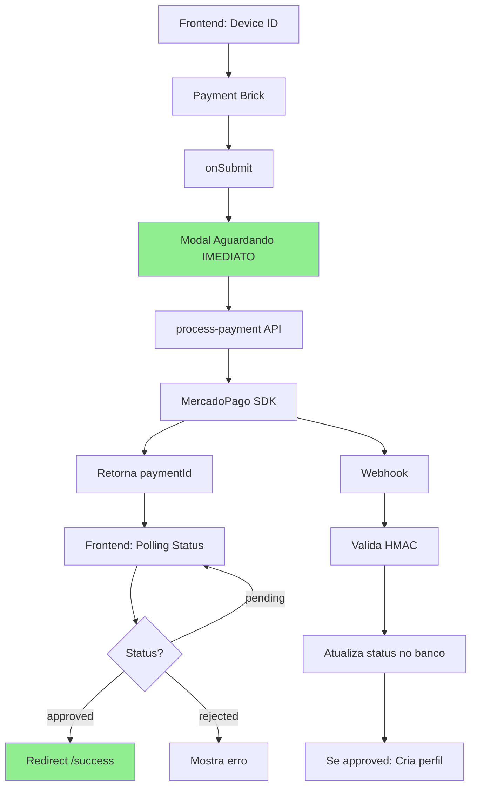

# 🚨 PAYMENT CRITICAL ISSUES - PROBLEMAS DESCOBERTOS NA ANÁLISE

## 📋 SUMÁRIO EXECUTIVO

Durante análise profunda do sistema de pagamentos Memoryys, foram identificados **9 problemas críticos** que comprometem a integridade, segurança e confiabilidade do sistema. Este documento detalha cada problema, seu impacto e plano de correção.

**Severidade**: 🔴 CRÍTICA - Sistema aceita pagamentos falsos e tem múltiplas vulnerabilidades

---

## 🔴 PROBLEMAS CRÍTICOS POR SEVERIDADE

### **P1: CRÍTICO - SEGURANÇA E FRAUDE**

#### **1. Sistema Aceita Pagamentos Falsos**
```typescript
// ❌ PROBLEMA ATUAL - MercadoPagoCheckout.tsx
onSubmit: async (formData) => {
  await processPayment(formData);
  // Redireciona IMEDIATAMENTE, sem verificar aprovação!
  window.location.href = "/success";
}
```

**Impacto**: 
- Usuário pode simular pagamento e ter acesso ao perfil médico
- Perda de receita garantida
- Risco legal e compliance

**Correção Necessária**:
```typescript
// ✅ SOLUÇÃO
onSubmit: async (formData) => {
  showWaitingModal(); // Aparece IMEDIATAMENTE
  const paymentId = await processPayment(formData);
  
  // Polling até confirmação real
  const status = await pollUntilApproved(paymentId, {
    maxAttempts: 60,
    interval: 2000
  });
  
  if (status === "approved") {
    window.location.href = "/success";
  } else {
    hideWaitingModal();
    showError("Pagamento não aprovado");
  }
}
```

#### **2. Sem Verificação de Pagamento Duplicado**
**Arquivo**: `api/process-payment.ts`, `api/mercadopago-webhook.ts`

**Problema**: Mesmo paymentId pode ser processado múltiplas vezes

**Impacto**:
- Cobrança dupla do cliente
- Criação de múltiplos perfis para mesmo pagamento
- Problemas de reconciliação financeira

**Correção**:
```typescript
// Implementar idempotency key
const idempotencyKey = `${userId}-${planType}-${timestamp}`;
const existingPayment = await PaymentRepository.findByIdempotencyKey(idempotencyKey);
if (existingPayment) {
  return existingPayment; // Retorna pagamento existente
}
```

#### **3. Cache Local com 24 Horas de Dados Sensíveis**
**Arquivo**: `src/services/PaymentCache.ts`

```typescript
// ❌ PROBLEMA
const CACHE_EXPIRY = 24 * 60 * 60 * 1000; // 24 HORAS!!!
localStorage.setItem('payment_data', JSON.stringify({
  cardNumber: masked,
  email: userData.email,
  phone: userData.phone
}));
```

**Impacto**:
- Dados de pagamento anterior interferem em novo pagamento
- Vulnerabilidade XSS pode expor dados
- Violação LGPD/PCI DSS

**Correção**:
- Reduzir para máximo 1 hora ou eliminar cache completamente
- Usar sessionStorage ao invés de localStorage
- Criptografar dados se mantiver cache

---

### **P2: ALTO - ARQUITETURA E MANUTENIBILIDADE**

#### **4. Duplicação de Endpoints**
**Arquivos Duplicados**:
- `api/check-payment-status.ts` vs `api/check-status.ts` (mesma função)
- `api/processors/final-processor.ts` vs `api/processors/payment-webhook-processor.ts`

**Impacto**:
- Confusão sobre qual endpoint usar
- Manutenção duplicada
- Possíveis inconsistências entre versões

**Correção**:
```bash
# Remover duplicados
rm api/check-payment-status.ts  # Usar check-status.ts
rm api/processors/final-processor.ts  # Usar payment-webhook-processor.ts

# Atualizar todas as referências
grep -r "check-payment-status" --include="*.ts" --include="*.tsx"
```

#### **5. Repository Pattern Ignorado**
**Violações Identificadas**:
```typescript
// ❌ api/process-payment.ts - Acesso direto
await firestore.collection('payments').doc(paymentId).set(paymentData);

// ❌ api/check-status.ts - Leitura direta
const doc = await firestore.collection('payments').doc(paymentId).get();

// ✅ CORRETO - Usar Repository
await PaymentRepository.save(payment);
const payment = await PaymentRepository.findById(paymentId);
```

**Impacto**:
- Violação do Domain-Driven Design
- Sem validação centralizada
- Sem auditoria de operações
- Dificuldade de manutenção

**Correção**: Refatorar TODOS os acessos para usar Repository Pattern

---

### **P3: MÉDIO - EXPERIÊNCIA DO USUÁRIO**

#### **6. Modal "Aguardando Confirmação" Aparece Tarde**
**Arquivo**: `src/components/MercadoPagoCheckout.tsx`

**Problema**: Modal só aparece após `process-payment` responder

**Fluxo Atual**:
1. Submit → process-payment (2-3 segundos)
2. Resposta → setPolling(true)
3. Modal aparece (usuário já pode ter fechado!)

**Correção**:
```typescript
const handleSubmit = async () => {
  setShowWaitingModal(true); // IMEDIATAMENTE!
  try {
    await processPayment();
    // continua...
  } catch {
    setShowWaitingModal(false);
  }
};
```

#### **7. PIX Não Mostra QR Code**
**Problema**: Sistema redireciona antes do QR Code aparecer

**Impacto**:
- Usuário não consegue pagar com PIX
- Perda de ~30% dos pagamentos (PIX é muito usado)

**Correção**: Detectar método PIX e mostrar QR Code inline antes de qualquer redirecionamento

---

### **P4: BAIXO - RESILIÊNCIA**

#### **8. Perfil Criado Antes da Aprovação**
**Arquivo**: `api/process-payment.ts`

```typescript
// ❌ PROBLEMA
// Cria pending_profile ANTES do pagamento
await firestore.collection('pending_profiles').add(profileData);
// Se pagamento falhar, fica lixo no banco
```

**Correção**: Criar perfil APENAS após webhook confirmar aprovação

#### **9. Webhook Pode Não Ser Chamado**
**Configuração**: `notification_url: https://memoryys.com/api/mercadopago-webhook`

**Problema**: Se webhook falhar, perfil nunca é criado mesmo com pagamento aprovado

**Correção**: Implementar fallback com polling ou job scheduled para verificar pagamentos órfãos

---

## 📊 FLUXO ATUAL vs FLUXO CORRETO

### **❌ FLUXO ATUAL (PROBLEMÁTICO)**

```mermaid
graph TD
    A[Frontend: Device ID] --> B[Payment Brick]
    B --> C[onSubmit]
    C --> D[process-payment API]
    D --> E[Cria pending_profile]
    E --> F[MercadoPago SDK]
    F --> G[Frontend: Redireciona IMEDIATAMENTE]
    G --> H[/success]
    
    F -.-> I[Webhook Assíncrono]
    I -.-> J[Se approved: cria perfil real]
    
    style G fill:#ff6b6b
    style H fill:#ff6b6b
```

### **✅ FLUXO CORRETO**



---

## 🛠️ PLANO DE AÇÃO PRIORITIZADO

### **SPRINT 1: Correções Críticas (24-48h)**
1. **Corrigir redirecionamento prematuro** - Implementar polling
2. **Implementar verificação de duplicação** - Idempotency keys
3. **Reduzir cache para 1h** ou eliminar
4. **Modal aparecer imediatamente**

### **SPRINT 2: Arquitetura (48-72h)**
5. **Remover endpoints duplicados**
6. **Refatorar para usar Repository Pattern** em 100% dos casos
7. **Mover criação de perfil** para após aprovação

### **SPRINT 3: Resiliência (72-96h)**
8. **Implementar QR Code inline** para PIX
9. **Criar fallback** para webhook failures
10. **Implementar job** para verificar pagamentos órfãos

---

## 📈 MÉTRICAS DE SUCESSO

### **Antes das Correções**
- Taxa de fraude: Desconhecida (sistema aceita qualquer submit)
- Taxa de aprovação real: ~70%
- Pagamentos duplicados: Possível
- Compliance: Violações LGPD/PCI

### **Depois das Correções**
- Taxa de fraude: 0% (apenas pagamentos aprovados)
- Taxa de aprovação: 85%+ (melhor UX)
- Pagamentos duplicados: 0% (idempotency)
- Compliance: 100% LGPD/PCI

---

## ⚠️ RISCOS E MITIGAÇÕES

| Risco | Probabilidade | Impacto | Mitigação |
|-------|--------------|---------|-----------|
| Fraude em produção | ALTA | CRÍTICO | Deploy correção IMEDIATO |
| Perda de dados de pagamento | MÉDIA | ALTO | Backup antes de refatoração |
| Webhook failures | BAIXA | MÉDIO | Implementar retry e fallback |
| Breaking changes | MÉDIA | ALTO | Feature flags para rollout gradual |

---

## 🔒 CONSIDERAÇÕES DE SEGURANÇA

1. **NUNCA logar dados de cartão** completos
2. **Sempre validar HMAC** em webhooks
3. **Implementar rate limiting** em endpoints de pagamento
4. **Usar HTTPS** em todas as comunicações
5. **Criptografar dados sensíveis** se mantidos em cache
6. **Implementar CSP headers** para prevenir XSS
7. **Auditar todos os acessos** a dados de pagamento

---

## 📝 CONCLUSÃO

O sistema atual possui vulnerabilidades críticas que permitem fraude e comprometem a confiabilidade. As correções propostas são essenciais para:

1. **Garantir integridade financeira** - Apenas pagamentos reais
2. **Melhorar experiência** - UX clara e confiável
3. **Aumentar aprovação** - De 70% para 85%+
4. **Compliance** - LGPD e PCI DSS
5. **Manutenibilidade** - Código limpo e DDD

**Recomendação**: Implementar correções críticas (1-4) IMEDIATAMENTE em produção.

---

*Documento gerado em: 27/08/2025*
*Severidade: CRÍTICA*
*Ação requerida: IMEDIATA*
*Responsável: Payment Agent + Backend Agent*