# 🔄 Fluxogramas de Execução - Sistema de Agentes Memoryys

**Documentação Técnica**: Fluxos detalhados de execução dos agentes especializados  
**Última Atualização**: 19 de agosto de 2025  
**Sistema**: Claude Code Agent Orchestration

## 📚 Índice
- [🎭 Fluxo Principal de Orquestração](#-fluxo-principal-de-orquestração)
- [🎨 Frontend Agent - Execução Detalhada](#-frontend-agent---execução-detalhada)
- [⚙️ Backend Agent - Execução Detalhada](#️-backend-agent---execução-detalhada)
- [💳 Payment Agent - Execução Detalhada](#-payment-agent---execução-detalhada)
- [🏥 Medical Validator - Execução Detalhada](#-medical-validator---execução-detalhada)
- [🚀 Deploy Orchestrator - Execução Detalhada](#-deploy-orchestrator---execução-detalhada)
- [🔗 Hooks Automáticos](#-hooks-automáticos)
- [⚡ MCP Integration Flow](#-mcp-integration-flow)
- [🛡️ Error Handling & Recovery](#️-error-handling--recovery)

---

## 🎭 Fluxo Principal de Orquestração

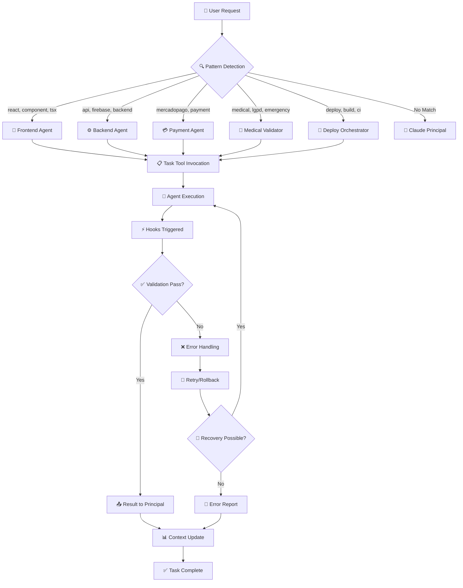

### **Timing Breakdown**
- **Pattern Detection**: ~100ms
- **Agent Selection**: ~50ms  
- **Task Tool Invocation**: ~200ms
- **Agent Execution**: 2-30s (depends on complexity)
- **Hook Validation**: ~1-3s
- **Result Processing**: ~100ms
- **Total**: 3-35s typical

---

## 🎨 Frontend Agent - Execução Detalhada

### **Trigger Flow**
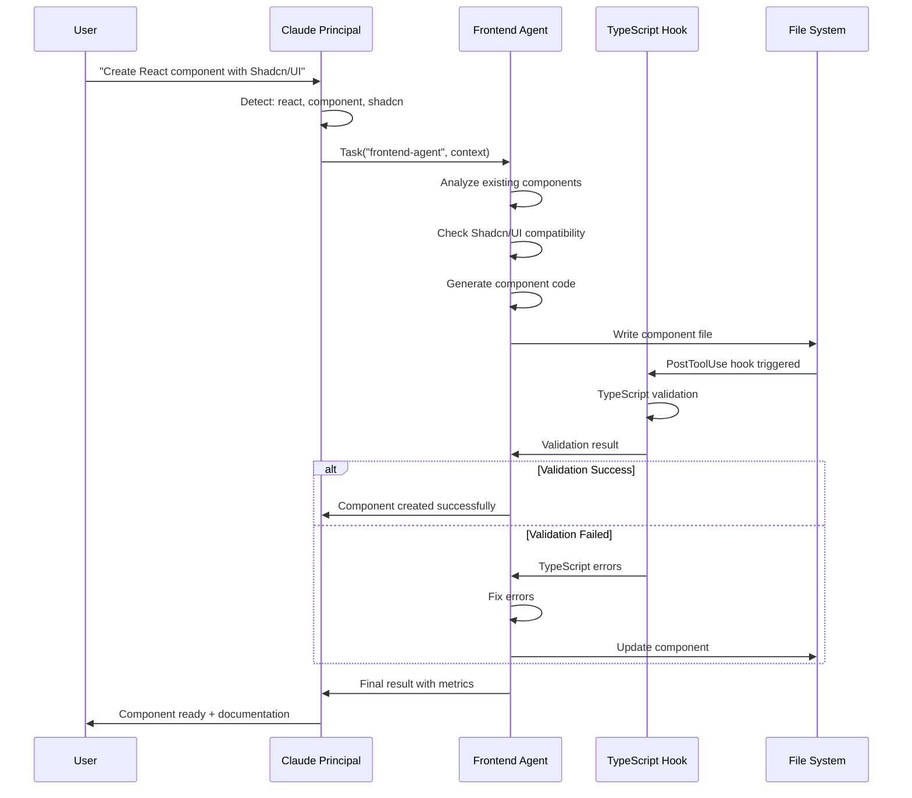

### **Frontend Agent Internal Process**
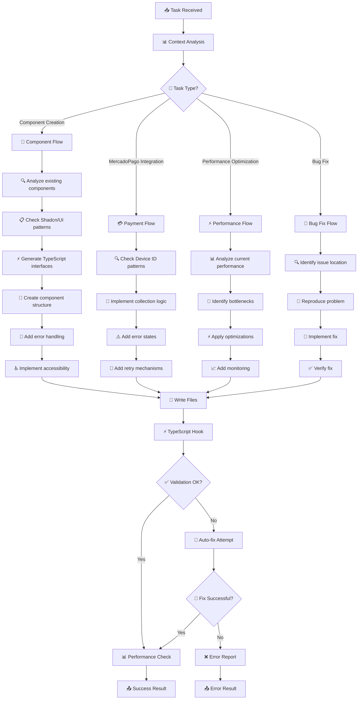

### **File Operations Sequence**
1. **Read existing components** (pattern analysis)
2. **Generate new component code** 
3. **Write TypeScript file** → Triggers Hook
4. **Write test file** (if applicable)
5. **Update index exports** (if needed)
6. **Generate documentation** (JSDoc)

### **Validation Points**
- ✅ TypeScript strict mode compliance
- ✅ Shadcn/UI pattern adherence
- ✅ Accessibility standards (WCAG)
- ✅ Performance benchmarks
- ✅ Error handling completeness

---

## ⚙️ Backend Agent - Execução Detalhada

### **Execution Flow**
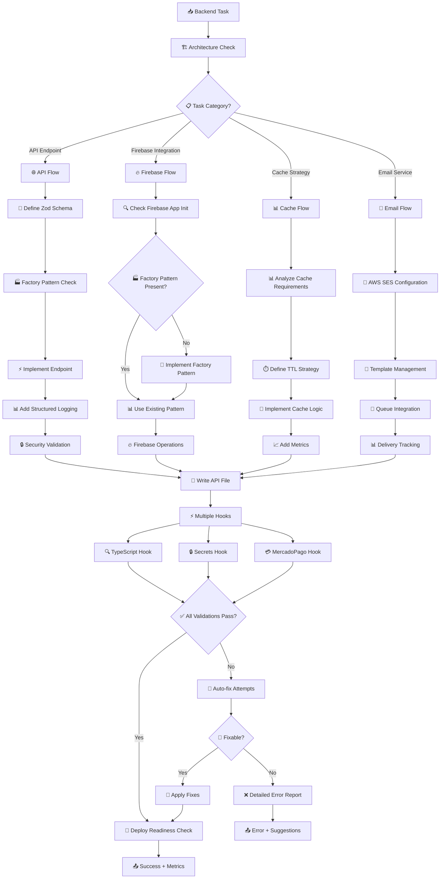

### **Serverless Optimization Process**
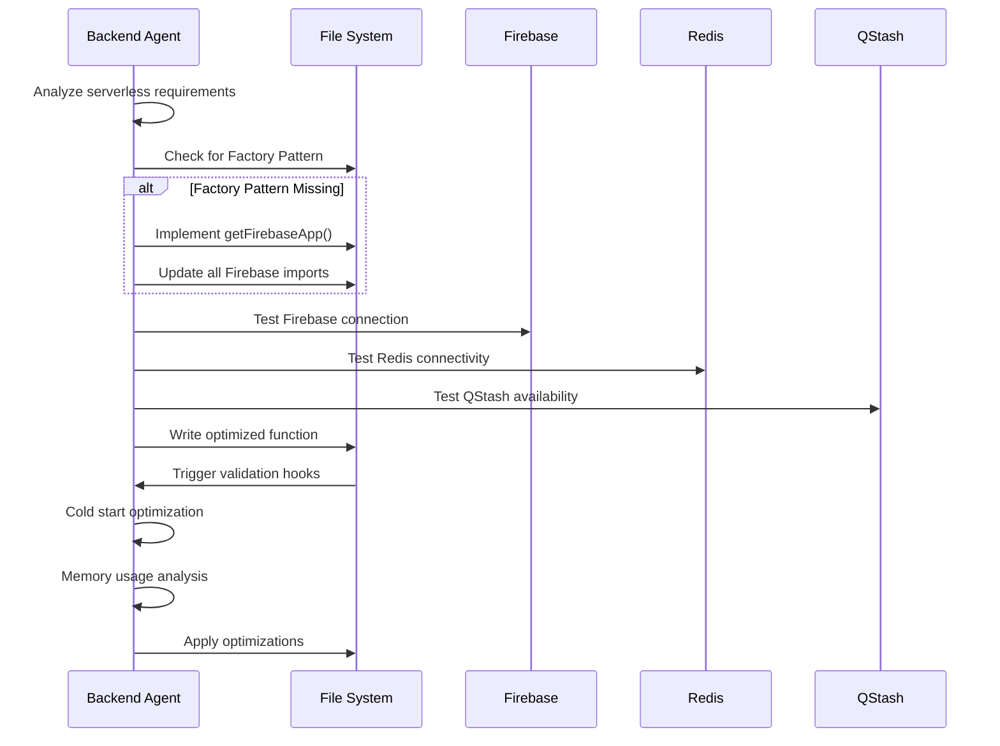

### **Performance Targets**
- 🎯 **Cold Start**: < 500ms
- 🎯 **API Response**: < 500ms P95
- 🎯 **Firebase Query**: < 200ms
- 🎯 **Cache Hit**: < 50ms
- 🎯 **Memory Usage**: < 128MB

---

## 💳 Payment Agent - Execução Detalhada

### **Payment Workflow Critical Path**
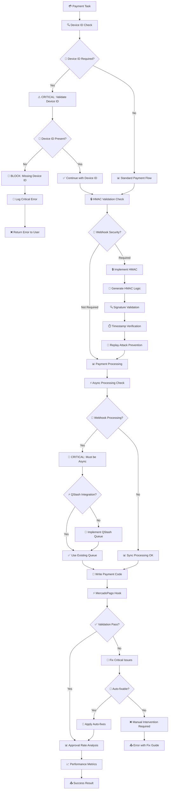

### **Device ID Collection Flow**
```mermaid
sequenceDiagram
    participant PA as Payment Agent
    participant MP as MercadoPago
    participant JS as JavaScript Runtime
    participant UI as User Interface
    
    PA->>PA: Analyze Device ID requirement
    PA->>JS: Check MP script loading
    
    alt Script Not Loaded
        PA->>UI: Add MP security script
        PA->>UI: Set view="checkout" attribute
    end
    
    PA->>JS: Implement polling logic
    PA->>JS: Add timeout safety (10s)
    PA->>UI: Add error handling
    
    loop Device ID Collection
        JS->>MP: Check MP_DEVICE_SESSION_ID
        MP-->>JS: Device ID or undefined
        
        alt Device ID Available
            JS->>UI: Store device_id
            break
        else Timeout Reached
            JS->>UI: Error - Device ID timeout
            break
        end
    end
    
    PA->>PA: Validate implementation
    PA->>UI: Add user feedback
```

### **Critical Validation Points**
1. ✅ **Device ID**: 100% collection rate
2. ✅ **HMAC**: Rigorosa validação webhook
3. ✅ **Async**: Zero processamento síncrono
4. ✅ **Service Layer**: Nunca API direta
5. ✅ **Approval Rate**: Target 85%+

---

## 🏥 Medical Validator - Execução Detalhada

### **Medical Data Validation Pipeline**
```mermaid
graph TD
    A[🏥 Medical Task] --> B[🔍 Data Type Analysis]
    B --> C{📋 Validation Type?}
    
    C -->|Blood Type| D[🩸 Blood Type Flow]
    C -->|Allergies| E[⚠️ Allergy Flow]
    C -->|Medications| F[💊 Medication Flow]
    C -->|Emergency Contacts| G[📞 Contact Flow]
    C -->|LGPD Compliance| H[🔒 LGPD Flow]
    C -->|QR Optimization| I[📱 QR Flow]
    
    D --> D1[📋 Validate Enum A+,A-,B+,B-,AB+,AB-,O+,O-]
    D1 --> D2[🔍 Check Format Consistency]
    D2 --> D3[⚡ Generate Zod Schema]
    D3 --> J[📝 Implementation]
    
    E --> E1[🧹 Sanitize Input (lowercase, trim)]
    E1 --> E2[🔍 Check Common Allergies DB]
    E2 --> E3[⚠️ Cross-reference with Medications]
    E3 --> E4[📊 Severity Classification]
    E4 --> J
    
    F --> F1[📋 Validate Medication Names]
    F1 --> F2[🔍 Check Controlled Substances]
    F2 --> F3[⚠️ Drug Interaction Analysis]
    F3 --> F4[👶 Age-appropriate Dosage Check]
    F4 --> J
    
    G --> G1[📞 Validate Brazilian Phone Format]
    G1 --> G2[👥 Relationship Validation]
    G2 --> G3[📊 Contact Prioritization]
    G3 --> G4[🔍 Duplicate Detection]
    G4 --> J
    
    H --> H1[🔒 Anonymization Implementation]
    H1 --> H2[📊 Audit Trail Setup]
    H2 --> H3[⏱️ TTL Configuration]
    H3 --> H4[📋 User Rights Implementation]
    H4 --> J
    
    I --> I1[📱 QR Size Optimization < 2KB]
    I1 --> I2[⚡ Cache Strategy Implementation]
    I2 --> I3[📊 Performance Monitoring]
    I3 --> I4[🔄 Fallback Mechanism]
    I4 --> J
    
    J --> K[📝 Generate Validation Code]
    K --> L[⚡ Medical Validation Hooks]
    L --> M{✅ LGPD Compliant?}
    
    M -->|No| N[🔒 Fix LGPD Issues]
    M -->|Yes| O{⚡ Performance OK?}
    
    N --> O
    O -->|No| P[⚡ Performance Optimization]
    O -->|Yes| Q[📊 Consistency Validation]
    
    P --> Q
    Q --> R{🔍 Data Consistent?}
    
    R -->|No| S[⚠️ Generate Warnings]
    R -->|Yes| T[✅ Validation Complete]
    
    S --> U[📝 Warning Documentation]
    U --> T
    T --> V[📤 Validated Medical System]
```

### **LGPD Compliance Automation**
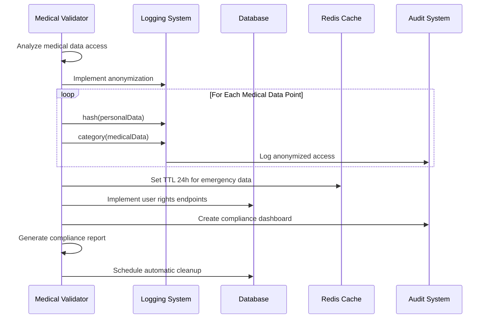

### **Emergency Optimization Targets**
- 🎯 **QR Load Time**: < 2 seconds
- 🎯 **Cache Hit Rate**: > 95%
- 🎯 **Data Validation**: < 100ms
- 🎯 **LGPD Compliance**: 100%
- 🎯 **Emergency Access**: < 1 second

---

## 🚀 Deploy Orchestrator - Execução Detalhada

### **Zero-Downtime Deployment Flow**
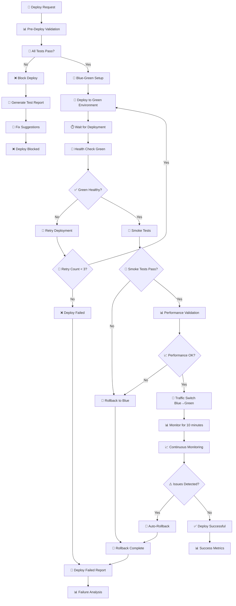

### **Health Check Automation**
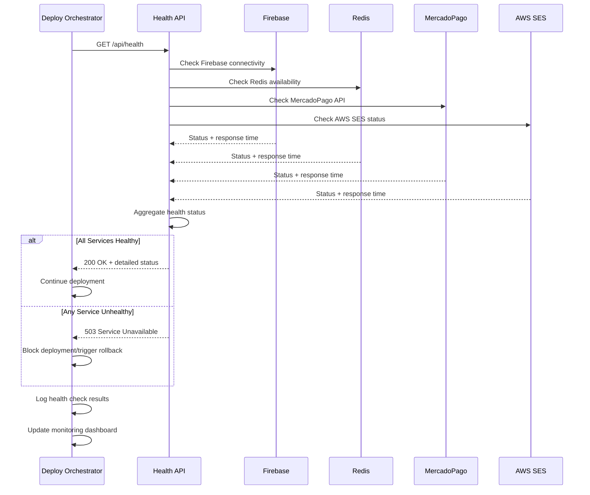

### **Critical Monitoring Points**
1. ✅ **API Response Time**: < 500ms P95
2. ✅ **Error Rate**: < 0.1%
3. ✅ **QR Code Load**: < 2s
4. ✅ **Payment Success**: > 85%
5. ✅ **System Uptime**: 99.9%

---

## 🔗 Hooks Automáticos

### **TypeScript Validator Hook**
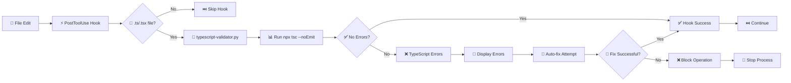

### **MercadoPago Validator Hook**
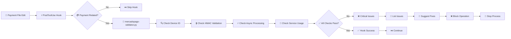

### **Secrets Scanner Hook**
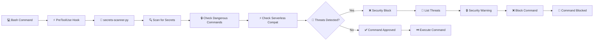

### **Hook Execution Timing**
- **PreToolUse**: ~100-500ms
- **PostToolUse**: ~1-3s  
- **Total Overhead**: ~1-4s per operation

---

## ⚡ MCP Integration Flow

### **MCP Server Communication**
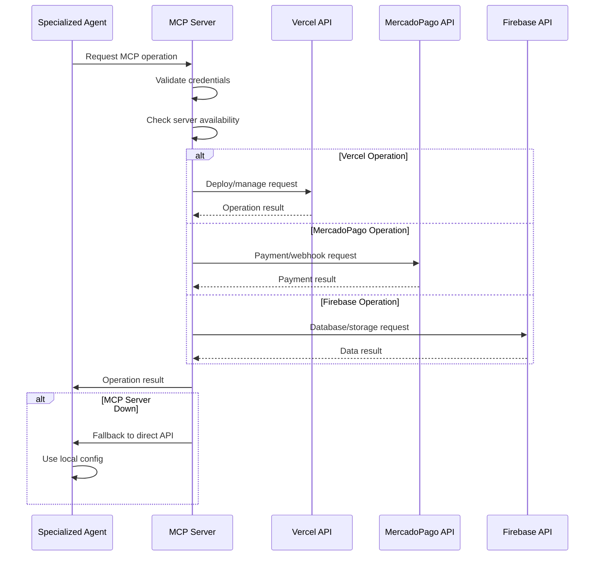

### **Fallback Strategy**
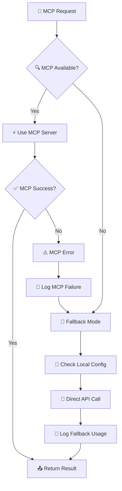

---

## 🛡️ Error Handling & Recovery

### **Error Propagation Chain**
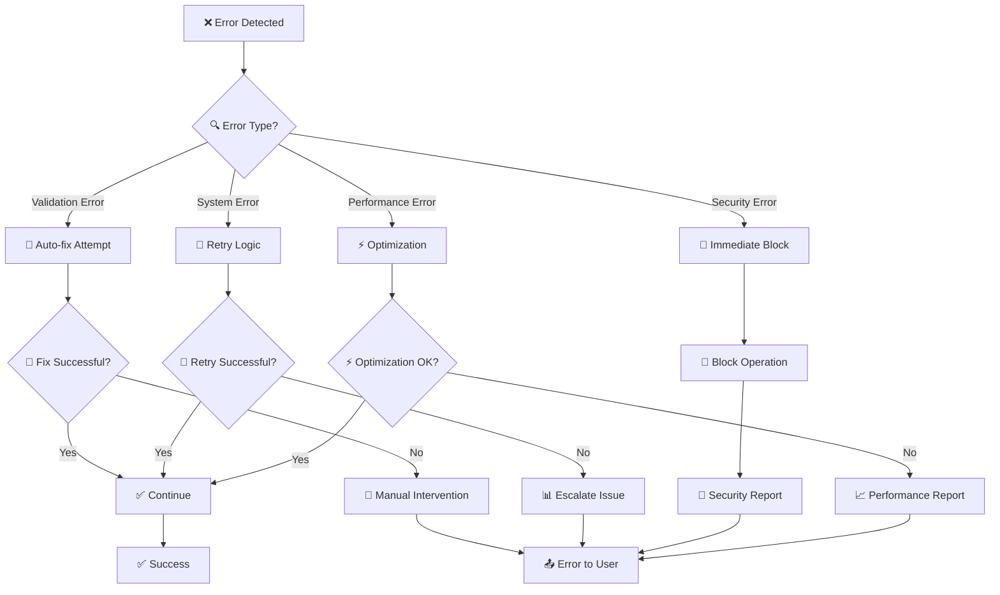

### **Recovery Procedures**
1. **Auto-fix**: TypeScript errors, format issues
2. **Retry**: Network failures, temporary issues  
3. **Rollback**: Deploy failures, breaking changes
4. **Escalate**: Security issues, system failures
5. **Manual**: Complex issues requiring human intervention

### **Recovery Timing Targets**
- 🎯 **Auto-fix**: < 5 seconds
- 🎯 **Retry**: < 30 seconds
- 🎯 **Rollback**: < 2 minutes
- 🎯 **Escalation**: Immediate
- 🎯 **Manual Response**: < 15 minutes

---

## 📊 Performance Metrics

### **Agent Performance Benchmarks**
| Agent | Avg Execution | P95 Execution | Success Rate | Error Recovery |
|-------|---------------|---------------|--------------|----------------|
| Frontend | 5-15s | 25s | 98% | 90% |
| Backend | 10-30s | 45s | 95% | 85% |
| Payment | 3-10s | 20s | 99% | 95% |
| Medical | 2-8s | 15s | 99% | 98% |
| Deploy | 60-300s | 600s | 97% | 80% |

### **System-wide SLIs**
- **Agent Availability**: 99.9%
- **Hook Success Rate**: 98%
- **MCP Connectivity**: 95%
- **Overall Success**: 97%
- **Error Recovery**: 90%

---

## 🎯 Debugging & Monitoring

### **Debug Information Access**
```bash
# Enable debug mode
export CLAUDE_DEBUG=1

# Monitor agent execution
tail -f ~/.claude/logs/agent-execution.log

# Check hook performance
tail -f ~/.claude/logs/hooks-performance.log

# MCP connectivity
claude mcp status --detailed
```

### **Performance Monitoring**
```bash
# Real-time metrics
watch -n 5 '/validate-flow'

# Agent response times
grep "Agent.*completed" ~/.claude/logs/debug.log | tail -20

# Hook execution times
grep "Hook.*duration" ~/.claude/logs/hooks.log | tail -20
```

### **Alerting Thresholds**
- ⚠️ **Agent timeout**: > 60s
- 🚨 **Hook failure**: > 3 consecutive
- ⚠️ **MCP disconnect**: > 5 minutes
- 🚨 **Error rate**: > 5% in 10 minutes

---

**📈 Este fluxograma documentado garante total transparência do sistema de agentes, permitindo debugging eficiente e otimização contínua para o sistema crítico Memoryys.**