# 🔄 Manual de Rollback e Recovery - Sistema de Agentes Memoryys

**Manual Crítico**: Como desfazer ações e recuperar de falhas no sistema de agentes  
**Última Atualização**: 19 de agosto de 2025  
**Sistema**: Claude Code Agent Recovery Framework

## 📚 Índice
- [🚨 Visão Geral de Recovery](#-visão-geral-de-recovery)
- [🎨 Rollback Frontend Agent](#-rollback-frontend-agent)
- [⚙️ Rollback Backend Agent](#️-rollback-backend-agent)
- [💳 Rollback Payment Agent](#-rollback-payment-agent)
- [🏥 Rollback Medical Validator](#-rollback-medical-validator)
- [🚀 Rollback Deploy Orchestrator](#-rollback-deploy-orchestrator)
- [🔧 Recovery de Hooks](#-recovery-de-hooks)
- [🔌 Recovery MCP](#-recovery-mcp)
- [🚨 Procedures de Emergência](#-procedures-de-emergência)
- [📊 Monitoramento pós-Recovery](#-monitoramento-pós-recovery)

---

## 🚨 Visão Geral de Recovery

### **Filosofia de Recovery Memoryys**
> **"Em um sistema de emergência médica, cada falha pode custar vidas. Recovery deve ser IMEDIATO e CONFIÁVEL."**

### **Tipos de Recovery**

```mermaid
graph TD
    A[🚨 Problema Detectado] --> B{🔍 Tipo de Falha?}
    
    B -->|Code Error| C[🔄 Code Rollback]
    B -->|Deploy Failure| D[🚀 Deploy Rollback]
    B -->|Data Corruption| E[📊 Data Recovery]
    B -->|System Outage| F[⚡ Emergency Recovery]
    B -->|Performance Degradation| G[📈 Performance Recovery]
    
    C --> H[🎯 Estratégias por Agente]
    D --> I[🚀 Blue-Green Rollback]
    E --> J[📦 Backup Restoration]
    F --> K[🚨 Emergency Procedures]
    G --> L[⚡ Performance Optimization]
    
    H --> M[✅ Validation]
    I --> M
    J --> M
    K --> M
    L --> M
    
    M --> N[📊 Post-Recovery Monitoring]
```



### **Priorização de Recovery**

1. **P0 - CRÍTICO**: Sistema de emergência médica indisponível
2. **P1 - URGENTE**: Funcionalidade crítica degradada (QR, Pagamentos)
3. **P2 - IMPORTANTE**: Performance degradada mas funcional
4. **P3 - BAIXO**: Melhorias ou otimizações

### **Tempos de Recovery (SLA)**

| Prioridade | Detection Time | Response Time | Recovery Time | Total SLA |
|------------|----------------|---------------|---------------|-----------|
| P0 | < 2 min | < 5 min | < 10 min | **< 15 min** |
| P1 | < 5 min | < 15 min | < 30 min | **< 45 min** |
| P2 | < 15 min | < 1 hour | < 2 hours | **< 3 hours** |
| P3 | < 1 hour | < 4 hours | < 8 hours | **< 12 hours** |

---

## 🎨 Rollback Frontend Agent

### **Cenários de Rollback Frontend**

#### **1. Componente React Quebrado**

```bash
#!/bin/bash
# Rollback de Componente React Quebrado

COMPONENT_FILE="src/components/MedicalForm.tsx"
BACKUP_DIR=".claude/backups/frontend"

echo "🔄 ROLLBACK: Componente React quebrado"

# 1. Verificar backup automático
if [ -f "$BACKUP_DIR/$(basename $COMPONENT_FILE).backup" ]; then
    echo "✅ Backup encontrado, restaurando..."
    cp "$BACKUP_DIR/$(basename $COMPONENT_FILE).backup" "$COMPONENT_FILE"
else
    echo "⚠️ Backup não encontrado, usando Git"
    git checkout HEAD~1 -- "$COMPONENT_FILE"
fi

# 2. Validar restauração
npm run type-check
if [ $? -eq 0 ]; then
    echo "✅ Rollback successful - TypeScript OK"
else
    echo "❌ Rollback failed - manual intervention needed"
    exit 1
fi

# 3. Testar build
npm run build
if [ $? -eq 0 ]; then
    echo "✅ Build successful após rollback"
else
    echo "❌ Build still failing"
    exit 1
fi

echo "🎯 Frontend rollback completo"
```

#### **2. Device ID Collection Quebrada**

```typescript
// Emergency Fix: Device ID Collection Recovery
// Arquivo: src/components/MercadoPagoCheckout.tsx

// ANTES (Quebrado)
/*
const deviceId = window.MP_DEVICE_SESSION_ID; // Pode ser undefined
*/

// DEPOIS (Recovery)
const [deviceId, setDeviceId] = useState<string | null>(null);
const [retryCount, setRetryCount] = useState(0);

useEffect(() => {
  // 🚨 EMERGENCY RECOVERY: Multiple collection strategies
  const collectDeviceId = () => {
    // Strategy 1: Direct collection
    if (window.MP_DEVICE_SESSION_ID) {
      setDeviceId(window.MP_DEVICE_SESSION_ID);
      return true;
    }
    
    // Strategy 2: Force script reload
    const script = document.createElement('script');
    script.src = 'https://www.mercadopago.com/v2/security.js';
    script.setAttribute('view', 'checkout');
    document.head.appendChild(script);
    
    return false;
  };
  
  // Emergency polling with retry limit
  const deviceIdInterval = setInterval(() => {
    if (collectDeviceId() || retryCount >= 20) { // 20 * 500ms = 10s max
      clearInterval(deviceIdInterval);
      
      if (!deviceId && retryCount >= 20) {
        // 🚨 EMERGENCY: Show error but allow manual retry
        logError('Device ID collection failed after 10s', { retryCount });
        setShowDeviceIdError(true);
      }
    }
    setRetryCount(prev => prev + 1);
  }, 500);
  
  // Cleanup
  return () => clearInterval(deviceIdInterval);
}, []);

// Emergency validation before payment
const handlePayment = () => {
  if (!deviceId) {
    // 🚨 CRITICAL: Block payment without Device ID
    alert('Sistema temporariamente indisponível. Recarregue a página e tente novamente.');
    window.location.reload(); // Force page reload as recovery
    return;
  }
  
  proceedWithPayment(deviceId);
};
```

#### **3. Performance Degradation Recovery**

```typescript
// Performance Recovery Script
// Arquivo: scripts/frontend-performance-recovery.ts

export async function frontendPerformanceRecovery() {
  console.log('🚀 Iniciando Frontend Performance Recovery...');
  
  // 1. Bundle analysis
  const bundleSize = await analyzeBundleSize();
  if (bundleSize > 500000) { // > 500KB
    console.log('⚠️ Bundle size crítico, aplicando otimizações...');
    await applyBundleOptimizations();
  }
  
  // 2. Component optimization
  const slowComponents = await identifySlowComponents();
  for (const component of slowComponents) {
    await optimizeComponent(component);
  }
  
  // 3. QR Code specific optimization (CRÍTICO)
  const qrLoadTime = await measureQRLoadTime();
  if (qrLoadTime > 2000) { // > 2s
    console.log('🚨 CRITICAL: QR Code > 2s, aplicando emergency fix...');
    await emergencyQROptimization();
  }
  
  console.log('✅ Frontend Performance Recovery completo');
}

async function emergencyQROptimization() {
  // Emergency QR optimization strategies
  const optimizations = [
    'preload-qr-generation-script',
    'implement-qr-cache-strategy', 
    'reduce-qr-payload-size',
    'add-qr-loading-skeleton',
    'implement-progressive-loading'
  ];
  
  for (const optimization of optimizations) {
    await applyOptimization(optimization);
  }
}
```

### **Frontend Recovery Checklist**

```markdown
## Frontend Recovery Checklist

### Immediate Actions (< 5 min)
- [ ] Identify broken component/feature
- [ ] Check if backup exists in .claude/backups/
- [ ] Restore from backup or Git
- [ ] Run TypeScript validation
- [ ] Test critical path (QR Code, Payment)

### Validation (< 10 min) 
- [ ] npm run type-check passes
- [ ] npm run build succeeds
- [ ] Device ID collection working
- [ ] QR Code loads < 2s
- [ ] Payment flow functional

### Post-Recovery (< 15 min)
- [ ] Performance metrics within SLA
- [ ] Error monitoring shows no new issues
- [ ] User reports confirm fix
- [ ] Document root cause and prevention
```

---

## ⚙️ Rollback Backend Agent

### **Cenários de Rollback Backend**

#### **1. API Endpoint Failure**

```bash
#!/bin/bash
# Rollback API Endpoint Failure

API_FILE="api/create-payment.ts"
BACKUP_DIR=".claude/backups/backend"

echo "🔄 ROLLBACK: API Endpoint failure"

# 1. Immediate response - disable endpoint if broken
if grep -q "EMERGENCY_DISABLE" "$API_FILE"; then
    echo "⚠️ Endpoint já desabilitado para emergency"
else
    # Create emergency disable version
    cat > "${API_FILE}.emergency" << 'EOF'
import type { VercelRequest, VercelResponse } from '@vercel/node';

export default async function handler(req: VercelRequest, res: VercelResponse) {
  // 🚨 EMERGENCY: Endpoint temporarily disabled
  return res.status(503).json({
    error: 'Serviço temporariamente indisponível',
    message: 'Sistema em manutenção - tente novamente em alguns minutos',
    emergency_mode: true,
    contact: '192' // SAMU emergency
  });
}
EOF
    
    # Deploy emergency version
    mv "$API_FILE" "${API_FILE}.broken"
    mv "${API_FILE}.emergency" "$API_FILE"
    
    echo "🚨 Emergency endpoint deployed - users see maintenance message"
fi

# 2. Restore from backup
if [ -f "$BACKUP_DIR/$(basename $API_FILE).backup" ]; then
    echo "✅ Backup encontrado, testando restauração..."
    cp "$BACKUP_DIR/$(basename $API_FILE).backup" "${API_FILE}.test"
    
    # Test restored version
    if npm run type-check && npm run build; then
        echo "✅ Backup válido, restaurando..."
        mv "${API_FILE}.test" "$API_FILE"
    else
        echo "❌ Backup também quebrado, necessário manual fix"
        exit 1
    fi
else
    echo "⚠️ Backup não encontrado, usando Git"
    git checkout HEAD~1 -- "$API_FILE"
fi

# 3. Validate API health
echo "🔍 Validando API health..."
curl -f http://localhost:3000/api/health || {
    echo "❌ API health check failed"
    exit 1
}

echo "✅ Backend API rollback completo"
```

#### **2. Firebase Factory Pattern Recovery**

```typescript
// Emergency Firebase Recovery
// Arquivo: lib/services/firebase-recovery.ts

interface FirebaseRecoveryStatus {
  factory_pattern_intact: boolean;
  initialization_working: boolean;
  connections_healthy: boolean;
  recovery_needed: boolean;
}

export async function firebaseEmergencyRecovery(): Promise<FirebaseRecoveryStatus> {
  console.log('🔥 Iniciando Firebase Emergency Recovery...');
  
  let status: FirebaseRecoveryStatus = {
    factory_pattern_intact: false,
    initialization_working: false,
    connections_healthy: false,
    recovery_needed: true
  };
  
  try {
    // 1. Check Factory Pattern integrity
    const { getApps } = await import('firebase-admin/app');
    
    if (getApps().length === 0) {
      console.log('⚠️ No Firebase apps initialized - applying emergency init...');
      await emergencyFirebaseInit();
    }
    
    status.factory_pattern_intact = true;
    
    // 2. Test connection
    const app = getApps()[0];
    const db = (await import('firebase-admin/firestore')).getFirestore(app);
    
    // Emergency connection test
    await db.collection('_health_check').doc('test').get();
    status.connections_healthy = true;
    
    // 3. Validate all Factory Pattern usage
    await validateFactoryPatternUsage();
    status.initialization_working = true;
    
    status.recovery_needed = false;
    console.log('✅ Firebase recovery successful');
    
  } catch (error) {
    console.error('❌ Firebase recovery failed:', error);
    
    // Emergency fallback: Direct initialization (temporary)
    await emergencyDirectInit();
  }
  
  return status;
}

async function emergencyFirebaseInit() {
  const { initializeApp, cert } = await import('firebase-admin/app');
  
  // Emergency initialization with validation
  if (!process.env.FIREBASE_PROJECT_ID) {
    throw new Error('🚨 CRITICAL: FIREBASE_PROJECT_ID missing');
  }
  
  const app = initializeApp({
    credential: cert({
      projectId: process.env.FIREBASE_PROJECT_ID,
      clientEmail: process.env.FIREBASE_CLIENT_EMAIL,
      privateKey: process.env.FIREBASE_PRIVATE_KEY?.replace(/\\n/g, '\n'),
    }),
    storageBucket: `${process.env.FIREBASE_PROJECT_ID}.appspot.com`,
  });
  
  console.log('🔥 Emergency Firebase initialization complete');
  return app;
}

async function emergencyDirectInit() {
  // 🚨 LAST RESORT: Direct initialization (breaks serverless best practices)
  console.log('🚨 EMERGENCY: Using direct Firebase initialization');
  
  // This should be temporary only
  const app = await emergencyFirebaseInit();
  
  // Log for monitoring - this should not be permanent
  console.log('⚠️ WARNING: Direct Firebase init used - fix Factory Pattern ASAP');
  
  return app;
}
```

#### **3. Cache System Recovery**

```typescript
// Cache Recovery System
// Arquivo: lib/services/cache-recovery.ts

export async function cacheEmergencyRecovery() {
  console.log('📊 Iniciando Cache Emergency Recovery...');
  
  try {
    // 1. Test Redis connectivity
    const redis = await import('../storage/redis.service');
    await redis.ping();
    console.log('✅ Redis connectivity OK');
    
  } catch (error) {
    console.log('❌ Redis down - implementing emergency fallback...');
    
    // Emergency fallback: In-memory cache
    await implementEmergencyMemoryCache();
    
    // Fallback: Direct Firebase access
    await enableDirectFirebaseMode();
  }
  
  // 2. Warm critical cache entries
  await warmCriticalCache();
  
  // 3. Validate emergency data access
  await validateEmergencyDataAccess();
  
  console.log('✅ Cache recovery complete');
}

async function implementEmergencyMemoryCache() {
  // Emergency in-memory cache for critical data
  const emergencyCache = new Map();
  
  // Cache most critical emergency profiles
  const criticalProfiles = await getCriticalProfiles(); // Last 100 accessed
  
  for (const profile of criticalProfiles) {
    emergencyCache.set(`emergency:${profile.id}`, profile);
  }
  
  // Replace Redis calls with memory cache temporarily
  global.emergencyCache = emergencyCache;
  
  console.log(`🚨 Emergency memory cache: ${emergencyCache.size} profiles loaded`);
}

async function enableDirectFirebaseMode() {
  // Emergency: Direct Firebase access when cache fails
  console.log('🔥 Enabling direct Firebase mode for emergency data');
  
  // Flag for emergency mode
  global.EMERGENCY_DIRECT_FIREBASE = true;
  
  // This bypasses cache for emergency data access
  // Performance will be slower but system remains functional
}

async function warmCriticalCache() {
  console.log('🔥 Warming critical cache entries...');
  
  // Warm most accessed emergency profiles
  const recentlyAccessed = await getRecentlyAccessedProfiles(100);
  
  for (const profileId of recentlyAccessed) {
    try {
      await cacheEmergencyProfile(profileId);
    } catch (error) {
      console.warn(`⚠️ Failed to warm cache for ${profileId}`);
    }
  }
}
```

### **Backend Recovery Checklist**

```markdown
## Backend Recovery Checklist

### Critical APIs (< 2 min)
- [ ] /api/health responding 200
- [ ] Emergency profile access working
- [ ] QR code data retrieval < 2s

### Factory Pattern (< 5 min)
- [ ] Firebase Factory Pattern intact
- [ ] No duplicate app initializations
- [ ] All imports using Factory Pattern

### Performance (< 10 min)
- [ ] API response times < 500ms
- [ ] Cache hit rate > 80%
- [ ] No memory leaks detected
- [ ] Queue processing working

### Data Integrity (< 15 min)
- [ ] Medical data accessible
- [ ] Payment logs intact
- [ ] Audit trails preserved
- [ ] Backup systems operational
```

---

## 💳 Rollback Payment Agent

### **Cenários Críticos de Payment Rollback**

#### **1. Device ID Collection Failure (CRÍTICO)**

```typescript
// CRITICAL: Device ID Recovery
// Impacto: Taxa de aprovação despenca de 85% para <50%

export function deviceIdEmergencyRecovery() {
  console.log('🚨 CRITICAL: Device ID Collection Recovery');
  
  // Emergency Strategy 1: Multiple collection attempts
  const collectDeviceIdEmergency = () => {
    return new Promise<string>((resolve, reject) => {
      let attempts = 0;
      const maxAttempts = 10;
      
      const tryCollect = () => {
        attempts++;
        
        if (window.MP_DEVICE_SESSION_ID) {
          resolve(window.MP_DEVICE_SESSION_ID);
          return;
        }
        
        if (attempts >= maxAttempts) {
          // Emergency: Force page reload to reset MercadoPago
          console.log('🚨 Device ID failed - forcing page reload');
          alert('Recarregando página para melhor conexão...');
          window.location.reload();
          return;
        }
        
        setTimeout(tryCollect, 1000); // Try every second
      };
      
      tryCollect();
    });
  };
  
  // Emergency Strategy 2: Alternative script loading
  const loadMercadoPagoScript = () => {
    // Remove existing script
    const existingScript = document.querySelector('script[src*="mercadopago.com"]');
    if (existingScript) {
      existingScript.remove();
    }
    
    // Load fresh script
    const script = document.createElement('script');
    script.src = 'https://www.mercadopago.com/v2/security.js?v=' + Date.now();
    script.setAttribute('view', 'checkout');
    script.onload = () => {
      console.log('✅ MercadoPago script reloaded');
    };
    script.onerror = () => {
      console.error('❌ MercadoPago script failed to load');
      // Emergency: Show user error with manual retry
      showDeviceIdError();
    };
    
    document.head.appendChild(script);
  };
  
  // Execute recovery
  loadMercadoPagoScript();
  return collectDeviceIdEmergency();
}

function showDeviceIdError() {
  // Emergency user interface for Device ID failure
  const errorDiv = document.createElement('div');
  errorDiv.style.cssText = `
    position: fixed; top: 0; left: 0; right: 0;
    background: #ff4444; color: white; padding: 15px;
    text-align: center; z-index: 9999;
  `;
  errorDiv.innerHTML = `
    <strong>⚠️ Problema de conexão detectado</strong><br>
    Recarregue a página e tente novamente.<br>
    <button onclick="window.location.reload()" style="margin-top:10px; padding:5px 15px;">
      🔄 Recarregar Página
    </button>
  `;
  
  document.body.prepend(errorDiv);
}
```

#### **2. HMAC Validation Failure Recovery**

```bash
#!/bin/bash
# HMAC Validation Emergency Recovery

WEBHOOK_FILE="api/mercadopago-webhook.ts"

echo "🔒 HMAC Validation Emergency Recovery"

# 1. Check if HMAC is completely broken
if ! grep -q "createHmac" "$WEBHOOK_FILE"; then
    echo "🚨 CRITICAL: HMAC validation missing completely!"
    
    # Emergency: Disable webhook until fixed
    cat > "${WEBHOOK_FILE}.emergency" << 'EOF'
import type { VercelRequest, VercelResponse } from '@vercel/node';

export default async function handler(req: VercelRequest, res: VercelResponse) {
  // 🚨 EMERGENCY: HMAC validation broken - webhook disabled
  console.log('EMERGENCY: Webhook disabled due to HMAC failure');
  
  return res.status(503).json({
    error: 'Webhook temporarily disabled for security',
    message: 'Payment processing via polling until fixed'
  });
}
EOF
    
    mv "$WEBHOOK_FILE" "${WEBHOOK_FILE}.broken"
    mv "${WEBHOOK_FILE}.emergency" "$WEBHOOK_FILE"
    
    echo "🚨 Webhook disabled - implement payment polling as backup"
    
    # Trigger payment polling backup system
    echo "Implementing payment polling backup..."
    # This would trigger alternative payment verification
fi

# 2. Test HMAC with known good signature
curl -X POST http://localhost:3000/api/mercadopago-webhook \
  -H "x-signature: ts=1234567890,v1=test_signature" \
  -H "x-request-id: test-request" \
  -d '{"test": "data"}'

# Response should be 401 for invalid signature
if [ $? -eq 0 ]; then
    echo "❌ HMAC validation not working properly"
else
    echo "✅ HMAC validation working"
fi
```

#### **3. Payment Approval Rate Emergency**

```typescript
// Emergency Approval Rate Recovery
export async function paymentApprovalEmergencyRecovery() {
  console.log('💳 Payment Approval Rate Emergency Recovery');
  
  // 1. Check current approval rate
  const currentRate = await getCurrentApprovalRate();
  
  if (currentRate < 70) { // Below critical threshold
    console.log(`🚨 CRITICAL: Approval rate at ${currentRate}% - applying emergency fixes`);
    
    // Emergency Fix 1: Ensure Device ID is mandatory
    await enforceDeviceIdCollection();
    
    // Emergency Fix 2: Optimize payment data
    await optimizePaymentData();
    
    // Emergency Fix 3: Switch to most reliable payment methods
    await enableOnlyReliablePaymentMethods();
    
    // Emergency Fix 4: Add payer verification
    await enhancePayerValidation();
  }
  
  // 2. Monitor improvement
  setTimeout(async () => {
    const newRate = await getCurrentApprovalRate();
    console.log(`📊 Approval rate after recovery: ${newRate}%`);
    
    if (newRate < 75) {
      console.log('🚨 Recovery insufficient - escalating to manual intervention');
      await escalateApprovalRateIssue();
    }
  }, 300000); // Check after 5 minutes
}

async function enforceDeviceIdCollection() {
  // Make Device ID absolutely mandatory
  console.log('🔒 Enforcing mandatory Device ID collection');
  
  // Add extra validation layers
  const deviceIdChecks = [
    'window.MP_DEVICE_SESSION_ID',
    'sessionStorage.getItem("mp_device_id")',
    'localStorage.getItem("mp_device_backup")'
  ];
  
  // Implementation would add multiple fallbacks
}

async function enableOnlyReliablePaymentMethods() {
  // Emergency: Disable unreliable payment methods
  console.log('💳 Enabling only most reliable payment methods');
  
  const reliablePaymentMethods = {
    excluded_payment_types: [
      { id: 'ticket' },    // Remove boleto (lower approval)
      { id: 'atm' }        // Remove ATM (unreliable)
    ],
    excluded_payment_methods: [
      { id: 'redlink' },   // Remove specific low-approval methods
      { id: 'pagofacil' }
    ],
    installments: 1  // Force single payment (higher approval)
  };
  
  // This would be applied to all new payment preferences
  return reliablePaymentMethods;
}
```

### **Payment Recovery Checklist**

```markdown
## Payment Recovery Checklist (CRÍTICO)

### Device ID (< 2 min) - BLOCANTE
- [ ] MP_DEVICE_SESSION_ID being collected
- [ ] No payments proceeding without Device ID
- [ ] User sees error if Device ID fails
- [ ] Page reload recovery working

### HMAC Security (< 5 min) - CRÍTICO
- [ ] Webhook HMAC validation intact
- [ ] No webhooks processing without validation
- [ ] Emergency webhook disable if broken
- [ ] Polling backup system activated

### Approval Rate (< 10 min) - NEGÓCIO
- [ ] Current approval rate > 75%
- [ ] Device ID collection rate = 100%
- [ ] Payment data optimized
- [ ] Reliable payment methods only

### Business Continuity (< 15 min)
- [ ] Payment processing functional
- [ ] User experience not broken
- [ ] Revenue impact minimized
- [ ] Monitoring alerts working
```

---

## 🏥 Rollback Medical Validator

### **Cenários Críticos Médicos**

#### **1. Dados Médicos Corrompidos (P0)**

```typescript
// CRITICAL: Medical Data Corruption Recovery
export async function medicalDataEmergencyRecovery(profileId: string) {
  console.log(`🚨 MEDICAL EMERGENCY: Data corruption for profile ${profileId}`);
  
  // 1. Immediate isolation
  await isolateCorruptedProfile(profileId);
  
  // 2. Restore from backup
  const backupData = await restoreFromMedicalBackup(profileId);
  
  if (!backupData) {
    // 3. Emergency data reconstruction
    console.log('⚠️ No backup found - initiating emergency reconstruction');
    return await emergencyDataReconstruction(profileId);
  }
  
  // 4. Validate restored data
  const validationResult = await validateMedicalData(backupData);
  
  if (validationResult.critical_errors.length > 0) {
    console.log('❌ Backup also corrupted - manual intervention required');
    await escalateMedicalDataIssue(profileId);
    return false;
  }
  
  // 5. Restore and validate
  await restoreMedicalProfile(profileId, backupData);
  console.log('✅ Medical data recovery successful');
  
  return true;
}

async function isolateCorruptedProfile(profileId: string) {
  // Emergency: Prevent corrupted data from being accessed
  const redis = await getRedisClient();
  
  // Mark profile as corrupted
  await redis.set(`corrupted:${profileId}`, JSON.stringify({
    timestamp: new Date().toISOString(),
    status: 'ISOLATED',
    reason: 'DATA_CORRUPTION'
  }), 'EX', 3600); // 1 hour isolation
  
  // Emergency response for QR access
  await redis.set(`emergency:${profileId}`, JSON.stringify({
    emergency_mode: true,
    message: 'DADOS EM RECUPERAÇÃO',
    instructions: 'Contactar SAMU 192',
    contact_emergency: '192'
  }), 'EX', 3600);
  
  console.log(`🔒 Profile ${profileId} isolated during recovery`);
}

async function emergencyDataReconstruction(profileId: string) {
  console.log('🚨 EMERGENCY: Attempting data reconstruction...');
  
  // Try to reconstruct from various sources
  const sources = [
    'audit_logs',      // LGPD audit trail
    'payment_records', // Payment associated data
    'cache_fragments', // Partial cache data
    'user_session'     // Session data if available
  ];
  
  let reconstructedData: any = {
    id: profileId,
    emergency_mode: true,
    reconstruction_timestamp: new Date().toISOString()
  };
  
  for (const source of sources) {
    try {
      const partialData = await getDataFromSource(source, profileId);
      if (partialData) {
        reconstructedData = { ...reconstructedData, ...partialData };
        console.log(`✅ Recovered partial data from ${source}`);
      }
    } catch (error) {
      console.warn(`⚠️ Could not recover from ${source}`);
    }
  }
  
  // Validate what we managed to reconstruct
  if (reconstructedData.bloodType || reconstructedData.emergencyContacts) {
    console.log('✅ Critical medical data partially reconstructed');
    return reconstructedData;
  } else {
    console.log('❌ Could not reconstruct critical medical data');
    return null;
  }
}
```

#### **2. LGPD Compliance Violation Recovery**

```typescript
// LGPD Compliance Emergency Recovery
export async function lgpdComplianceEmergencyRecovery() {
  console.log('🔒 LGPD Compliance Emergency Recovery');
  
  // 1. Immediate data exposure audit
  const exposureAudit = await auditDataExposure();
  
  if (exposureAudit.violations.length > 0) {
    console.log(`🚨 CRITICAL: ${exposureAudit.violations.length} LGPD violations found`);
    
    // 2. Immediate remediation
    for (const violation of exposureAudit.violations) {
      await remediateViolation(violation);
    }
    
    // 3. Notify authorities if required
    if (exposureAudit.severity === 'HIGH') {
      await notifyLGPDAuthorities(exposureAudit);
    }
  }
  
  // 4. Implement emergency anonymization
  await emergencyAnonymization();
  
  // 5. Audit trail repair
  await repairAuditTrail();
  
  console.log('✅ LGPD compliance recovery complete');
}

async function emergencyAnonymization() {
  console.log('🔒 Implementing emergency anonymization...');
  
  // Emergency: Anonymize all logs immediately
  const logFiles = await getLogFiles();
  
  for (const logFile of logFiles) {
    await anonymizeLogFile(logFile);
  }
  
  // Emergency: Implement real-time anonymization
  await implementRealTimeAnonymization();
  
  console.log('✅ Emergency anonymization complete');
}

async function anonymizeLogFile(logFile: string) {
  // Read, anonymize, and rewrite log file
  const content = await readFile(logFile);
  
  // Anonymization patterns
  const patterns = [
    { pattern: /"email":"[^"]+"/g, replacement: '"email":"[ANONYMIZED]"' },
    { pattern: /"name":"[^"]+"/g, replacement: '"name":"[ANONYMIZED]"' },
    { pattern: /"phone":"[^"]+"/g, replacement: '"phone":"[ANONYMIZED]"' },
    { pattern: /"bloodType":"[^"]+"/g, replacement: '"bloodType":"[CATEGORY]"' },
    { pattern: /"allergies":\[[^\]]+\]/g, replacement: '"allergies":["[ANONYMIZED]"]' }
  ];
  
  let anonymizedContent = content;
  for (const { pattern, replacement } of patterns) {
    anonymizedContent = anonymizedContent.replace(pattern, replacement);
  }
  
  await writeFile(logFile, anonymizedContent);
  console.log(`🔒 Anonymized ${logFile}`);
}
```

#### **3. QR Code Emergency Access Recovery**

```typescript
// QR Code Emergency Access Recovery
export async function qrCodeEmergencyRecovery(profileId: string) {
  console.log(`📱 QR Code Emergency Recovery for ${profileId}`);
  
  try {
    // 1. Try normal cache access
    const cachedData = await getCachedEmergencyData(profileId);
    if (cachedData) {
      return cachedData;
    }
    
    // 2. Try direct Firebase access
    const firebaseData = await getDirectFirebaseData(profileId);
    if (firebaseData) {
      // Re-cache for future access
      await cacheEmergencyData(profileId, firebaseData);
      return firebaseData;
    }
    
    // 3. Emergency fallback data
    console.log('⚠️ No profile data found - using emergency fallback');
    return getEmergencyFallbackData();
    
  } catch (error) {
    console.error('❌ All QR access methods failed', error);
    
    // 4. Last resort: Emergency static response
    return getLastResortEmergencyData();
  }
}

function getEmergencyFallbackData() {
  return {
    emergency_mode: true,
    message: 'PERFIL MÉDICO TEMPORARIAMENTE INDISPONÍVEL',
    instructions: [
      '🚨 EMERGÊNCIA MÉDICA DETECTADA',
      '📞 Contactar SAMU: 192',
      '🏥 Informar que é motociclista com perfil Memoryys',
      '📋 Verificar documentos na moto para informações médicas',
      '👥 Contactar familiares se possível'
    ],
    emergency_contacts: [
      { name: 'SAMU', phone: '192', type: 'emergency' },
      { name: 'Bombeiros', phone: '193', type: 'emergency' },
      { name: 'Polícia', phone: '190', type: 'emergency' }
    ],
    timestamp: new Date().toISOString()
  };
}

function getLastResortEmergencyData() {
  // Absolute last resort when everything fails
  return {
    emergency_mode: true,
    critical_failure: true,
    message: 'SISTEMA TEMPORARIAMENTE FORA DO AR',
    instructions: [
      '🚨 EMERGÊNCIA MÉDICA',
      '📞 SAMU: 192',
      '🏥 INFORMAR: Motociclista, verificar documentos',
      '📱 Sistema Memoryys temporariamente indisponível'
    ],
    system_status: 'CRITICAL_FAILURE',
    recovery_eta: 'Em andamento - contactar suporte técnico'
  };
}
```

### **Medical Recovery Checklist**

```markdown
## Medical Data Recovery Checklist (CRÍTICO VIDA)

### Data Integrity (< 2 min) - VIDA
- [ ] Corrupted profiles isolated
- [ ] Emergency fallback data available
- [ ] QR codes showing emergency contact info
- [ ] SAMU contact (192) always accessible

### LGPD Compliance (< 5 min) - LEGAL
- [ ] No personal data in logs
- [ ] Anonymization functioning
- [ ] Audit trail preserved
- [ ] Violation remediation complete

### Emergency Access (< 1 min) - CRÍTICO
- [ ] QR codes loading emergency data
- [ ] Cache fallback working
- [ ] Firebase direct access available
- [ ] Last resort emergency info displayed

### System Recovery (< 10 min)
- [ ] Medical validation schemas working
- [ ] Data consistency checks passing
- [ ] Performance < 2s for QR access
- [ ] All medical data sources healthy
```

---

## 🚀 Rollback Deploy Orchestrator

### **Deploy Failure Recovery**

#### **1. Blue-Green Rollback (< 30 segundos)**

```bash
#!/bin/bash
# Emergency Blue-Green Rollback

echo "🚀 EMERGENCY: Blue-Green Rollback iniciado"

# 1. Identify current deployment
CURRENT_DEPLOYMENT=$(vercel list --confirm | grep "READY" | head -1 | awk '{print $1}')
PREVIOUS_DEPLOYMENT=$(vercel list --confirm | grep "READY" | head -2 | tail -1 | awk '{print $1}')

echo "Current: $CURRENT_DEPLOYMENT"
echo "Rolling back to: $PREVIOUS_DEPLOYMENT"

if [ -z "$PREVIOUS_DEPLOYMENT" ]; then
    echo "❌ No previous deployment found - cannot rollback"
    exit 1
fi

# 2. Health check previous deployment
echo "🔍 Testing previous deployment health..."
HEALTH_URL="https://${PREVIOUS_DEPLOYMENT}-memoryys.vercel.app/api/health"

curl -f --max-time 10 "$HEALTH_URL" > /dev/null 2>&1
if [ $? -ne 0 ]; then
    echo "❌ Previous deployment also unhealthy - manual intervention needed"
    exit 1
fi

# 3. Execute rollback
echo "🔄 Executing rollback..."
vercel promote "$PREVIOUS_DEPLOYMENT" --confirm

# 4. Validate rollback
sleep 10
curl -f --max-time 10 "https://memoryys.com/api/health" > /dev/null 2>&1
if [ $? -eq 0 ]; then
    echo "✅ Rollback successful - system healthy"
    
    # 5. Test critical paths
    echo "🧪 Testing critical paths..."
    
    # Test QR code access
    TEST_QR_URL="https://memoryys.com/emergency/test-profile"
    QR_RESPONSE_TIME=$(curl -w "%{time_total}" -s -o /dev/null "$TEST_QR_URL")
    
    if (( $(echo "$QR_RESPONSE_TIME < 2.0" | bc -l) )); then
        echo "✅ QR Code access OK (${QR_RESPONSE_TIME}s)"
    else
        echo "⚠️ QR Code slow (${QR_RESPONSE_TIME}s) but functional"
    fi
    
    # Test payment endpoint
    curl -f -X POST "https://memoryys.com/api/create-payment" \
         -H "Content-Type: application/json" \
         -d '{"test": true}' > /dev/null 2>&1
    
    if [ $? -eq 0 ]; then
        echo "✅ Payment endpoint responding"
    else
        echo "⚠️ Payment endpoint may have issues"
    fi
    
else
    echo "❌ Rollback failed - system still unhealthy"
    echo "🚨 ESCALATING TO MANUAL INTERVENTION"
    exit 1
fi

echo "🎯 Emergency rollback complete"
```

#### **2. Database Rollback Protection**

```typescript
// Database State Protection During Rollback
export async function protectDatabaseDuringRollback() {
  console.log('🔒 Protecting database state during rollback...');
  
  // 1. Create snapshot of current state
  const snapshot = await createDatabaseSnapshot();
  
  // 2. Enable read-only mode for safety
  await enableReadOnlyMode();
  
  // 3. Backup critical collections
  const criticalCollections = ['profiles', 'payments', 'emergencyAccess'];
  
  for (const collection of criticalCollections) {
    await backupCollection(collection);
  }
  
  // 4. Set up monitoring for data integrity
  await setupRollbackMonitoring();
  
  console.log('✅ Database protected during rollback');
  
  return {
    snapshot_id: snapshot.id,
    read_only_enabled: true,
    backup_timestamp: new Date().toISOString()
  };
}

async function enableReadOnlyMode() {
  // Emergency: Make database read-only during rollback
  const redis = await getRedisClient();
  
  await redis.set('SYSTEM_READ_ONLY', 'true', 'EX', 3600); // 1 hour max
  
  console.log('🔒 System in read-only mode');
}

async function setupRollbackMonitoring() {
  // Monitor for data integrity during rollback
  const monitoringInterval = setInterval(async () => {
    try {
      // Check critical data accessibility
      await checkEmergencyDataAccess();
      await checkPaymentDataIntegrity();
      
      console.log('✅ Data integrity check passed');
      
    } catch (error) {
      console.error('❌ Data integrity issue during rollback', error);
      clearInterval(monitoringInterval);
      await escalateRollbackIssue();
    }
  }, 30000); // Check every 30 seconds
  
  // Auto-cleanup after 10 minutes
  setTimeout(() => {
    clearInterval(monitoringInterval);
    console.log('✅ Rollback monitoring completed');
  }, 600000);
}
```

### **Deploy Recovery Checklist**

```markdown
## Deploy Recovery Checklist (SISTEMA CRÍTICO)

### Immediate Response (< 30s)
- [ ] Health check failed deployment identified
- [ ] Previous healthy deployment identified
- [ ] Blue-green rollback executed
- [ ] Traffic switched to healthy version

### Validation (< 2 min)
- [ ] System health check passing
- [ ] QR code access < 2s
- [ ] Payment endpoints responding
- [ ] Medical data accessible

### Data Protection (< 5 min)
- [ ] Database integrity preserved
- [ ] No data loss during rollback
- [ ] Audit trails maintained
- [ ] Emergency access still working

### Monitoring (< 10 min)
- [ ] Error rates back to normal
- [ ] Performance metrics stable
- [ ] User reports confirm fix
- [ ] Post-rollback monitoring active
```

---

## 🔧 Recovery de Hooks

### **Hook Failure Recovery**

```bash
#!/bin/bash
# Hook Recovery System

echo "🔧 Hook Recovery System iniciado"

HOOK_DIR=".claude/hooks"
BACKUP_DIR=".claude/backups/hooks"

# 1. Test all hooks
echo "🧪 Testing all hooks..."

HOOKS=("typescript-validator.py" "mercadopago-validator.py" "secrets-scanner.py")
FAILED_HOOKS=()

for hook in "${HOOKS[@]}"; do
    echo "Testing $hook..."
    
    # Test hook with dummy data
    echo '{"test": "data"}' | python3 "$HOOK_DIR/$hook" > /dev/null 2>&1
    
    if [ $? -ne 0 ]; then
        echo "❌ $hook failed"
        FAILED_HOOKS+=("$hook")
    else
        echo "✅ $hook working"
    fi
done

# 2. Restore failed hooks
if [ ${#FAILED_HOOKS[@]} -gt 0 ]; then
    echo "🔄 Restoring failed hooks..."
    
    for hook in "${FAILED_HOOKS[@]}"; do
        if [ -f "$BACKUP_DIR/$hook" ]; then
            echo "Restoring $hook from backup..."
            cp "$BACKUP_DIR/$hook" "$HOOK_DIR/$hook"
        else
            echo "⚠️ No backup for $hook - using Git"
            git checkout HEAD~1 -- "$HOOK_DIR/$hook"
        fi
    done
    
    # Re-test restored hooks
    echo "🧪 Re-testing restored hooks..."
    for hook in "${FAILED_HOOKS[@]}"; do
        python3 "$HOOK_DIR/$hook" <<< '{"test": "data"}' > /dev/null 2>&1
        if [ $? -eq 0 ]; then
            echo "✅ $hook restored successfully"
        else
            echo "❌ $hook still failing - manual intervention needed"
        fi
    done
else
    echo "✅ All hooks working correctly"
fi

# 3. Performance check
echo "📊 Hook performance check..."
for hook in "${HOOKS[@]}"; do
    start_time=$(date +%s%N)
    python3 "$HOOK_DIR/$hook" <<< '{"test": "data"}' > /dev/null 2>&1
    end_time=$(date +%s%N)
    
    duration=$(( (end_time - start_time) / 1000000 )) # Convert to milliseconds
    
    if [ $duration -gt 5000 ]; then # > 5 seconds
        echo "⚠️ $hook slow: ${duration}ms"
    else
        echo "✅ $hook performance OK: ${duration}ms"
    fi
done

echo "🎯 Hook recovery complete"
```

---

## 🔌 Recovery MCP

### **MCP Server Recovery**

```bash
#!/bin/bash
# MCP Server Recovery

echo "🔌 MCP Server Recovery iniciado"

# 1. Check MCP server status
claude mcp status

# 2. Restart specific server if down
if ! claude mcp status mcp-firebase-memoryys | grep -q "Connected"; then
    echo "🔄 Restarting mcp-firebase-memoryys..."
    
    # Remove and re-add server
    claude mcp remove mcp-firebase-memoryys
    claude mcp add --transport http mcp-firebase-memoryys https://mcp.vercel.com/cta-mantraom/firebase-memoryys
    
    # Wait for connection
    sleep 5
    
    if claude mcp status mcp-firebase-memoryys | grep -q "Connected"; then
        echo "✅ MCP server restored"
    else
        echo "❌ MCP server still down - using fallback"
        
        # Enable fallback mode
        echo "🔄 Enabling MCP fallback mode..."
        export CLAUDE_MCP_FALLBACK=true
    fi
fi

# 3. Test MCP functionality
echo "🧪 Testing MCP functionality..."

# Test with a simple operation
claude mcp test mcp-firebase-memoryys 2>/dev/null

if [ $? -eq 0 ]; then
    echo "✅ MCP functionality working"
else
    echo "⚠️ MCP functionality limited - fallback mode active"
fi
```

---

## 🚨 Procedures de Emergência

### **Sistema Down Completo (P0)**

```bash
#!/bin/bash
# EMERGENCY: Sistema Completamente Down

echo "🚨 EMERGENCY PROCEDURE: Sistema Down Completo"
echo "Início: $(date)"

# 1. Immediate assessment (< 1 min)
echo "📊 Assessment inicial..."

# Check if it's a deploy issue
VERCEL_STATUS=$(curl -s -w "%{http_code}" -o /dev/null https://memoryys.com/api/health)

if [ "$VERCEL_STATUS" != "200" ]; then
    echo "❌ Sistema principal down - iniciando recovery"
    
    # Emergency rollback
    echo "🔄 Emergency rollback..."
    bash .claude/scripts/emergency-rollback.sh
    
    # Wait and recheck
    sleep 30
    VERCEL_STATUS=$(curl -s -w "%{http_code}" -o /dev/null https://memoryys.com/api/health)
fi

if [ "$VERCEL_STATUS" = "200" ]; then
    echo "✅ Sistema restaurado via rollback"
else
    echo "🚨 CRITICAL: Rollback failed - escalating"
    
    # Emergency static page deployment
    echo "🚨 Deploying emergency static page..."
    
    cat > emergency.html << 'EOF'
<!DOCTYPE html>
<html>
<head>
    <title>Memoryys - Manutenção</title>
    <meta charset="utf-8">
    <meta name="viewport" content="width=device-width, initial-scale=1">
    <style>
        body { font-family: Arial; text-align: center; padding: 50px; background: #f0f0f0; }
        .emergency { background: #ff4444; color: white; padding: 20px; border-radius: 10px; margin: 20px; }
        .contact { background: #4444ff; color: white; padding: 15px; border-radius: 5px; margin: 10px; }
    </style>
</head>
<body>
    <h1>🚨 Memoryys - Sistema Temporariamente Indisponível</h1>
    
    <div class="emergency">
        <h2>⚠️ EMERGÊNCIA MÉDICA?</h2>
        <p><strong>Ligue imediatamente: 192 (SAMU)</strong></p>
        <p>Informe que é um motociclista com perfil Memoryys</p>
    </div>
    
    <div class="contact">
        <h3>📞 Contatos de Emergência</h3>
        <p>SAMU: 192</p>
        <p>Bombeiros: 193</p>
        <p>Polícia: 190</p>
    </div>
    
    <p>Sistema em manutenção - Previsão de retorno: máximo 30 minutos</p>
    <p>Para suporte: suporte@memoryys.com</p>
    
    <script>
        // Auto-refresh every 5 minutes
        setTimeout(() => window.location.reload(), 300000);
    </script>
</body>
</html>
EOF
    
    # Deploy emergency page
    vercel --prod --confirm emergency.html
    
    echo "🚨 Emergency page deployed - users see maintenance info"
fi

echo "Fim emergency procedure: $(date)"
```

### **All-Hands Incident Response**

```markdown
# 🚨 ALL-HANDS INCIDENT RESPONSE

## Critérios de Ativação
- Sistema principal down > 5 minutos
- Dados médicos inacessíveis > 2 minutos  
- Taxa de erro > 10% por > 5 minutos
- Brecha de segurança detectada

## Response Team
- **Incident Commander**: Deploy Orchestrator Agent
- **Technical Lead**: Claude Principal
- **Domain Experts**: Agentes especializados
- **Communications**: Automated notifications

## Response Phases

### Phase 1: Immediate (0-5 min)
1. Assess impact scope
2. Execute immediate rollback if possible
3. Deploy emergency static page if needed
4. Notify key stakeholders

### Phase 2: Stabilization (5-30 min)
1. Root cause analysis
2. Implement fix or workaround
3. Validate fix with smoke tests
4. Gradual traffic restoration

### Phase 3: Recovery (30-60 min)
1. Full system validation
2. Performance monitoring
3. Data integrity checks
4. User communication update

### Phase 4: Post-Incident (1+ hour)
1. Post-mortem scheduled
2. Prevention measures identified
3. Monitoring improvements
4. Documentation updates
```

---

## 📊 Monitoramento pós-Recovery

### **Recovery Success Metrics**

```typescript
interface RecoveryMetrics {
  // System Health
  system_availability: number;    // Target: 99.9%
  api_response_time: number;      // Target: < 500ms
  error_rate: number;             // Target: < 0.1%
  
  // Critical Functions
  qr_code_load_time: number;      // Target: < 2s
  payment_success_rate: number;   // Target: > 85%
  medical_data_access_time: number; // Target: < 1s
  
  // Recovery Specific
  recovery_time: number;          // Target: < 15min P0
  rollback_success_rate: number;  // Target: > 95%
  data_integrity_score: number;   // Target: 100%
  
  // User Impact
  affected_users: number;         // Target: minimize
  user_complaints: number;        // Target: < 10
  revenue_impact: number;         // Target: minimize
}
```

### **Continuous Monitoring Setup**

```bash
#!/bin/bash
# Post-Recovery Monitoring Setup

echo "📊 Setting up post-recovery monitoring..."

# 1. Health check monitoring (every 30s)
(
  while true; do
    HEALTH_STATUS=$(curl -s -w "%{http_code}" -o /dev/null https://memoryys.com/api/health)
    
    if [ "$HEALTH_STATUS" != "200" ]; then
      echo "⚠️ $(date): Health check failed - $HEALTH_STATUS"
      # Alert mechanism would trigger here
    else
      echo "✅ $(date): System healthy"
    fi
    
    sleep 30
  done
) &

# 2. QR Code performance monitoring (every 2 min)
(
  while true; do
    QR_TIME=$(curl -w "%{time_total}" -s -o /dev/null https://memoryys.com/emergency/test-profile)
    
    if (( $(echo "$QR_TIME > 2.0" | bc -l) )); then
      echo "⚠️ $(date): QR Code slow - ${QR_TIME}s"
    else
      echo "✅ $(date): QR Code performance OK - ${QR_TIME}s"
    fi
    
    sleep 120
  done
) &

# 3. Payment monitoring (every 5 min)
(
  while true; do
    PAYMENT_STATUS=$(curl -s -w "%{http_code}" -o /dev/null -X POST https://memoryys.com/api/create-payment -d '{"test":true}')
    
    if [ "$PAYMENT_STATUS" != "200" ]; then
      echo "⚠️ $(date): Payment endpoint issues - $PAYMENT_STATUS"
    else
      echo "✅ $(date): Payment endpoint healthy"
    fi
    
    sleep 300
  done
) &

echo "📊 Post-recovery monitoring active"
echo "Monitor logs: tail -f recovery-monitoring.log"
```

### **Recovery Documentation Template**

```markdown
# Recovery Report Template

## Incident Summary
- **Date/Time**: 
- **Duration**: 
- **Severity**: P0/P1/P2/P3
- **Affected Systems**: 
- **User Impact**: 

## Timeline
- **Detection**: 
- **Response Start**: 
- **Recovery Complete**: 
- **All Clear**: 

## Root Cause
- **Primary Cause**: 
- **Contributing Factors**: 
- **Detection Method**: 

## Recovery Actions
- **Immediate Actions**: 
- **Rollback Performed**: 
- **Data Recovery**: 
- **Validation Steps**: 

## Impact Assessment
- **Users Affected**: 
- **Revenue Impact**: 
- **Data Integrity**: 
- **Performance Impact**: 

## Prevention Measures
- **Immediate Fixes**: 
- **Monitoring Improvements**: 
- **Process Changes**: 
- **Long-term Prevention**: 

## Lessons Learned
- **What Worked Well**: 
- **What Could Improve**: 
- **Action Items**: 
```

---

**🎯 Este manual de rollback e recovery garante que o sistema Memoryys possa se recuperar rapidamente de qualquer falha, mantendo a disponibilidade crítica necessária para salvar vidas em emergências médicas.**

<function_calls>
<invoke name="TodoWrite">
<parameter name="todos">[{"id": "1", "content": "Criar guia mestre de opera\u00e7\u00e3o com setup MCP Vercel", "status": "completed"}, {"id": "2", "content": "Implementar manual de prompts por agente com exemplos pr\u00e1ticos", "status": "completed"}, {"id": "3", "content": "Documentar fluxogramas de execu\u00e7\u00e3o detalhados", "status": "completed"}, {"id": "4", "content": "Criar guia de valida\u00e7\u00e3o e testes para cada agente", "status": "completed"}, {"id": "5", "content": "Implementar manual de rollback e recovery", "status": "completed"}, {"id": "6", "content": "Criar estrutura de diret\u00f3rios para documenta\u00e7\u00e3o", "status": "completed"}]