# Design Document

---

## ⚠️ Regras CRÍTICAS para o Projeto

> **DEVE SER SEGUIDA EM TODA IMPLEMENTAÇÃO**

### **🚫 Proibições Absolutas:**

- **NUNCA usar `any`** em nenhuma situação no código de produção
- **É TOTALMENTE PROIBIDO** adicionar, modificar ou excluir qualquer arquivo ou código dentro da pasta `tests/` E `test-integration/` ou seus subdiretórios
- **NUNCA misturar** código de teste com código de produção

### **✅ Práticas Obrigatórias:**

- Usar `unknown` **SOMENTE** para dados brutos/exteriores recebidos na fronteira do sistema (entrada de dados), antes da validação
- Validar **TODOS** os dados externos imediatamente com schemas definidos, preferencialmente utilizando Zod
- Após validação, trabalhar apenas com tipos claros, específicos e definidos
- Manutenção da estrutura modular e clara, desacoplada, é prioridade
- Usar `.env` files para variáveis de ambiente

---

## Overview

**REANÁLISE DO SISTEMA EM PRODUÇÃO**: Este documento documenta o estado atual real do SOS Moto (70% implementado) após análise completa do código. O foco é mapear fluxos de dados existentes, identificar orquestradores principais, e otimizar performance/custos mantendo o desacoplamento de serviços.

**PRINCIPAIS DEPENDÊNCIAS IDENTIFICADAS:**

- **@mercadopago/sdk-react**: ^1.0.4 (Payment Brick)
- **mercadopago**: ^2.8.0 (Server SDK)
- **@aws-sdk/client-sesv2**: ^3.849.0 (Email)
- **qrcode**: ^1.5.4 + **qrcode.react**: ^4.2.0 (QR Generation)
- **uuid**: ^11.1.0 (ID Generation)
- **zod**: ^3.23.8 (Validation)

## Architecture

### FLUXO PRINCIPAL DO SISTEMA (ATUAL EM PRODUÇÃO)

```mermaid
sequenceDiagram
    participant U as Usuário
    participant F as Frontend (React)
    participant CP as create-payment.ts
    participant MP as MercadoPago
    participant W as webhook.ts
    participant Q as QStash
    participant FP as final-processor.ts
    participant ES as email-sender.ts
    participant FB as Firebase
    participant R as Redis
    participant AWS as AWS SES

    U->>F: Preenche formulário
    F->>CP: POST /api/create-payment
    CP->>FB: Salva pending_profile
    CP->>MP: Cria preferência
    MP-->>CP: preferenceId
    CP-->>F: { preferenceId, uniqueUrl }

    F->>MP: Payment Brick checkout
    MP->>W: Webhook notification
    W->>MP: Valida HMAC + busca payment
    W->>FB: Log payment
    W->>Q: Enfileira ProcessingJob

    Q->>FP: Processa pagamento aprovado
    FP->>FB: Cria user_profile
    FP->>FB: Upload QR Code
    FP->>R: Cache profile (TTL 24h)
    FP->>Q: Enfileira EmailJob

    Q->>ES: Envia email confirmação
    ES->>AWS: SES send email
```



### ORQUESTRADORES PRINCIPAIS IDENTIFICADOS

1. **create-payment.ts** - Orquestrador inicial (Form → MercadoPago)
2. **mercadopago-webhook.ts** - Orquestrador de pagamentos (MP → QStash)
3. **final-processor.ts** - Orquestrador principal (Payment → Profile → QR → Cache)
4. **email-sender.ts** - Orquestrador de notificações (Profile → Email)

### PONTOS DE PERSISTÊNCIA DE DADOS

| Momento              | Coleção Firebase   | Dados                      | Justificativa                                             |
| -------------------- | ------------------ | -------------------------- | --------------------------------------------------------- |
| **Form Submit**      | `pending_profiles` | Dados completos do usuário | ✅ **CORRETO** - Necessário para processar após pagamento |
| **Payment Approved** | `user_profiles`    | Profile final + QR Code    | ✅ **CORRETO** - Dados definitivos                        |
| **Webhook**          | `payments_log`     | Log de auditoria           | ✅ **CORRETO** - Compliance e debugging                   |

### INTEGRAÇÃO COM SERVIÇOS EXTERNOS

| Serviço         | Momento de Ativação              | Orquestrador                           | Dados Enviados          |
| --------------- | -------------------------------- | -------------------------------------- | ----------------------- |
| **MercadoPago** | Form submit                      | create-payment.ts                      | Preference data         |
| **Firebase**    | Form submit + Payment approved   | create-payment.ts + final-processor.ts | User data + Profile     |
| **Redis**       | Profile created                  | final-processor.ts                     | Memorial data (TTL 24h) |
| **QStash**      | Payment approved + Profile ready | webhook.ts + final-processor.ts        | Processing jobs         |
| **AWS SES**     | Profile completed                | email-sender.ts                        | Email confirmation      |

### ANÁLISE DE CÓDIGO REDUNDANTE E PROBLEMAS IDENTIFICADOS

#### 1. **CÓDIGO DUPLICADO IDENTIFICADO**

**❌ PROBLEMA**: Lógica duplicada entre arquivos

- `create-payment.ts` - Função `processApprovedPayment` (não deveria existir)
- `final-processor.ts` - Processamento completo (correto)
- **SOLUÇÃO**: Remover processamento de `create-payment.ts`, manter apenas criação de preferência

#### 2. **FLUXOS PARALELOS CORRETOS**

**✅ CORRETO**: Sistema de filas assíncronas

```
webhook.ts → QStash → final-processor.ts → QStash → email-sender.ts
```

#### 3. **VALIDAÇÃO E SEGURANÇA**

**✅ IMPLEMENTADO CORRETAMENTE**:

- HMAC validation no webhook
- Zod validation em todos os pontos de entrada
- Correlation ID tracking
- Device ID para MercadoPago

#### 4. **CACHE E PERFORMANCE**

**✅ ESTRATÉGIA CORRETA**:

- Redis cache com TTL 24h
- Cache-first strategy no get-profile
- Graceful degradation (Redis falha → Firebase)

#### 5. **COMPONENTE FRONTEND**

**❌ PROBLEMA IDENTIFICADO**: `src/components/MercadoPagoCheckout.tsx`

- Não implementa Device ID obrigatório
- Falta callback onReady
- Não gerencia unmount do Brick

**CORREÇÃO NECESSÁRIA**:

```typescript
// Adicionar Device ID
const deviceId = window.MP_DEVICE_SESSION_ID;

// Adicionar onReady callback
onReady={() => console.log('Payment Brick ready')}

// Gerenciar unmount
useEffect(() => {
  return () => {
    if (window.paymentBrickController) {
      window.paymentBrickController.unmount();
    }
  };
}, []);
```

## Components and Interfaces

### Documentation Generator Component

**Purpose**: Processes existing `.trae/` documentation and generates structured output

**Key Functions**:

- Parse existing markdown files
- Extract and consolidate critical rules
- Generate cross-references and navigation
- Create role-specific views
- Maintain consistency across documents

**Input Sources**:

- `.trae/document/requisitos-produto-sos-moto.md`
- `.trae/document/arquitetura-tecnica-sos-moto.md`
- `.trae/document/documentacao-tecnica-sos-moto.md`
- `.trae/document/refatoracao-arquitetural-sos-moto.md`
- `.trae/document/mercadopago-integration-guide.md`
- `.trae/documents/analise-corrigida-implementacao.md`
- `.trae/documents/arquivos-pendentes-implementacao.md`

### Content Consolidation Engine

**Purpose**: Merges overlapping information and eliminates redundancy

**Key Functions**:

- Identify duplicate content across documents
- Merge related sections intelligently
- Maintain source traceability
- Generate unified content with proper attribution

### Navigation System

**Purpose**: Provides intuitive access to documentation based on user needs

**Key Features**:

- Role-based entry points
- Topic-based navigation
- Search functionality (through file structure)
- Cross-document linking
- Quick reference sections

### Validation System

**Purpose**: Ensures documentation accuracy and completeness

**Key Functions**:

- Verify all critical rules are properly propagated
- Check for broken internal links
- Validate code examples for syntax correctness
- Ensure consistent formatting and structure

## Data Models

### Document Metadata Structure

```typescript
interface DocumentMetadata {
  title: string;
  description: string;
  targetAudience: UserRole[];
  lastUpdated: Date;
  version: string;
  relatedDocuments: string[];
  criticalRules: CriticalRule[];
  codeExamples: CodeExample[];
}

interface CriticalRule {
  id: string;
  category: "type-safety" | "architecture" | "security" | "testing";
  severity: "critical" | "important" | "recommended";
  description: string;
  examples: string[];
  relatedFiles: string[];
}

interface CodeExample {
  language: string;
  code: string;
  description: string;
  category: string;
  validationRules: string[];
}

enum UserRole {
  DEVELOPER = "developer",
  PROJECT_MANAGER = "project-manager",
  TECHNICAL_LEAD = "technical-lead",
  QA_ENGINEER = "qa-engineer",
  NEW_DEVELOPER = "new-developer",
}
```

### Content Organization Model

```typescript
interface DocumentSection {
  id: string;
  title: string;
  content: string;
  subsections: DocumentSection[];
  metadata: SectionMetadata;
  crossReferences: CrossReference[];
}

interface SectionMetadata {
  importance: "critical" | "high" | "medium" | "low";
  targetRoles: UserRole[];
  prerequisites: string[];
  relatedSections: string[];
}

interface CrossReference {
  type: "internal" | "external" | "code-example" | "api-reference";
  target: string;
  description: string;
  context: string;
}
```

## Error Handling

### Documentation Validation Errors

**Missing Critical Rules**: When critical refactoring rules are not properly propagated across documents

- **Detection**: Automated scanning for rule presence in relevant sections
- **Resolution**: Automatic insertion of missing rules with proper formatting
- **Logging**: Track which documents required rule insertion

**Broken Cross-References**: When internal links point to non-existent sections

- **Detection**: Link validation during document generation
- **Resolution**: Update links to correct targets or mark as requiring manual review
- **Fallback**: Provide alternative navigation paths

**Content Inconsistencies**: When the same information appears differently across documents

- **Detection**: Content comparison algorithms to identify variations
- **Resolution**: Flag inconsistencies for manual review and resolution
- **Standardization**: Apply consistent formatting and terminology

### Generation Process Errors

**Source File Access Issues**: When original `.trae/` files cannot be read

- **Handling**: Graceful degradation with partial documentation generation
- **Logging**: Clear error messages indicating which sources are unavailable
- **Recovery**: Retry mechanisms for temporary access issues

**Output Generation Failures**: When documentation files cannot be created

- **Handling**: Rollback to previous version if available
- **Logging**: Detailed error information for troubleshooting
- **Notification**: Alert system administrators of generation failures

## Testing Strategy

### Content Validation Testing

**Critical Rules Propagation Test**

- Verify all critical rules appear in appropriate documents
- Validate consistent formatting and emphasis
- Check for complete rule coverage across all relevant sections

**Cross-Reference Validation Test**

- Verify all internal links resolve correctly
- Test navigation paths between related documents
- Validate external links are accessible and current

**Content Completeness Test**

- Ensure all source documents are processed
- Verify no critical information is lost during consolidation
- Check that all user roles have appropriate documentation coverage

### User Experience Testing

**Role-Based Navigation Test**

- Validate each user role can find relevant information efficiently
- Test onboarding flow for new developers
- Verify project managers can access status and planning information

**Documentation Usability Test**

- Test document readability and structure
- Validate code examples are clear and executable
- Ensure troubleshooting guides are comprehensive and actionable

### Integration Testing

**Source Document Processing Test**

- Test parsing of all `.trae/` directory files
- Validate handling of different markdown formats and structures
- Test consolidation of overlapping content

**Output Generation Test**

- Verify all target documentation files are created correctly
- Test file structure and organization
- Validate metadata and navigation elements

### Performance Testing

**Generation Speed Test**

- Measure time to process all source documents
- Test scalability with additional documentation sources
- Validate memory usage during large document processing

**Search and Navigation Performance**

- Test file-based navigation efficiency
- Validate cross-reference resolution speed
- Measure user task completion times
