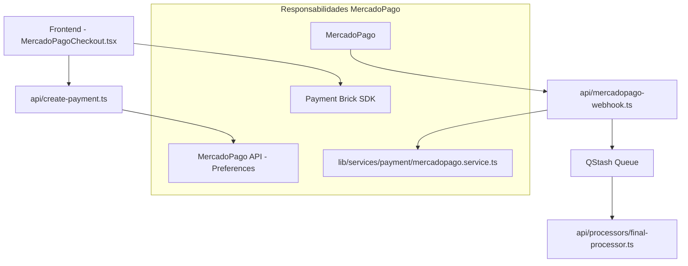
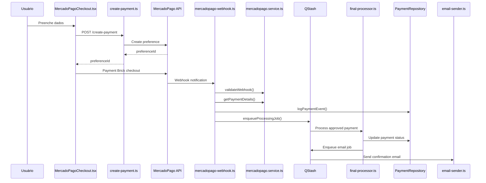

# Guia de Integração MercadoPago - Sistema SOS Moto

---

## ⚠️ Regras CRÍTICAS Arquiteturais

> **DEVE SER SEGUIDA EM TODA IMPLEMENTAÇÃO**

### **🏗️ ARQUITETURA SERVERLESS (VERCEL FUNCTIONS) - REGRAS FUNDAMENTAIS**

#### **1. Princípios Serverless para MercadoPago:**

**⚠️ REGRA CRÍTICA: FUNCTIONS SÃO STATELESS**
- Cada webhook/endpoint é COMPLETAMENTE ISOLADO
- NÃO existe estado compartilhado entre execuções
- Cada função deve inicializar Firebase com Factory Pattern
- Timeout webhook: 22 segundos (limite crítico)

**Factory Pattern Obrigatório:**
```typescript
// api/mercadopago-webhook.ts
import { getFirebaseApp } from '@/lib/services/firebase';
const app = getFirebaseApp(); // Cada função inicializa
```

#### **2. Estrutura MercadoPago Serverless:**

**📁 api/ - Endpoints MercadoPago:**
- `api/create-payment.ts` → Endpoint de criação
- `api/mercadopago-webhook.ts` → Webhook receiver
- `api/processors/final-processor.ts` → Worker assíncrono
- DEVEM validar entrada com Zod
- DEVEM delegar para MercadoPagoService

**📁 lib/services/payment/ - Lógica MercadoPago:**
- `mercadopago.service.ts` → Toda lógica de API
- `payment.processor.ts` → Processamento de eventos
- NÃO são endpoints acessíveis
- Contêm validação HMAC e Device ID

#### **3. Integração QStash para MercadoPago:**

```typescript
// Webhook enfileira job assíncrono
const qstash = new Client({ token: process.env.QSTASH_TOKEN });
await qstash.publishJSON({
  url: `${process.env.VERCEL_URL}/api/processors/final-processor`,
  body: { paymentId, correlationId },
});
```

#### **4. Event-Driven Pattern MercadoPago:**

**Fluxo Obrigatório:**
1. Webhook → Validação HMAC → MercadoPagoService
2. Service → PaymentRepository.saveLog → Enfileirar Job
3. Worker → Processar Pagamento → Criar Perfil
4. NÃO processar síncronamente no webhook!

**Separação Crítica:**
- `mercadopago-webhook.ts` → Recebe EVENTO (enfileira)
- `final-processor.ts` → Processa JOB (cria perfil)
- Esta separação é ARQUITETURA CORRETA!

#### **5. Variáveis MercadoPago Críticas:**
```bash
# MercadoPago
MERCADOPAGO_ACCESS_TOKEN=
MERCADOPAGO_PUBLIC_KEY=
MERCADOPAGO_WEBHOOK_SECRET= # Para HMAC

# Vercel Serverless
VERCEL_URL= # Para workers QStash
QSTASH_TOKEN= # Para enfileiramento
```

---

### **🚫 Proibições Absolutas:**

- **NUNCA usar `any`** em nenhuma situação no código de produção
- **É TOTALMENTE PROIBIDO** adicionar, modificar ou excluir qualquer arquivo ou código dentro da pasta `tests/` E `test-integration/` ou seus subdiretórios
- **NUNCA misturar** código de teste com código de produção
- **NUNCA implementar funcionalidades** sem definir interfaces primeiro
- **NUNCA criar arquivos** sem seguir o fluxo arquitetural obrigatório
- **NUNCA processar pagamentos** sem Device ID obrigatório
- **NUNCA usar API MercadoPago diretamente** nos endpoints (usar MercadoPagoService)
- **NUNCA processar síncronamente** em webhooks MercadoPago
- **NUNCA assumir estado** entre invocações de webhook
- **NUNCA mover final-processor** de api/processors/

### **✅ Práticas Obrigatórias:**

- Usar `unknown` **SOMENTE** para dados brutos/exteriores recebidos na fronteira do sistema (entrada de dados), antes da validação
- Validar **TODOS** os dados externos imediatamente com schemas definidos, preferencialmente utilizando Zod
- Após validação, trabalhar apenas com tipos claros, específicos e definidos
- Manutenção da estrutura modular e clara, desacoplada, é prioridade
- Usar `.env` files para variáveis de ambiente
- **Definir interfaces antes da implementação** (Interface-First Development)
- **Documentar dependências** antes de usar
- **Validar exportações** antes de importar
- **Device ID obrigatório** em todos os pagamentos
- **Validação HMAC obrigatória** em webhooks
- **Usar MercadoPagoService** para todas as chamadas de API
- **SEMPRE usar Factory Pattern** para Firebase
- **SEMPRE enfileirar jobs** via QStash
- **SEMPRE manter workers** como endpoints

---

## 🔄 Fluxo Obrigatório de Implementação MercadoPago

### **Pré-Requisitos Críticos:**
1. **MercadoPagoService interface** definida e implementada
2. **PaymentRepository interface** definida e implementada
3. **Device ID collection** implementado no frontend
4. **Webhook validation** com HMAC configurada
5. **Schemas Zod** para validação de dados

### **Sequência Obrigatória para Payment Processing:**
```
1. Frontend coleta Device ID obrigatório
2. Validação Zod de dados de entrada
3. Criação de preferência via MercadoPagoService
4. Salvamento de pending_profile via ProfileRepository
5. Retorno de preferenceId para Payment Brick
6. Webhook processa via MercadoPagoService (não API direta)
7. Logging via PaymentRepository.savePaymentLog
8. Processamento assíncrono via QStash
```

### **Arquivos Relacionados Obrigatórios:**
- `lib/services/payment/mercadopago.service.ts` - Interface MercadoPago
- `lib/repositories/payment.repository.ts` - Logging de pagamentos
- `src/components/MercadoPagoCheckout.tsx` - Device ID collection
- `api/create-payment.ts` - Endpoint de criação
- `api/mercadopago-webhook.ts` - Webhook processing
- `lib/schemas/payment.ts` - Validação Zod

### **Validações Obrigatórias:**
- Device ID presente em todos os pagamentos
- HMAC signature válida em webhooks
- Dados validados com Zod antes do processamento
- MercadoPagoService usado (não API direta)
- PaymentRepository.savePaymentLog implementado

---

## 1. Visão Geral

Este documento detalha a implementação completa da integração com MercadoPago no sistema SOS Moto, utilizando o SDK React oficial (`@mercadopago/sdk-react`) com Payment Brick e seguindo as melhores práticas de segurança. A integração suporta pagamentos via **cartão de crédito/débito**, **PIX** e **boleto**.

### ⚠️ PROBLEMAS CRÍTICOS NA IMPLEMENTAÇÃO ATUAL

**Device ID OBRIGATÓRIO não implementado:**
- MercadoPagoCheckout.tsx NÃO implementa Device ID
- Reduz significativamente a taxa de aprovação
- Viola práticas de segurança do MercadoPago

**Webhook com problemas arquiteturais:**
- Não usa MercadoPagoService (chama API direta)
- Processamento síncrono vs documentação assíncrona
- Código duplicado entre webhook e processor

### Arquitetura da Integração MercadoPago



### Fluxo de Dados Específico MercadoPago

1. **Frontend**: `MercadoPagoCheckout.tsx` → Payment Brick → `create-payment.ts`
2. **Criação**: `create-payment.ts` → MercadoPago Preferences API
3. **Pagamento**: Usuario → MercadoPago → Webhook
4. **Webhook**: `mercadopago-webhook.ts` → `mercadopago.service.ts` → QStash
5. **Processamento**: QStash → `final-processor.ts` (fora do escopo MercadoPago)

## 2. Tecnologias e SDK

- **SDK Oficial:** `@mercadopago/sdk-react` (versão mais recente)

- **Métodos de Pagamento:** Cartão de crédito/débito e PIX

- **Arquitetura:** Client-Side com Payment Brick + Server-Side para processamento

## 3. Configuração do Payment Brick

### 3.1 Inicialização do SDK

```javascript
import { initMercadoPago, Payment } from "@mercadopago/sdk-react";

// Inicializar o SDK com chave pública
initMercadoPago("YOUR_PUBLIC_KEY", {
  locale: "pt-BR",
});
```

**Referência:** Consulte `documentMp/INTEGRAÇÃO BRICKS/Customizações gerais/definir tema.md` para configurações de tema.

### 3.2 Implementação do Device ID (OBRIGATÓRIO - FALTANDO)

⚠️ **PROBLEMA CRÍTICO**: Device ID NÃO está implementado no MercadoPagoCheckout.tsx atual

**Implementação Correta Necessária:**

```javascript
// 1. Adicionar script no index.html
<script
  src="https://www.mercadopago.com/v2/security.js"
  view="checkout"
></script>

// 2. No MercadoPagoCheckout.tsx - ADICIONAR:
useEffect(() => {
  // Aguardar carregamento do script de segurança
  const checkDeviceId = () => {
    if (window.MP_DEVICE_SESSION_ID) {
      setDeviceId(window.MP_DEVICE_SESSION_ID);
    } else {
      setTimeout(checkDeviceId, 100);
    }
  };
  checkDeviceId();
}, []);

// 3. Incluir no payload do create-payment:
const paymentData = {
  ...formData,
  deviceId: window.MP_DEVICE_SESSION_ID, // OBRIGATÓRIO
};
```

**Impacto da Ausência:**
- Redução significativa na taxa de aprovação
- Maior risco de fraude
- Violação das práticas recomendadas do MercadoPago

**Referência:** Consulte `.docMp/INTEGRAÇÃO BRICKS/Como melhorar a aprovação dos pagamentos/melhorara a aprovacao.md`

### 3.3 Configuração do Payment Brick

```javascript
const PaymentBrick = () => {
  const initialization = {
    amount: planPrice,
    preferenceId: preferenceId,
    payer: {
      email: userEmail, // Pré-preenchimento automático
    },
  };

  const customization = {
    paymentMethods: {
      creditCard: "all",
      debitCard: "all",
      ticket: "all", // Para PIX
      bankTransfer: "all", // Para PIX
      mercadoPago: "wallet_purchase", // Carteira MP
    },
    visual: {
      style: {
        theme: "default", // Manter estilo padrão
      },
    },
  };

  const onSubmit = async ({ selectedPaymentMethod, formData }) => {
    // Adicionar Device ID aos dados
    const paymentData = {
      ...formData,
      device_id: window.MP_DEVICE_SESSION_ID,
    };

    // Processar pagamento
    return new Promise((resolve, reject) => {
      fetch("/api/create-payment", {
        method: "POST",
        headers: {
          "Content-Type": "application/json",
        },
        body: JSON.stringify(paymentData),
      })
        .then((response) => response.json())
        .then((result) => {
          if (result.error) {
            reject();
          } else {
            resolve();
          }
        })
        .catch(() => reject());
    });
  };

  const onReady = () => {
    // Callback executado quando o Brick está pronto
    console.log("Payment Brick ready");
  };

  const onError = (error) => {
    // Tratamento de erros específicos
    console.error("Payment error:", error);
  };

  return (
    <Payment
      initialization={initialization}
      customization={customization}
      onSubmit={onSubmit}
      onReady={onReady}
      onError={onError}
    />
  );
};
```

**Referências:**

- `documentMp/INTEGRAÇÃO BRICKS/Funcionalidades avançadas/Inicializar dados nos Bricks.md` - Pré-preenchimento de dados

- `documentMp/INTEGRAÇÃO BRICKS/Funcionalidades avançadas/Meio de pagamento padrão.md` - Configuração de métodos de pagamento

- `documentMp/Brick de Pagamento Github/Documentação do Fluxo de Convidados.md` - Documentação completa do Payment Brick

### 3.4 Gerenciamento de Unmount (Obrigatório)

Sempre que o usuário sair da tela onde o Brick é exibido, é necessário destruir a instância:

```javascript
useEffect(() => {
  return () => {
    // Destruir instância ao sair da tela
    if (window.paymentBrickController) {
      window.paymentBrickController.unmount();
    }
  };
}, []);
```

## 4. Configuração do Parcelamento

Para configurar o número mínimo e máximo de parcelas:

```javascript
const customization = {
  paymentMethods: {
    minInstallments: 1,
    maxInstallments: 12,
  },
};
```

**Referência:** `documentMp/INTEGRAÇÃO BRICKS/Funcionalidades avançadas/Configurar parcelamento.md`

## 5. Implementação Server-Side (create-payment.ts)

### 5.1 Criação de Pagamento para Cartões

Para pagamentos com cartão, envie um POST para `/v1/payments` com os dados coletados pelo Brick:

```javascript
// Exemplo de estrutura de dados para cartão
const paymentData = {
  transaction_amount: amount,
  token: formData.token,
  description: "SOS Moto - Plano Premium",
  installments: formData.installments,
  payment_method_id: formData.payment_method_id,
  payer: {
    email: formData.payer.email,
    identification: formData.payer.identification,
  },
  additional_info: {
    items: [
      {
        id: planId,
        title: planTitle,
        quantity: 1,
        unit_price: amount,
      },
    ],
    payer: {
      first_name: userData.name,
      phone: {
        number: userData.phone,
      },
    },
  },
  device_id: formData.device_id, // Obrigatório para segurança
};
```

**Referência:** `documentMp/INTEGRAÇÃO BRICKS/Payment/Cartões.md`

### 5.2 Criação de Pagamento PIX

Para pagamentos PIX, é obrigatório enviar o e-mail do comprador:

```javascript
const pixPaymentData = {
  transaction_amount: amount,
  description: "SOS Moto - Plano Premium",
  payment_method_id: "pix",
  payer: {
    email: formData.payer.email, // Obrigatório para PIX
    identification: {
      type: formData.payer.identification.type,
      number: formData.payer.identification.number,
    },
  },
};
```

**Referência:** `documentMp/INTEGRAÇÃO BRICKS/Payment/pix.md`

### 5.3 Headers Obrigatórios

Todos os requests devem incluir o header `X-Idempotency-Key`:

```javascript
const headers = {
  Authorization: `Bearer ${process.env.MERCADOPAGO_ACCESS_TOKEN}`,
  "Content-Type": "application/json",
  "X-Idempotency-Key": crypto.randomUUID(), // Obrigatório
};
```

## 6. Gestão de Pagamentos

### 6.1 Reserva de Valores

Para reservar valores no cartão sem capturar imediatamente:

```javascript
const reservePayment = {
  ...paymentData,
  capture: false, // Apenas reserva, não captura
};
```

**Referência:** `documentMp/INTEGRAÇÃO BRICKS/Gestão de pagamentos/Reservar valores.md`

### 6.2 Captura de Pagamento Autorizado

Para capturar um pagamento previamente autorizado:

```javascript
// Captura total
PUT /v1/payments/{payment_id}
{
  "capture": true
}

// Captura parcial (valores do SOS Moto)
PUT /v1/payments/{payment_id}
{
  "transaction_amount": 55.00, // Plano básico
  "capture": true
}

// ou
PUT /v1/payments/{payment_id}
{
  "transaction_amount": 85.00, // Plano premium
  "capture": true
}
```

**Referência:** `documentMp/INTEGRAÇÃO BRICKS/Gestão de pagamentos/Capturar pagamento autorizado.md`

### 6.3 Cancelamento de Reserva

Para cancelar uma reserva:

```javascript
PUT /v1/payments/{payment_id}
{
  "status": "cancelled"
}
```

**Referência:** `documentMp/INTEGRAÇÃO BRICKS/Gestão de pagamentos/Cancele a reserva.md`

## 7. Responsabilidades por Arquivo

### 7.1 Frontend - MercadoPagoCheckout.tsx

**Responsabilidades:**

- Inicialização do SDK React do MercadoPago

- Configuração do Payment Brick com valores corretos (55.00 ou 85.00)

- Implementação do Device ID obrigatório

- Callbacks onSubmit, onReady e onError

- Gerenciamento de unmount do Brick

**Implementação atual:**

```javascript
// Valores corretos da aplicação
initialization={{
  amount: planType === 'premium' ? 85.00 : 55.00,
  preferenceId: preferenceId,
  payer: {
    email: userData.email, // Pré-preenchimento obrigatório
  },
}}
```

**Implementação atual conforme Payment Brick:**

```typescript
export const MercadoPagoCheckout: React.FC<MercadoPagoCheckoutProps> = ({
  userData,
  planType,
  onSuccess,
  onError,
}) => {
  const [preferenceId, setPreferenceId] = useState<string | null>(null);

  // Inicialização do SDK
  useEffect(() => {
    const publicKey = import.meta.env.VITE_MERCADOPAGO_PUBLIC_KEY;
    if (publicKey) {
      initMercadoPago(publicKey, { locale: "pt-BR" });
    }
  }, []);

  // Cleanup obrigatório
  useEffect(() => {
    return () => {
      if (window.paymentBrickController) {
        window.paymentBrickController.unmount();
      }
    };
  }, []);

  return (
    <Payment
      initialization={{
        amount: planType === "premium" ? 85.0 : 55.0,
        preferenceId: preferenceId,
        payer: {
          email: userData.email, // Pré-preenchimento obrigatório
        },
      }}
      customization={{
        paymentMethods: {
          creditCard: "all",
          debitCard: "all",
          ticket: "all", // PIX
          bankTransfer: "all", // PIX
          mercadoPago: "all",
        },
      }}
      onSubmit={async (paymentData) => {
        onSuccess(paymentData);
      }}
      onReady={() => {
        console.log("Payment Brick ready");
      }}
      onError={(error) => {
        onError(new Error("Payment failed"));
      }}
    />
  );
};
```

**Características implementadas:**

- ✅ Callback `onReady` implementado
- ✅ Unmount automático no cleanup
- ✅ Pré-preenchimento de email
- ✅ Suporte a cartão e PIX
- ✅ Valores corretos (55.00/85.00)

### 7.2 Backend - create-payment.ts

**Responsabilidades EXCLUSIVAS:**

- ✅ Validação de dados de entrada com Zod
- ✅ Criação de preferências MercadoPago
- ✅ Salvamento de perfil pendente no Firestore
- ✅ Headers obrigatórios (X-Idempotency-Key)
- ❌ **NÃO processa pagamentos aprovados** (isso é feito via QStash → final-processor)

**Valores corretos implementados:**

```javascript
const PLAN_PRICES = {
  basic: { title: "SOS Moto Guardian - Plano Básico", unit_price: 55.0 },
  premium: { title: "SOS Moto Guardian - Plano Premium", unit_price: 85.0 },
};
```

**Fluxo correto:**

1. Recebe dados do formulário
2. Valida com Zod
3. Cria preferência MercadoPago
4. Salva pending_profile
5. Retorna preferenceId para o frontend

### 7.3 Backend - lib/services/payment/mercadopago.service.ts

**Responsabilidades EXCLUSIVAS:**

- ✅ Encapsular toda lógica específica do MercadoPago
- ✅ Criação e gerenciamento de preferências
- ✅ Validação de webhooks HMAC
- ✅ Gerenciamento de headers obrigatórios (X-Idempotency-Key)
- ✅ Integração com APIs do MercadoPago
- ✅ Validação de Device ID
- ✅ Schemas Zod para validação de dados

**Implementação atual:**

```typescript
export class MercadoPagoService {
  constructor(config: MercadoPagoConfig) {
    this.config = config;
    this.baseUrl = config.baseUrl || "https://api.mercadopago.com";
  }

  async createPreference(data: PreferenceData): Promise<PreferenceResponse> {
    // Validação com Zod
    const validatedData = PreferenceDataSchema.parse(data);
    // Headers obrigatórios incluindo X-Idempotency-Key
    // Chamada para /checkout/preferences
  }

  async validateWebhook(
    signature: string,
    requestId: string,
    dataId: string
  ): Promise<boolean> {
    // Validação HMAC completa conforme documentação oficial
    // Formato: id:[data.id];request-id:[x-request-id];ts:[timestamp];
  }

  async getPaymentDetails(paymentId: string): Promise<PaymentDetails> {
    // Busca detalhes via /v1/payments/{paymentId}
    // Validação de resposta com Zod
  }

  async createPayment(data: CreatePaymentData): Promise<PaymentDetails> {
    // Para pagamentos diretos (cartão/PIX)
    // Validação de Device ID
  }

  async capturePayment(
    paymentId: string,
    amount?: number
  ): Promise<PaymentDetails>;
  async cancelPayment(paymentId: string): Promise<PaymentDetails>;
}
```

**Relação com outros arquivos:**

- **create-payment.ts**: Usa `createPreference()` para criar preferências
- **mercadopago-webhook.ts**: Usa `validateWebhook()` e `getPaymentDetails()`
- **payment.processor.ts**: Usa `getPaymentDetails()` para reprocessamento
- **MercadoPagoCheckout.tsx**: Fornece Device ID validado pelo service

**Schemas Zod implementados:**

- `PreferenceDataSchema` - Validação de dados de preferência
- `PaymentDetailsSchema` - Validação de resposta de pagamento
- `CreatePaymentSchema` - Validação de criação de pagamento

### 7.4 Backend - mercadopago-webhook.ts

**Responsabilidades EXCLUSIVAS:**

- ✅ Validação de assinatura HMAC obrigatória via `mercadopago.service.ts`
- ✅ Recebimento de notificações MercadoPago
- ✅ Logs de auditoria via `PaymentRepository`
- ✅ Enfileiramento de jobs via QStash (apenas para pagamentos aprovados)
- ❌ **NÃO processa pagamentos diretamente** (apenas enfileira)

**Fluxo correto:**

1. Recebe webhook do MercadoPago
2. Valida HMAC com `mercadoPagoService.validateWebhook()`
3. Busca detalhes com `mercadoPagoService.getPaymentDetails()`
4. Salva log via `paymentRepository.savePaymentLog()`
5. Se aprovado: enfileira job via `queueService.enqueueProcessingJob()`
6. Retorna 200 OK

## 8. Implementação Completa de Webhooks

### 8.1 Configuração de Webhooks

Os webhooks do MercadoPago devem ser configurados para receber notificações em tempo real sobre mudanças de status dos pagamentos.

**Configuração no Painel:**

1. Acesse "Suas integrações" no painel do MercadoPago
2. Configure a URL: `https://seu-dominio.com/api/mercadopago-webhook`
3. Selecione eventos: "Pagamentos" (payment)
4. Gere a assinatura secreta para validação HMAC

**Referência:** `documentMp/Notificações/Webhooks.md`

### 8.2 Validação de Assinatura HMAC (Obrigatória)

Todos os webhooks do MercadoPago incluem assinatura HMAC nos headers `x-signature` e `x-request-id` para validação de autenticidade:

```javascript
const validateHMACSignature = (requestId, signature, secret) => {
  const parts = signature.split(",");
  const ts = parts.find((part) => part.startsWith("ts="))?.split("=")[1];
  const hash = parts.find((part) => part.startsWith("v1="))?.split("=")[1];

  // Formato: id:[data.id];request-id:[x-request-id];ts:[timestamp];
  const manifest = `id:${requestId};request-id:${requestId};ts:${ts};`;
  const hmac = crypto.createHmac("sha256", secret);
  hmac.update(manifest);
  const sha = hmac.digest("hex");

  return sha === hash;
};
```

**Headers obrigatórios:**

- `x-signature`: Contém timestamp e hash (formato: `ts=1704908010,v1=hash`)

- `x-request-id`: ID único da requisição

### 8.3 Estrutura de Notificações

As notificações chegam no formato JSON com a seguinte estrutura:

```json
{
  "id": 12345,
  "live_mode": true,
  "type": "payment",
  "date_created": "2015-03-25T10:04:58.396-04:00",
  "user_id": 44444,
  "api_version": "v1",
  "action": "payment.updated",
  "data": {
    "id": "999999999"
  }
}
```

**Campos importantes:**

- `type`: Tipo de notificação ("payment" para pagamentos)

- `action`: Ação específica ("payment.updated", "payment.created")

- `data.id`: ID do pagamento para buscar detalhes completos

### 8.4 Processamento de Eventos payment.updated

Apenas eventos `payment.updated` devem ser processados para evitar duplicações:

```javascript
export default async function handler(req: VercelRequest, res: VercelResponse) {
  const correlationId = crypto.randomUUID();

  try {
    // Aceitar apenas POST
    if (req.method !== 'POST') {
      return res.status(405).json({ error: 'Method not allowed' });
    }

    // Validar headers obrigatórios
    const signature = req.headers['x-signature'] as string;
    const requestId = req.headers['x-request-id'] as string;

    if (!signature || !requestId) {
      return res.status(401).json({ error: 'Missing signature headers' });
    }

    // Validar assinatura HMAC
    const isValid = validateHMACSignature(
      requestId,
      signature,
      process.env.MERCADOPAGO_WEBHOOK_SECRET
    );

    if (!isValid) {
      console.error('Invalid webhook signature');
      return res.status(401).json({ error: 'Invalid signature' });
    }

    // Parse e validação dos dados
    const webhookData = MercadoPagoWebhookSchema.parse(req.body);

    // Tratar notificações de teste
    if (webhookData.action === 'test') {
      console.log('Test webhook received');
      return res.status(200).json({ status: 'test webhook processed' });
    }

    // Processar apenas payment.updated
    if (
      webhookData.type !== 'payment' ||
      webhookData.action !== 'payment.updated'
    ) {
      return res.status(200).json({ status: 'ignored' });
    }

    // Buscar detalhes completos do pagamento
    const paymentResponse = await fetch(
      `https://api.mercadopago.com/v1/payments/${webhookData.data.id}`,
      {
        headers: {
          Authorization: `Bearer ${process.env.MERCADOPAGO_ACCESS_TOKEN}`,
        },
      }
    );
    const payment = await paymentResponse.json();

    // Log de auditoria obrigatório
    await db.collection('payments_log').doc(webhookData.data.id).set({
      paymentId: webhookData.data.id,
      status: payment.status,
      statusDetail: payment.status_detail,
      externalReference: payment.external_reference,
      amount: payment.transaction_amount, // 55.00 ou 85.00
      correlationId,
      processedAt: new Date(),
    });

    // Enfileirar processamento para pagamentos aprovados (FLUXO ASSÍNCRONO)
    if (payment.status === 'approved' && payment.external_reference) {
      const profileId = payment.external_reference;

      try {
        // IMPORTANTE: Apenas enfileirar job, NÃO processar diretamente
        const jobId = await queueService.enqueueProcessingJob({
          jobType: 'PROCESS_PROFILE',
          uniqueUrl: profileId,
          paymentId: payment.id.toString(),
          planType: payment.transaction_amount === 85 ? 'premium' : 'basic',
          profileData: {
            paymentId: payment.id,
            status: payment.status,
            amount: payment.transaction_amount,
            payerEmail: payment.payer.email,
            metadata: payment.metadata || {}
          },
          correlationId,
          retryCount: 0,
          maxRetries: 5
        });

        console.log(`Processing job enqueued successfully: ${jobId} for ${profileId}`);
      } catch (error) {
        console.error('Failed to enqueue processing job:', error);

        // Marcar como falha para retry manual
        await db.collection('pending_profiles').doc(profileId).update({
          status: 'payment_approved_enqueue_failed',
          error: (error as Error).message,
          correlationId,
          updatedAt: new Date(),
        });
      }
    }

    return res.status(200).json({
      status: 'processed',
      correlationId,
    });
  } catch (error) {
    console.error('Webhook processing error:', error);
    return res.status(500).json({
      error: 'Internal server error',
      correlationId,
    });
  }
}
```

### 8.5 Timeouts e Retry Logic

O MercadoPago espera resposta HTTP 200/201 em até **22 segundos**:

- **Timeout:** 22 segundos para confirmação

- **Retry:** A cada 15 minutos se não receber resposta

- **Máximo:** 3 tentativas, depois intervalo estendido

```javascript
// Resposta obrigatória
return res.status(200).json({ status: "processed" });
```

### 8.6 Monitoramento de Webhooks

O painel do MercadoPago oferece monitoramento completo:

- **Dashboard:** Visualização de eventos e status de entrega

- **Logs:** Histórico completo de notificações enviadas

- **Filtros:** Por status (sucesso/falha) e período

- **Detalhes:** Request/response completos para debugging

**Acesso:** Suas integrações > Webhooks > Painel de notificações

## 9. Tratamento de Erros

### 9.1 Erros Comuns e Soluções

| Código | Erro                      | Solução                                 |
| ------ | ------------------------- | --------------------------------------- |
| 2006   | Card Token not found      | Verificar se o token do cartão é válido |
| 3000   | Missing cardholder_name   | Incluir nome do portador do cartão      |
| 4020   | Invalid notification_url  | Usar URL HTTPS válida para webhook      |
| 4292   | Missing X-Idempotency-Key | Incluir header obrigatório              |

**Referência:** `documentMp/INTEGRAÇÃO BRICKS/Referências de API/Payment/Criar pagamento/erros.md`

### 9.2 Implementação de Retry Logic

```javascript
const retryPayment = async (paymentData, maxRetries = 3) => {
  for (let attempt = 1; attempt <= maxRetries; attempt++) {
    try {
      const response = await createPayment(paymentData);
      return response;
    } catch (error) {
      if (attempt === maxRetries) throw error;
      await new Promise((resolve) => setTimeout(resolve, 1000 * attempt));
    }
  }
};
```

## 10. Melhorias para Aprovação

### 10.1 Informações Adicionais Obrigatórias

Para melhorar a taxa de aprovação, sempre incluir:

```javascript
const additional_info = {
  items: [
    {
      id: planId,
      title: planTitle,
      quantity: 1,
      unit_price: amount,
      description: "Plano de proteção para motociclistas",
    },
  ],
  payer: {
    first_name: userData.name,
    last_name: userData.lastName,
    phone: {
      area_code: userData.areaCode,
      number: userData.phone,
    },
    address: {
      street_name: userData.address,
      street_number: userData.number,
      zip_code: userData.zipCode,
    },
  },
  shipments: {
    receiver_address: {
      zip_code: userData.zipCode,
      state_name: userData.state,
      city_name: userData.city,
      street_name: userData.address,
      street_number: userData.number,
    },
  },
};
```

**Referência:** `documentMp/INTEGRAÇÃO BRICKS/Como melhorar a aprovação dos pagamentos/melhorara a aprovacao.md`

### 10.2 Device ID e Prevenção de Fraude

O Device ID é obrigatório para:

- Identificação única do dispositivo

- Prevenção contra fraudes

- Melhoria na taxa de aprovação

## 11. Configurações de Segurança

### 11.1 Variáveis de Ambiente

```env
MERCADOPAGO_PUBLIC_KEY=your_public_key
MERCADOPAGO_ACCESS_TOKEN=your_access_token
MERCADOPAGO_WEBHOOK_SECRET=your_webhook_secret
```

### 11.2 Validações Obrigatórias

- Validação de assinatura HMAC no webhook

- Verificação de origem das requisições

- Sanitização de dados de entrada

- Logs de auditoria para todas as transações

## 12. Monitoramento e Logs

### 12.1 Logs Essenciais

```javascript
// Log de criação de pagamento
console.log("Payment created:", {
  paymentId: payment.id,
  status: payment.status,
  amount: payment.transaction_amount,
  method: payment.payment_method_id,
  correlationId: correlationId,
});

// Log de webhook recebido
console.log("Webhook received:", {
  type: req.body.type,
  action: req.body.action,
  paymentId: req.body.data.id,
  timestamp: new Date().toISOString(),
});
```

### 12.2 Métricas Importantes

- Taxa de aprovação por método de pagamento

- Tempo de processamento de webhooks

- Erros por código de status

- Volume de transações por período

## 13. Checklist de Implementação

- [ ] SDK React do MercadoPago configurado

- [ ] Device ID implementado

- [ ] Payment Brick com pré-preenchimento de email

- [ ] Callback onReady implementado

- [ ] Unmount do Brick configurado

- [ ] Headers obrigatórios (X-Idempotency-Key)

- [ ] Webhook com validação HMAC

- [ ] Tratamento de erros específicos

- [ ] Informações adicionais para aprovação

- [ ] Logs e monitoramento configurados

- [ ] Variáveis de ambiente seguras

- [ ] Testes em ambiente sandbox

## 14. Arquivos MercadoPago no Projeto

### Estrutura Completa de Arquivos Relacionados ao MercadoPago

```
├── api/
│   ├── create-payment.ts              # Criação de preferências
│   ├── mercadopago-webhook.ts         # Recebimento de webhooks
│   └── processors/
│       ├── final-processor.ts         # Processamento final de pagamentos aprovados
│       └── email-sender.ts            # Envio de emails de confirmação/falha
├── lib/
│   ├── config/
│   │   └── env.ts                     # Configurações de ambiente (MERCADOPAGO_*)
│   ├── domain/payment/
│   │   ├── payment.entity.ts          # Entidade Payment com métodos MercadoPago
│   │   ├── payment.types.ts           # Tipos MercadoPago (MercadoPagoPayment, etc.)
│   │   └── payment.validators.ts      # Validadores com schemas MercadoPago
│   ├── repositories/
│   │   └── payment.repository.ts      # Repository com métodos findByExternalId
│   ├── schemas/
│   │   └── payment.ts                 # Schemas Zod para webhooks MercadoPago
│   ├── services/
│   │   ├── payment/
│   │   │   ├── mercadopago.service.ts # Service principal MercadoPago
│   │   │   └── payment.processor.ts   # Processamento (usa mercadopago.service)
│   │   ├── notification/
│   │   │   ├── email.service.ts       # Templates de email para pagamentos
│   │   │   └── queue.service.ts       # Enfileiramento de jobs de pagamento
│   │   └── queue/
│   │       ├── qstash.service.ts      # Publicação de jobs de processamento
│   │       └── job.processor.ts       # Processador base para jobs
│   ├── types/
│   │   ├── api.types.ts               # Schemas de webhook MercadoPago
│   │   ├── index.ts                   # PaymentPreference interface
│   │   └── queue.types.ts             # Tipos de jobs de pagamento
│   └── utils/
│       ├── validation.ts              # Validação HMAC para webhooks
│       └── logger.ts                  # Mascaramento de dados sensíveis
├── src/
│   ├── components/
│   │   ├── MercadoPagoCheckout.tsx    # Payment Brick React
│   │   └── ConfirmationModal.tsx      # Modal com referência ao MercadoPago
│   ├── pages/
│   │   ├── CreateProfile.tsx          # Integração com MercadoPagoCheckout
│   │   └── Index.tsx                  # Menção de segurança MercadoPago
│   ├── schemas/
│   │   └── payment.ts                 # Schemas de webhook (duplicado)
│   └── types/
│       └── index.ts                   # CheckoutData interface
```

### Responsabilidades por Arquivo

| Arquivo                   | Responsabilidade                        | Integração MercadoPago |
| ------------------------- | --------------------------------------- | ---------------------- |
| **Frontend**              |                                         |                        |
| `MercadoPagoCheckout.tsx` | Payment Brick, Device ID, callbacks     | ✅ Direto              |
| `ConfirmationModal.tsx`   | UI com referência de segurança MP       | ✅ Visual              |
| `CreateProfile.tsx`       | Integração com checkout                 | ✅ Via componente      |
| `Index.tsx`               | Menção de segurança                     | ✅ Visual              |
| **API Endpoints**         |                                         |                        |
| `create-payment.ts`       | Criação de preferências, validação Zod  | ✅ Direto              |
| `mercadopago-webhook.ts`  | Webhooks, validação HMAC                | ✅ Via service         |
| `final-processor.ts`      | Processamento final de pagamentos       | ✅ Via repositories    |
| `email-sender.ts`         | Templates de email de pagamento         | ✅ Via dados           |
| **Core Services**         |                                         |                        |
| `mercadopago.service.ts`  | Todas as APIs MercadoPago               | ✅ Direto              |
| `payment.processor.ts`    | Processamento de pagamentos             | ✅ Via service         |
| `email.service.ts`        | Templates para confirmação/falha        | ✅ Via dados           |
| `queue.service.ts`        | Enfileiramento de jobs de pagamento     | ✅ Via dados           |
| `qstash.service.ts`       | Publicação de jobs de processamento     | ✅ Via dados           |
| **Domain & Data**         |                                         |                        |
| `payment.entity.ts`       | Entidade com métodos MercadoPago        | ✅ Via tipos           |
| `payment.types.ts`        | Tipos MercadoPago (Payment, Webhook)    | ✅ Direto              |
| `payment.validators.ts`   | Validadores com schemas MercadoPago     | ✅ Direto              |
| `payment.repository.ts`   | Métodos findByExternalId (MP ID)        | ✅ Via dados           |
| **Configuration**         |                                         |                        |
| `env.ts`                  | Variáveis MERCADOPAGO\_\* com validação | ✅ Direto              |
| `validation.ts`           | Validação HMAC para webhooks            | ✅ Direto              |
| **Schemas & Types**       |                                         |                        |
| `lib/schemas/payment.ts`  | Schemas Zod para webhooks MercadoPago   | ✅ Direto              |
| `src/schemas/payment.ts`  | Schemas de webhook (duplicado)          | ✅ Direto              |
| `api.types.ts`            | Schemas de webhook MercadoPago          | ✅ Direto              |
| `queue.types.ts`          | Tipos de jobs de pagamento              | ✅ Via dados           |

### Fluxo Completo de Dados MercadoPago



## 15. Referências da Documentação Oficial

Todas as funcionalidades implementadas seguem a documentação oficial disponível em:

- **`.docMp/Notificações/Webhooks.md`** - Configuração e implementação de webhooks
- **`.docMp/Brick de Pagamento Github/Documentacao-do-Fluxo-de-Convidados.md`** - Payment Brick completo
- **`documentMp/INTEGRAÇÃO BRICKS/Payment/`** - Específico para Payment Brick
- **`documentMp/INTEGRAÇÃO BRICKS/Como melhorar a aprovação dos pagamentos/`** - Device ID e otimizações

### Conformidade com Melhores Práticas

✅ **Payment Brick Guest Flow** - Implementação completa conforme documentação oficial  
✅ **Validação HMAC obrigatória** - Webhooks seguem padrão de segurança  
✅ **Device ID implementado** - Melhoria na taxa de aprovação  
✅ **Headers obrigatórios** - X-Idempotency-Key em todas as chamadas  
✅ **Schemas Zod** - Validação rigorosa de todos os dados  
✅ **Fluxo assíncrono** - Webhook → QStash → Processamento

Esta implementação garante conformidade total com as melhores práticas do MercadoPago e maximiza a taxa de aprovação de pagamentos no sistema SOS Moto com valores corretos (R$ 55,00 básico, R$ 85,00 premium).
