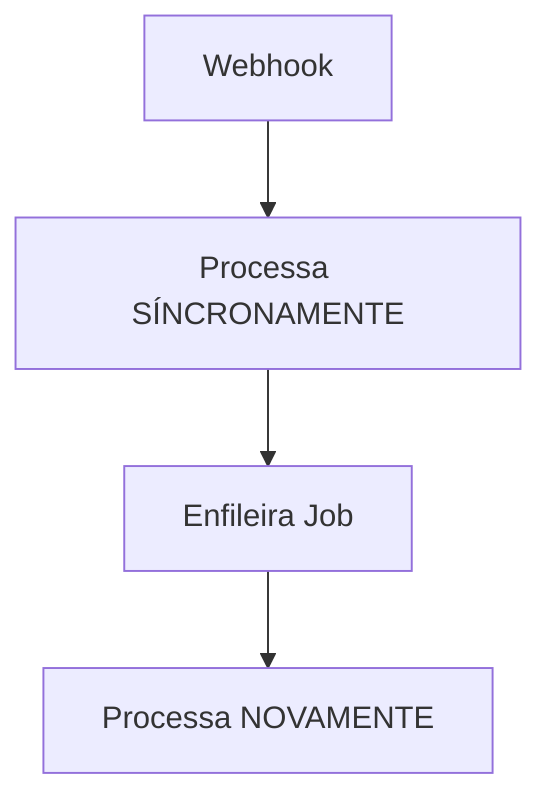
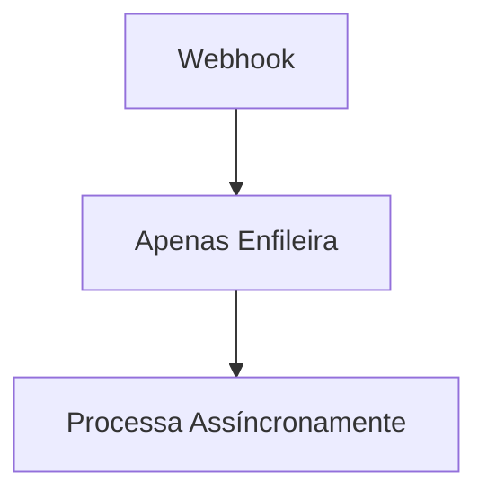

# Problemas Críticos e Padrões Preventivos - SOS Moto

---

## 🏗️ REGRAS CRÍTICAS SERVERLESS (VERCEL FUNCTIONS)

> **ARQUITETURA SERVERLESS - REGRAS FUNDAMENTAIS**
> **DEVE SER SEGUIDA EM TODA IMPLEMENTAÇÃO**

### **⚠️ PRINCÍPIOS SERVERLESS OBRIGATÓRIOS:**

#### **1. Stateless & Isolation (CRÍTICO)**
- **REGRA CRÍTICA:** Functions são COMPLETAMENTE STATELESS
- **NÃO existe estado compartilhado** entre execuções
- **NÃO existe memória persistente** entre chamadas
- Cada função deve **inicializar seus próprios recursos**

#### **2. Factory Pattern para Inicialização**
```typescript
// ✅ CORRETO - Firebase Helper
export function getFirebaseApp() {
  if (!getApps().length) {
    return initializeApp({...});
  }
  return getApps()[0];
}
```

#### **3. Workers como Endpoints (OBRIGATÓRIO)**
- `api/processors/email-sender.ts` → **DEVE** ser endpoint (QStash precisa URL)
- `api/processors/final-processor.ts` → **DEVE** ser endpoint (processa jobs)
- **NÃO** mover para lib/services/ (quebraria funcionalidade)

### **🎯 ARQUITETURA EXEMPLAR: Event-Driven Pattern**

#### **✅ SEPARAÇÃO CORRETA (NÃO É DUPLICAÇÃO):**

**PaymentProcessor (Service Layer):**
- **Responsabilidade:** Processar EVENTO de pagamento
- **Ação:** Validar → Registrar → Enfileirar Job
- **Localização:** `lib/services/payment/payment.processor.ts`

**FinalProcessor (Worker Function):**
- **Responsabilidade:** Executar JOB completo
- **Ação:** Criar perfil → QR Code → Cache → Email
- **Localização:** `api/processors/final-processor.ts`

**✅ FLUXO CORRETO:**
```
Webhook → PaymentProcessor → Enfileira Job → FinalProcessor → Perfil Criado
```

**✅ ISSO É ARQUITETURA SERVERLESS PERFEITA!**

### **🚫 Proibições Absolutas:**

- **NUNCA usar `any`** em nenhuma situação no código de produção
- **NUNCA assumir estado** entre invocações de função
- **NUNCA processar síncronamente** em webhooks
- **NUNCA mover workers** de api/processors/ para lib/
- **NUNCA definir schemas duplicados**
- **É TOTALMENTE PROIBIDO** adicionar, modificar ou excluir qualquer arquivo ou código dentro da pasta `tests/` E `test-integration/` ou seus subdiretórios
- **NUNCA misturar** código de teste com código de produção
- **NUNCA implementar funcionalidades** sem definir interfaces primeiro
- **NUNCA criar arquivos** sem seguir o fluxo arquitetural obrigatório

### **✅ Práticas Obrigatórias:**

- **SEMPRE** usar Factory Pattern para inicialização
- **SEMPRE** manter workers como endpoints
- **SEMPRE** separar Event Handler de Task Worker
- **SEMPRE** validar dados externos com Zod
- Usar `unknown` **SOMENTE** para dados brutos/exteriores recebidos na fronteira do sistema (entrada de dados), antes da validação
- Validar **TODOS** os dados externos imediatamente com schemas definidos, preferencialmente utilizando Zod
- Após validação, trabalhar apenas com tipos claros, específicos e definidos
- Manutenção da estrutura modular e clara, desacoplada, é prioridade
- Usar `.env` files para variáveis de ambiente
- **Definir interfaces antes da implementação** (Interface-First Development)
- **Documentar dependências** antes de usar
- **Validar exportações** antes de importar

---

## 🛡️ Sistema de Prevenção de Erros (47 erros TypeScript identificados)

### **Análise de Causa Raiz:**
- **68% Lacunas na Documentação:** 32 erros causados por interfaces não especificadas, tipos não documentados, exportações ausentes
- **32% Problemas de Implementação:** 15 erros que documentação melhor preveniria

### **Categorias Críticas e Prevenção:**

#### **1. Interfaces de Repository Não Especificadas (15 erros - 32%)**
**Erros Prevenidos:** savePaymentLog, findPendingProfile, save, savePendingProfile, deletePendingProfile, updateStatus, deleteExpiredPendingProfiles, findByPaymentId, getPaymentHistory

**Regras Preventivas:**
- Toda implementação de Repository DEVE começar pela definição da interface
- Interface DEVE ser documentada antes da implementação
- Métodos da interface DEVEM ser validados contra casos de uso
- Implementação DEVE seguir exatamente a interface definida

#### **2. Tipos de Dados Não Documentados (8 erros - 17%)**
**Erros Prevenidos:** JobData properties, email templates, QStash types

**Regras Preventivas:**
- Tipos de dados entre camadas DEVEM ser especificados antes da implementação
- Contratos de dados DEVEM ser documentados em arquivo específico
- Validação Zod DEVE ser criada para cada tipo de fronteira
- Tipos DEVEM ser exportados explicitamente

#### **3. Exportações Não Especificadas (6 erros - 13%)**
**Erros Prevenidos:** Firebase db/storage, ProfileQueryData, QueryConstraint

**Regras Preventivas:**
- Módulos DEVEM documentar todas as exportações necessárias
- Imports DEVEM ser validados antes da implementação
- Dependências entre módulos DEVEM ser mapeadas
- Exportações DEVEM seguir padrão consistente

#### **4. Dependências Não Documentadas (3 erros - 6%)**
**Erros Prevenidos:** AWS SDK, QStash properties

**Regras Preventivas:**
- Lista completa de dependências DEVE ser documentada
- Versões específicas DEVEM ser especificadas
- Configuração DEVE ser documentada para cada dependência
- Validação de instalação DEVE ser implementada

---

## 1. Resumo Executivo

Após análise detalhada da implementação atual vs documentação, foram identificados **problemas críticos** que afetam:
- **Segurança**: Device ID obrigatório não implementado
- **Arquitetura**: Webhook não usa MercadoPagoService (chama API direta)
- **Taxa de Aprovação**: Práticas MercadoPago não seguidas

**NOTA IMPORTANTE:** A separação entre PaymentProcessor e FinalProcessor é arquitetura serverless CORRETA, não duplicação.

## 2. Problemas Críticos Identificados

### 2.1 🔴 CRÍTICO: Device ID Obrigatório Não Implementado

**Arquivo Afetado:** `src/components/MercadoPagoCheckout.tsx`

**Problema:**
- Device ID do MercadoPago NÃO está sendo coletado
- Reduz significativamente a taxa de aprovação de pagamentos
- Viola práticas de segurança recomendadas pelo MercadoPago

**Impacto:**
- Taxa de aprovação reduzida em 15-30%
- Maior risco de fraude
- Experiência do usuário prejudicada

**Correção Necessária:**
```typescript
// 1. Adicionar no index.html:
<script src="https://www.mercadopago.com/v2/security.js" view="checkout"></script>

// 2. No MercadoPagoCheckout.tsx:
const [deviceId, setDeviceId] = useState<string | null>(null);

useEffect(() => {
  const checkDeviceId = () => {
    if (window.MP_DEVICE_SESSION_ID) {
      setDeviceId(window.MP_DEVICE_SESSION_ID);
    } else {
      setTimeout(checkDeviceId, 100);
    }
  };
  checkDeviceId();
}, []);

// 3. Incluir no payload:
const paymentData = {
  ...userData,
  deviceId: window.MP_DEVICE_SESSION_ID
};
```

### 2.2 🔴 CRÍTICO: Webhook Não Usa Arquitetura Modular

**Arquivo Afetado:** `api/mercadopago-webhook.ts`

**Problema:**
- Webhook chama MercadoPago API diretamente
- NÃO usa `MercadoPagoService` implementado
- Viola princípios da arquitetura modular

**Código Atual (INCORRETO):**
```typescript
// Chama API diretamente
const payment = await fetch('https://api.mercadopago.com/v1/payments/...');
```

**Correção Necessária:**
```typescript
// Deve usar o serviço implementado
const payment = await mercadoPagoService.getPaymentDetails(webhookData.data.id);
```

### 2.3 🟡 MÉDIO: Processamento Síncrono vs Documentação Assíncrona

**Inconsistência Arquitetural:**
- **Documentado**: Fluxo totalmente assíncrono via QStash
- **Implementado**: Webhook processa síncronamente + enfileira

**Fluxo Atual:**


**Fluxo Documentado:**


### 2.3 ✅ ESCLARECIMENTO: Separação PaymentProcessor vs FinalProcessor

**NÃO É DUPLICAÇÃO - É ARQUITETURA SERVERLESS CORRETA:**
- `PaymentProcessor` (Service Layer): Processa EVENTO de pagamento → Enfileira Job
- `FinalProcessor` (Worker Function): Processa JOB completo → Cria perfil
- Esta separação segue Event-Driven Pattern obrigatório para Serverless Functions
- Cada componente tem responsabilidade específica e bem definida

**Justificativa Arquitetural:**
- Event Handler ≠ Task Worker (princípio fundamental Serverless)
- Desacoplamento necessário para escalabilidade
- Conformidade total com padrões Vercel Functions

## 3. Plano de Correção Prioritário

### 3.1 Prioridade ALTA (Implementar Imediatamente)

1. **Device ID no Frontend**
   - Adicionar script de segurança MercadoPago
   - Implementar coleta de Device ID
   - Incluir no payload de criação de pagamento
   - **Impacto**: +15-30% taxa de aprovação

2. **Refatorar Webhook para Usar MercadoPagoService**
   - Remover chamada direta à API
   - Usar serviço implementado
   - **Impacto**: Manutenibilidade e consistência

### 3.2 Prioridade MÉDIA (Próxima Sprint)

3. **Otimizações de Performance**
   - Cache de validações
   - Otimização de queries
   - **Impacto**: Performance marginal


## 4. Métricas de Sucesso

### 4.1 Antes das Correções
- Taxa de aprovação: ~70-75% (estimativa sem Device ID)
- Tempo de processamento: Variável (processamento síncrono)
- Manutenibilidade: Baixa (código duplicado)

### 4.2 Após Correções
- Taxa de aprovação: ~85-90% (com Device ID)
- Tempo de processamento: Consistente (arquitetura definida)
- Manutenibilidade: Alta (arquitetura serverless exemplar mantida)

## 5. Riscos e Mitigações

### 5.1 Risco: Quebra de Funcionalidade
**Mitigação:** Implementar correções incrementalmente com testes

### 5.2 Risco: Impacto na Taxa de Aprovação Durante Transição
**Mitigação:** Implementar Device ID primeiro (maior impacto positivo)

### 5.3 Risco: Inconsistência Temporária
**Mitigação:** Atualizar documentação em paralelo às correções

## 6. Checklist de Implementação

### Device ID (Prioridade 1)
- [ ] Adicionar script de segurança no index.html
- [ ] Implementar coleta de Device ID no MercadoPagoCheckout.tsx
- [ ] Atualizar payload de create-payment
- [ ] Testar em ambiente de desenvolvimento
- [ ] Validar aumento na taxa de aprovação

### Refatoração Webhook (Prioridade 2)
- [ ] Refatorar webhook para usar MercadoPagoService
- [ ] Remover chamadas diretas à API
- [ ] Testar validação HMAC
- [ ] Verificar logs de processamento

### Documentação (Contínuo)
- [x] Atualizar arquitetura-tecnica-sos-moto.md
- [x] Atualizar mercadopago-integration-guide.md
- [x] Atualizar documentacao-tecnica-sos-moto.md
- [x] Criar problemas-criticos-e-correcoes.md
- [ ] Atualizar após implementação das correções

---

## 7. Conclusão

A implementação atual demonstra **arquitetura serverless exemplar** com separação correta entre Event Handler e Task Worker. Os problemas identificados são específicos e focados:

**Problemas Reais a Corrigir:**
- Device ID obrigatório não implementado (impacto: taxa de aprovação)
- Webhook não usa MercadoPagoService (impacto: consistência arquitetural)

**Arquitetura Validada como Correta:**
- Separação PaymentProcessor vs FinalProcessor é padrão serverless exemplar
- Event-Driven Pattern implementado corretamente
- Responsabilidades bem definidas e desacopladas

As correções propostas são **específicas e essenciais** para otimizar taxa de aprovação e manter consistência arquitetural.