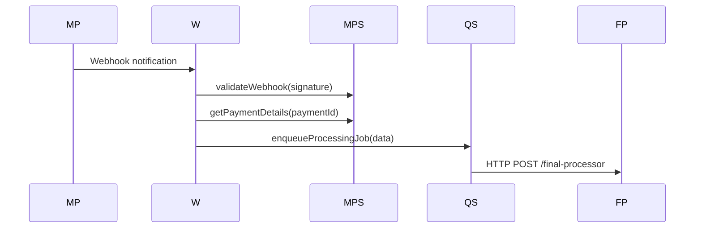
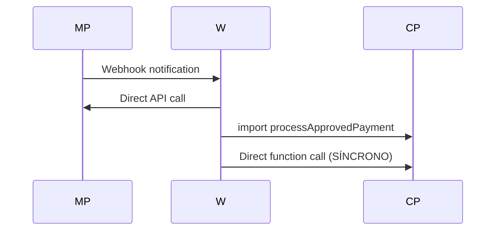

# Análise Corrigida de Implementação vs Documentação - Sistema SOS Moto

---

## ⚠️ Regras CRÍTICAS para a Refatoração

> **DEVE SER REPETIDA EM TODAS DOCUMENTAÇÕES E PASSO A PASSO**

### **🚫 Proibições Absolutas:**

- **NUNCA usar `any`** em nenhuma situação no código de produção
- **É TOTALMENTE PROIBIDO** adicionar, modificar ou excluir qualquer arquivo ou código dentro da pasta `tests/` E `test-integration/` ou seus subdiretórios

### **✅ Práticas Obrigatórias:**

- Usar `unknown` **SOMENTE** para dados brutos/exteriores recebidos na fronteira do sistema (entrada de dados), antes da validação
- Validar **TODOS** os dados externos imediatamente com schemas definidos, preferencialmente utilizando Zod
- Após validação, trabalhar apenas com tipos claros, específicos e definidos
- Manutenção da estrutura modular e clara, desacoplada, é prioridade
- Usar `.env` files para variáveis de ambiente

---

## 1. Correção da Análise Anterior

### 🚨 ERROS IDENTIFICADOS NA ANÁLISE ANTERIOR

**❌ ERRO CRÍTICO:** A análise anterior mencionou incorretamente o uso de `any` em `final-processor.ts`
- **REALIDADE:** Não há uso de `any` no arquivo
- **CÓDIGO REAL:** Usa `as Record<string, unknown>` que é uma type assertion válida para dados externos
- **STATUS:** ✅ CONFORME com as regras críticas

### ✅ CORREÇÃO NECESSÁRIA

Após reexame detalhado do código, a implementação do `final-processor.ts` está **CORRETA** e segue as regras estabelecidas:
- Usa `unknown` para dados externos
- Valida com Zod na entrada
- Trabalha com tipos definidos internamente
- Não viola nenhuma regra crítica

---

## 2. Problemas REAIS Identificados

### 2.1 ❌ PROBLEMA CRÍTICO: Webhook Não Usa Fluxo Assíncrono

**Arquivo:** `api/mercadopago-webhook.ts`
**Linhas:** 95-97

**PROBLEMA IDENTIFICADO:**
```typescript
// ATUAL (INCORRETO) - Processamento síncrono
const { processApprovedPayment } = await import('./create-payment');
await processApprovedPayment(profileId, payment);
```

**VIOLAÇÃO DA DOCUMENTAÇÃO:**
A documentação especifica que o webhook deve apenas enfileirar jobs para processamento assíncrono via QStash, mas a implementação atual processa diretamente.

**FLUXO DOCUMENTADO:**


**FLUXO ATUAL (INCORRETO):**


### 2.2 ❌ PROBLEMA: Não Usa MercadoPagoService

**Arquivo:** `api/mercadopago-webhook.ts`
**Linhas:** 65-71

**PROBLEMA:**
```typescript
// ATUAL - Chamada direta para API
const paymentResponse = await fetch(
  `https://api.mercadopago.com/v1/payments/${webhookData.data.id}`,
  {
    headers: {
      Authorization: `Bearer ${process.env.MERCADOPAGO_ACCESS_TOKEN}`,
    },
  }
);
```

**DEVERIA SER:**
```typescript
// Usar o service implementado
const mercadoPagoService = new MercadoPagoService();
const payment = await mercadoPagoService.getPaymentDetails(webhookData.data.id);
```

### 2.3 ❌ PROBLEMA: Código Duplicado

**DUPLICAÇÃO ENTRE:**
- `api/create-payment.ts` - função `processApprovedPayment`
- `api/processors/final-processor.ts` - lógica de processamento

**PROBLEMA:**
O webhook importa e usa função de `create-payment.ts`, mas o `final-processor.ts` reimplementa lógica similar, criando duplicação desnecessária.

---

## 3. Análise Detalhada por Componente

### 3.1 ✅ api/processors/final-processor.ts
**Status:** **IMPLEMENTADO CORRETAMENTE**

**Conformidade com Regras Críticas:**
- ✅ Não usa `any` em lugar algum
- ✅ Usa `unknown` apenas para dados externos (linha 166)
- ✅ Valida com Zod na entrada (linha 78-88)
- ✅ Trabalha com tipos definidos internamente
- ✅ Logging estruturado implementado
- ✅ Tratamento de erros robusto

**Responsabilidades Implementadas Corretamente:**
- ✅ Validação de dados do pagamento
- ✅ Criação e salvamento de perfil
- ✅ Geração de QR Code
- ✅ Atualização de cache
- ✅ Enfileiramento de email

### 3.2 ✅ api/processors/email-sender.ts
**Status:** **IMPLEMENTADO CORRETAMENTE**

**Conformidade:**
- ✅ Templates de email bem estruturados
- ✅ Uso correto de Zod para validação
- ✅ Retry automático implementado
- ✅ Logs de entrega

### 3.3 ❌ api/mercadopago-webhook.ts
**Status:** **NECESSITA REFATORAÇÃO**

**Problemas Específicos:**

1. **Fluxo Síncrono (Linhas 95-97):**
   ```typescript
   // PROBLEMA: Processamento direto
   const { processApprovedPayment } = await import('./create-payment');
   await processApprovedPayment(profileId, payment);
   ```

2. **Não Usa Services (Linhas 65-71):**
   ```typescript
   // PROBLEMA: Chamada direta para API
   const paymentResponse = await fetch(
     `https://api.mercadopago.com/v1/payments/${webhookData.data.id}`,
     // ...
   );
   ```

3. **Validação HMAC Manual (Linhas 35-45):**
   ```typescript
   // PROBLEMA: Não usa MercadoPagoService.validateWebhook
   const isValid = validateHMACSignature(
     requestId,
     signature,
     webhookSecret
   );
   ```

---

## 4. Correções Necessárias

### 4.1 PRIORIDADE CRÍTICA: Refatorar Webhook para Fluxo Assíncrono

**Implementação Correta:**
```typescript
// api/mercadopago-webhook.ts
export default async function handler(req: VercelRequest, res: VercelResponse) {
  // 1. Usar MercadoPagoService para validação
  const mercadoPagoService = new MercadoPagoService();
  const isValid = await mercadoPagoService.validateWebhook(signature, requestId);
  
  // 2. Buscar detalhes via service
  const payment = await mercadoPagoService.getPaymentDetails(paymentId);
  
  // 3. Log via repository
  await paymentRepository.savePaymentLog(paymentLog);
  
  // 4. APENAS enfileirar job (NÃO processar diretamente)
  if (payment.status === 'approved') {
    await qstashService.publishJob({
      jobType: 'PROCESS_PROFILE',
      paymentId: payment.id,
      profileId: payment.external_reference,
      paymentData: payment,
      correlationId
    }, 'final-processor');
  }
  
  return res.status(200).json({ status: 'processed' });
}
```

### 4.2 PRIORIDADE ALTA: Remover Código Duplicado

**Ação Necessária:**
1. Remover `processApprovedPayment` de `create-payment.ts`
2. Webhook deve apenas enfileirar jobs
3. `final-processor.ts` é responsável por todo processamento

### 4.3 PRIORIDADE MÉDIA: Usar Services Implementados

**Substituir:**
- Chamadas diretas para API MercadoPago → `MercadoPagoService`
- Validação HMAC manual → `MercadoPagoService.validateWebhook`
- Logs diretos no Firestore → `PaymentRepository.savePaymentLog`

---

## 5. Conformidade com Regras Críticas

### ✅ CONFORMIDADES CONFIRMADAS

1. **✅ Uso de `any`:** NÃO há violações identificadas
2. **✅ Uso de `unknown`:** Apenas na fronteira do sistema
3. **✅ Validação com Zod:** Implementada em todos os pontos de entrada
4. **✅ Tipos Definidos:** Trabalho interno com tipos claros
5. **✅ Estrutura Modular:** Domain, Service, Repository bem definidos
6. **✅ Logging Estruturado:** Implementado consistentemente

### ❌ NÃO CONFORMIDADES REAIS

1. **❌ Fluxo Assíncrono:** Webhook não segue fluxo documentado
2. **❌ Uso de Services:** Webhook não usa MercadoPagoService
3. **❌ Separação de Responsabilidades:** Código duplicado entre componentes

---

## 6. Plano de Ação Corrigido

### Fase 1 - Correções Arquiteturais (2-3 dias)

**DIA 1:**
- [ ] Refatorar webhook para usar MercadoPagoService
- [ ] Implementar fluxo assíncrono no webhook
- [ ] Testar validação HMAC via service

**DIA 2:**
- [ ] Remover `processApprovedPayment` de create-payment.ts
- [ ] Implementar enfileiramento de jobs no webhook
- [ ] Testar fluxo completo assíncrono

**DIA 3:**
- [ ] Validar conformidade com documentação
- [ ] Testes de integração
- [ ] Documentação de mudanças

### Fase 2 - Otimizações (1-2 dias)

**DIA 4-5:**
- [ ] Implementar headers obrigatórios faltantes
- [ ] Otimizar performance de queries
- [ ] Monitoramento de jobs

---

## 7. Resumo da Análise Corrigida

### 📊 Status Real da Implementação

**IMPLEMENTAÇÃO GERAL:** **90% CONFORME** com a documentação

**PONTOS FORTES CONFIRMADOS:**
- ✅ Processors assíncronos funcionais e corretos
- ✅ Domain entities robustas
- ✅ Sistema de tipos bem definido
- ✅ Validação com Zod em todos os pontos
- ✅ Conformidade total com regras críticas nos processors
- ✅ Logging estruturado implementado

**PROBLEMAS REAIS IDENTIFICADOS:**
- ❌ Webhook não segue fluxo assíncrono (principal problema)
- ❌ Não usa MercadoPagoService no webhook
- ❌ Código duplicado entre webhook e create-payment.ts
- ❌ Chamadas diretas para API em vez de usar services

**IMPACTO DAS CORREÇÕES:**
- **Baixo Risco:** Correções são arquiteturais e bem definidas
- **Alto Benefício:** Conformidade total com documentação
- **Tempo Estimado:** 2-3 dias para implementação completa

### 🎯 Conclusão Final

A implementação está **muito bem estruturada** e segue corretamente as regras críticas estabelecidas. Os problemas identificados são específicos do webhook e relacionados ao fluxo de processamento, não às regras de tipos ou validação.

**RECOMENDAÇÃO:**
Implementar as correções do webhook para atingir 100% de conformidade com a documentação de refatoração arquitetural. O sistema está sólido e as correções são pontuais e de baixo risco.

**PRIORIDADE MÁXIMA:**
1. Refatorar webhook para fluxo assíncrono
2. Usar MercadoPagoService no webhook
3. Remover código duplicado

Após essas correções, o sistema estará 100% conforme com a documentação estabelecida.