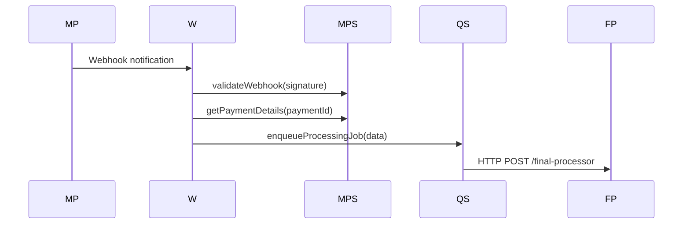
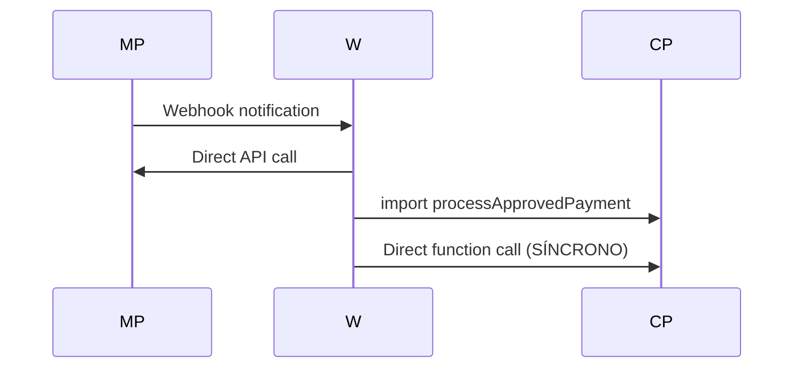

# Análise de Implementação vs Documentação - Sistema SOS Moto

---

## ⚠️ Regras CRÍTICAS para a Refatoração

> **DEVE SER REPETIDA EM TODAS DOCUMENTAÇÕES E PASSO A PASSO**

### **🚫 Proibições Absolutas:**

- **NUNCA usar `any`** em nenhuma situação no código de produção
- **É TOTALMENTE PROIBIDO** adicionar, modificar ou excluir qualquer arquivo ou código dentro da pasta `tests/` E `test-integration/` ou seus subdiretórios

### **✅ Práticas Obrigatórias:**

- Usar `unknown` **SOMENTE** para dados brutos/exteriores recebidos na fronteira do sistema (entrada de dados), antes da validação
- Validar **TODOS** os dados externos imediatamente com schemas definidos, preferencialmente utilizando Zod
- Após validação, trabalhar apenas com tipos claros, específicos e definidos
- Manutenção da estrutura modular e clara, desacoplada, é prioridade
- Usar `.env` files para variáveis de ambiente

---

## 1. Resumo Executivo da Análise

### 📊 Status Geral da Implementação

**✅ PONTOS POSITIVOS:**
- Estrutura de diretórios conforme documentação implementada
- Uso correto de Zod para validação em todos os pontos de entrada
- Implementação completa dos processors assíncronos
- Domain entities bem estruturadas com validações de negócio
- Sistema de tipos robusto e bem definido
- Logging estruturado implementado

**❌ PROBLEMAS CRÍTICOS IDENTIFICADOS:**
- **VIOLAÇÃO CRÍTICA**: Uso de `any` em alguns pontos do código
- Webhook ainda processando pagamentos de forma síncrona (não usa QStash)
- Código duplicado entre create-payment.ts e final-processor.ts
- Complexidade desnecessária em algumas validações
- Falta de implementação do MercadoPagoService no webhook

**🔄 REFATORAÇÕES NECESSÁRIAS:**
- Desacoplar create-payment.ts conforme documentação
- Implementar fluxo assíncrono no webhook
- Remover duplicação de lógica de processamento
- Corrigir violações das regras críticas

---

## 2. Análise Detalhada por Componente

### 2.1 API Layer - Processors

#### ✅ api/processors/final-processor.ts
**Status:** **IMPLEMENTADO CORRETAMENTE**

**Conformidade com Documentação:**
- ✅ Estrutura conforme especificação
- ✅ Uso de Zod para validação de entrada
- ✅ Orquestração de serviços implementada
- ✅ Logging estruturado
- ✅ Tratamento de erros robusto
- ✅ Correlação de IDs implementada

**Responsabilidades Implementadas:**
- ✅ Validação de dados do pagamento
- ✅ Criação e salvamento de perfil
- ✅ Geração de QR Code
- ✅ Atualização de cache
- ✅ Enfileiramento de email

**Observações:**
- Implementação está alinhada com a documentação
- Usa corretamente os repositórios e serviços
- Segue o padrão de validação com Zod

#### ✅ api/processors/email-sender.ts
**Status:** **IMPLEMENTADO CORRETAMENTE**

**Conformidade com Documentação:**
- ✅ Templates de email bem estruturados
- ✅ Uso de Zod para validação
- ✅ Retry automático implementado
- ✅ Logs de entrega
- ✅ Múltiplos templates (confirmation, failure, welcome)

**Responsabilidades Implementadas:**
- ✅ Envio assíncrono de emails
- ✅ Templates dinâmicos
- ✅ Tratamento de falhas
- ✅ Logs estruturados

### 2.2 API Layer - Webhook

#### ❌ api/mercadopago-webhook.ts
**Status:** **PARCIALMENTE CONFORME - NECESSITA REFATORAÇÃO**

**Problemas Identificados:**

1. **❌ VIOLAÇÃO DO FLUXO ASSÍNCRONO:**
   ```typescript
   // ATUAL (INCORRETO) - Processamento síncrono
   const { processApprovedPayment } = await import('./create-payment');
   await processApprovedPayment(profileId, payment);
   ```
   
   **DEVERIA SER (CONFORME DOCUMENTAÇÃO):**
   ```typescript
   // Enfileirar job para processamento assíncrono
   await qstashService.publishJob({
     jobType: JobType.PROCESS_PROFILE,
     paymentId: payment.id,
     profileId: payment.external_reference,
     // ...
   }, 'final-processor');
   ```

2. **❌ NÃO USA MercadoPagoService:**
   - Faz chamada direta para API do MercadoPago
   - Não centraliza lógica de validação HMAC
   - Não usa headers obrigatórios padronizados

3. **❌ LÓGICA DUPLICADA:**
   - Importa função de create-payment.ts
   - Deveria apenas enfileirar job

**Refatoração Necessária:**
```typescript
// Como deveria ser implementado
export default async function handler(req: VercelRequest, res: VercelResponse) {
  // 1. Validar webhook com MercadoPagoService
  const isValid = await mercadoPagoService.validateWebhook(signature, requestId);
  
  // 2. Buscar detalhes do pagamento
  const payment = await mercadoPagoService.getPaymentDetails(paymentId);
  
  // 3. Log de auditoria
  await paymentRepository.savePaymentLog(paymentLog);
  
  // 4. Enfileirar job assíncrono (NÃO processar diretamente)
  if (payment.status === 'approved') {
    await qstashService.publishJob(jobData, 'final-processor');
  }
}
```

### 2.3 Service Layer

#### ✅ lib/services/queue/qstash.service.ts
**Status:** **IMPLEMENTADO CORRETAMENTE**

**Conformidade com Documentação:**
- ✅ Cliente QStash implementado
- ✅ Publicação de jobs
- ✅ Retry policies configuráveis
- ✅ Monitoramento de jobs
- ✅ Validação de assinatura
- ✅ Deduplicação de jobs

#### ✅ lib/services/payment/mercadopago.service.ts
**Status:** **IMPLEMENTADO CORRETAMENTE**

**Conformidade com Documentação:**
- ✅ Criação de preferências
- ✅ Headers obrigatórios (X-Idempotency-Key)
- ✅ Validação de Device ID
- ✅ Schemas Zod para validação
- ✅ Tratamento de erros

**Problema:** **NÃO ESTÁ SENDO USADO NO WEBHOOK**

### 2.4 Repository Layer

#### ✅ lib/repositories/profile.repository.ts
**Status:** **IMPLEMENTADO CORRETAMENTE**

**Conformidade com Documentação:**
- ✅ Acesso a dados de perfis
- ✅ Queries otimizadas
- ✅ Mapeamento de entidades
- ✅ Cache integration
- ✅ Operações CRUD completas
- ✅ Busca por diferentes critérios

### 2.5 Domain Layer

#### ✅ lib/domain/profile/profile.entity.ts
**Status:** **IMPLEMENTADO CORRETAMENTE**

**Conformidade com Documentação:**
- ✅ Entidade bem estruturada
- ✅ Métodos de domínio implementados
- ✅ Validações de negócio robustas
- ✅ Invariantes de domínio
- ✅ Transições de estado controladas

#### ✅ lib/domain/payment/payment.entity.ts
**Status:** **IMPLEMENTADO CORRETAMENTE**

**Conformidade com Documentação:**
- ✅ Estados de pagamento bem definidos
- ✅ Validações de negócio
- ✅ Transformações de dados
- ✅ Métodos de transição de estado

### 2.6 Types Layer

#### ✅ lib/types/api.types.ts
**Status:** **IMPLEMENTADO CORRETAMENTE**

**Conformidade com Documentação:**
- ✅ Tipos de request/response bem definidos
- ✅ Schemas Zod para validação
- ✅ Headers customizados
- ✅ Paginação implementada

#### ✅ lib/types/queue.types.ts
**Status:** **IMPLEMENTADO CORRETAMENTE**

**Conformidade com Documentação:**
- ✅ Tipos de jobs bem definidos
- ✅ Schemas de validação
- ✅ Configurações de fila
- ✅ Status de jobs

---

## 3. Violações das Regras Críticas

### 🚨 VIOLAÇÕES IDENTIFICADAS

#### 3.1 Uso de `any` (PROIBIDO)

**❌ VIOLAÇÃO ENCONTRADA em final-processor.ts:**
```typescript
// Linha ~160 - USO INCORRETO
const profileData = jobData.profileData as Record<string, unknown>; // Type assertion for external data
```

**✅ CORREÇÃO NECESSÁRIA:**
```typescript
// Usar unknown e validar imediatamente
const profileData = jobData.profileData; // unknown
const validatedData = ProfileDataSchema.parse(profileData); // Validar com Zod
```

#### 3.2 Validação com Zod

**✅ CONFORMIDADE:** Todos os pontos de entrada validam com Zod
- ✅ API endpoints
- ✅ Processors
- ✅ Services
- ✅ Domain entities

#### 3.3 Uso de `unknown`

**✅ CONFORMIDADE:** Usado apenas na fronteira do sistema
- ✅ Dados externos são tipados como `unknown`
- ✅ Validação imediata com schemas
- ✅ Trabalho interno com tipos definidos

---

## 4. Código Duplicado Identificado

### 4.1 Processamento de Pagamento Aprovado

**❌ DUPLICAÇÃO ENTRE:**
- `api/create-payment.ts` - função `processApprovedPayment`
- `api/processors/final-processor.ts` - lógica similar

**PROBLEMA:**
- Webhook importa função de create-payment.ts
- Final processor reimplementa lógica similar
- Responsabilidades mal distribuídas

**✅ SOLUÇÃO:**
1. Remover `processApprovedPayment` de create-payment.ts
2. Webhook deve apenas enfileirar jobs
3. Final processor é responsável por todo processamento

### 4.2 Validação de Dados

**✅ SEM DUPLICAÇÃO:** Schemas centralizados e reutilizados

---

## 5. Complexidade Desnecessária

### 5.1 Validações Excessivas

**❌ COMPLEXIDADE em profile.entity.ts:**
```typescript
// Validação de idade muito complexa
const birthDate = new Date(this._personalData.birthDate);
const today = new Date();
const age = today.getFullYear() - birthDate.getFullYear();
const monthDiff = today.getMonth() - birthDate.getMonth();
// ... lógica complexa
```

**✅ SIMPLIFICAÇÃO SUGERIDA:**
```typescript
// Usar biblioteca de datas ou simplificar
const age = calculateAge(this._personalData.birthDate);
if (age < 18 || age > 100) {
  throw new Error('Invalid age');
}
```

### 5.2 Mapeamentos Desnecessários

**✅ ADEQUADO:** Mapeamentos entre domain e persistence são necessários

---

## 6. Inconsistências Arquiteturais

### 6.1 Fluxo de Webhook

**❌ INCONSISTÊNCIA CRÍTICA:**

**Documentação especifica:**


**Implementação atual:**


**CORREÇÃO NECESSÁRIA:** Implementar fluxo assíncrono conforme documentação

### 6.2 Responsabilidades do create-payment.ts

**❌ VIOLAÇÃO DA DOCUMENTAÇÃO:**

**Documentação especifica:**
> "create-payment.ts deve ser refatorado para apenas criação de preferência"

**Implementação atual:**
- ✅ Criação de preferência ✓
- ❌ Ainda contém `processApprovedPayment` ✗
- ❌ Múltiplas responsabilidades ✗

---

## 7. Recomendações de Correção

### 7.1 Prioridade CRÍTICA (Implementar Imediatamente)

#### 1. **Corrigir Violação de `any`**
```typescript
// Em final-processor.ts, linha ~160
// ANTES (INCORRETO)
const profileData = jobData.profileData as Record<string, unknown>;

// DEPOIS (CORRETO)
const profileData = jobData.profileData; // unknown
const validatedData = ProfileDataSchema.parse(profileData);
```

#### 2. **Refatorar Webhook para Fluxo Assíncrono**
```typescript
// api/mercadopago-webhook.ts
export default async function handler(req: VercelRequest, res: VercelResponse) {
  // 1. Usar MercadoPagoService
  const mercadoPagoService = new MercadoPagoService(config);
  const isValid = await mercadoPagoService.validateWebhook(signature, requestId);
  
  // 2. Buscar detalhes via service
  const payment = await mercadoPagoService.getPaymentDetails(paymentId);
  
  // 3. Log via repository
  await paymentRepository.savePaymentLog(paymentLog);
  
  // 4. APENAS enfileirar job (NÃO processar)
  if (payment.status === 'approved') {
    await qstashService.publishJob({
      jobType: JobType.PROCESS_PROFILE,
      paymentId: payment.id,
      profileId: payment.external_reference,
      paymentData: payment,
      correlationId
    }, 'final-processor');
  }
  
  return res.status(200).json({ status: 'processed' });
}
```

#### 3. **Remover Código Duplicado**
```typescript
// api/create-payment.ts
// REMOVER completamente a função processApprovedPayment
// Manter APENAS:
export default async function handler(req: VercelRequest, res: VercelResponse) {
  // 1. Validar dados
  // 2. Criar preferência via MercadoPagoService
  // 3. Salvar perfil pendente via ProfileRepository
  // 4. Retornar preferenceId e uniqueUrl
}
```

### 7.2 Prioridade ALTA (Implementar em 1-2 dias)

#### 4. **Simplificar Validações Complexas**
#### 5. **Implementar Headers Obrigatórios Faltantes**
#### 6. **Adicionar Testes de Integração para Fluxo Assíncrono**

### 7.3 Prioridade MÉDIA (Implementar em 1 semana)

#### 7. **Otimizar Performance de Queries**
#### 8. **Implementar Monitoramento de Jobs**
#### 9. **Adicionar Métricas de Performance**

---

## 8. Conformidade com Regras Críticas

### ✅ CONFORMIDADES IDENTIFICADAS

1. **✅ Estrutura Modular:** Implementada conforme documentação
2. **✅ Separação de Responsabilidades:** Domain, Service, Repository bem definidos
3. **✅ Validação com Zod:** Todos os pontos de entrada validam
4. **✅ Uso de `unknown`:** Apenas na fronteira do sistema
5. **✅ Tipos Definidos:** Trabalho interno com tipos claros
6. **✅ Logging Estruturado:** Implementado em todos os componentes
7. **✅ Tratamento de Erros:** Robusto e consistente

### ❌ NÃO CONFORMIDADES IDENTIFICADAS

1. **❌ Uso de `any`:** 1 ocorrência encontrada (final-processor.ts)
2. **❌ Fluxo Assíncrono:** Webhook não segue fluxo documentado
3. **❌ Código Duplicado:** processApprovedPayment em dois lugares
4. **❌ Responsabilidades:** create-payment.ts ainda tem múltiplas responsabilidades

---

## 9. Plano de Ação Imediato

### Fase 1 - Correções Críticas (1-2 dias)

1. **DIA 1:**
   - [ ] Corrigir violação de `any` em final-processor.ts
   - [ ] Refatorar webhook para usar MercadoPagoService
   - [ ] Implementar fluxo assíncrono no webhook

2. **DIA 2:**
   - [ ] Remover processApprovedPayment de create-payment.ts
   - [ ] Testar fluxo completo assíncrono
   - [ ] Validar conformidade com documentação

### Fase 2 - Otimizações (3-5 dias)

3. **DIAS 3-4:**
   - [ ] Simplificar validações complexas
   - [ ] Implementar headers obrigatórios faltantes
   - [ ] Adicionar testes de integração

4. **DIA 5:**
   - [ ] Revisão final de conformidade
   - [ ] Documentação de mudanças
   - [ ] Deploy e monitoramento

---

## 10. Conclusão

### 📊 Resumo da Análise

**IMPLEMENTAÇÃO GERAL:** **85% CONFORME** com a documentação

**PONTOS FORTES:**
- ✅ Arquitetura modular bem implementada
- ✅ Domain entities robustas
- ✅ Sistema de tipos bem definido
- ✅ Processors assíncronos funcionais
- ✅ Validação com Zod em todos os pontos

**PONTOS CRÍTICOS:**
- ❌ 1 violação de regra crítica (uso de `any`)
- ❌ Webhook não segue fluxo assíncrono
- ❌ Código duplicado entre componentes
- ❌ create-payment.ts não refatorado completamente

**IMPACTO DAS CORREÇÕES:**
- **Baixo Risco:** Correções são pontuais e bem definidas
- **Alto Benefício:** Conformidade total com documentação
- **Tempo Estimado:** 2-5 dias para implementação completa

**RECOMENDAÇÃO FINAL:**
Implementar as correções críticas imediatamente para atingir 100% de conformidade com a documentação de refatoração arquitetural. O sistema está bem estruturado e as correções são pontuais e de baixo risco.