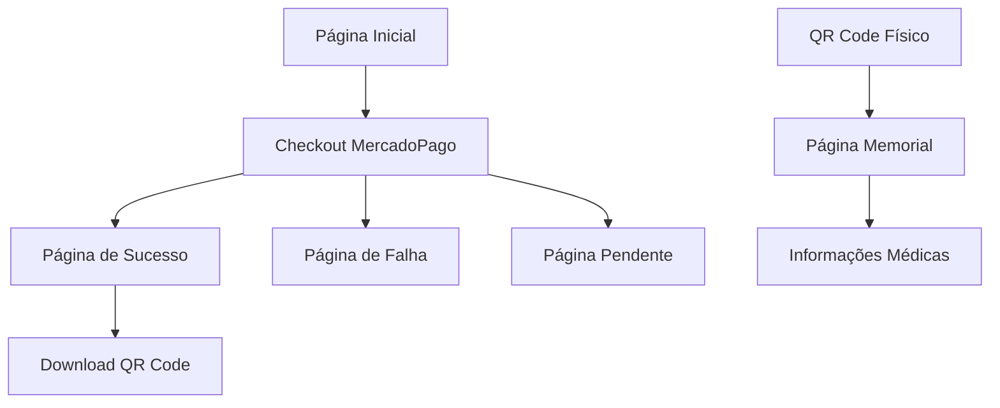
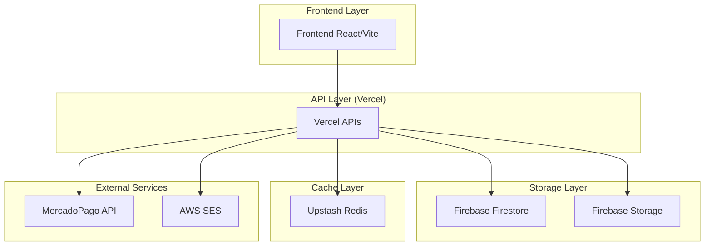
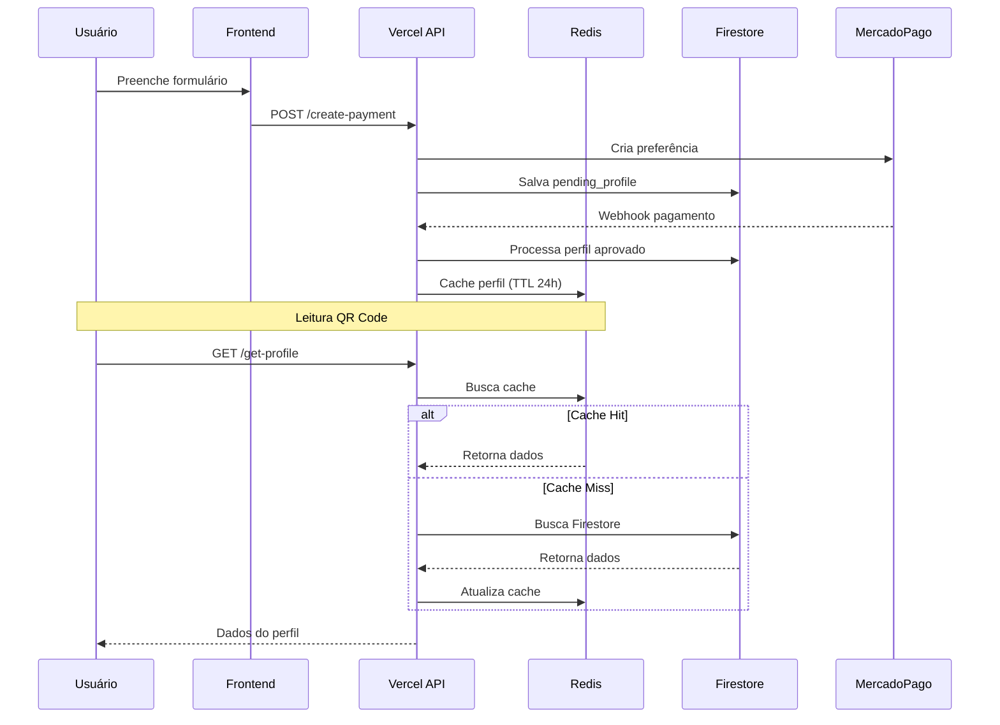
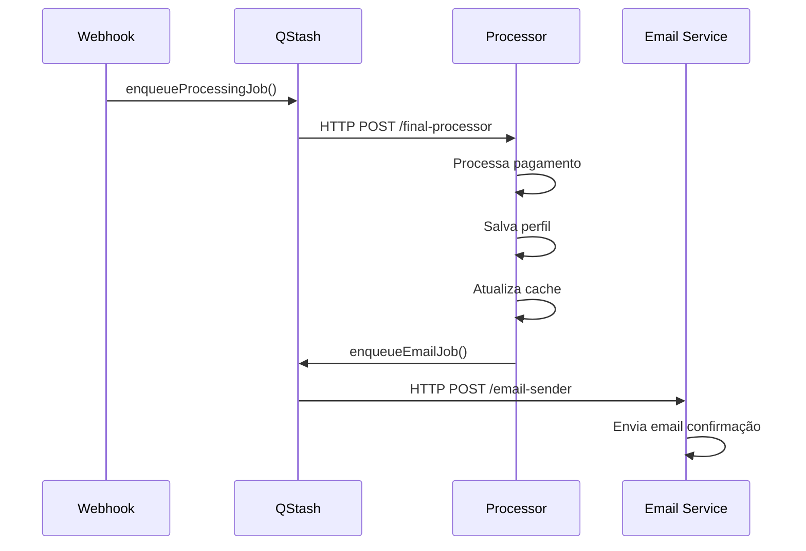

# Documentação Técnica - Sistema SOS Moto

## 1. Visão Geral do Produto

O SOS Moto é uma plataforma de emergência médica para motociclistas que permite criar perfis médicos digitais acessíveis via QR Code. O sistema processa pagamentos via MercadoPago, gera QR Codes únicos e disponibiliza informações médicas críticas para socorristas em situações de emergência.

- **Objetivo Principal**: Fornecer acesso rápido a informações médicas vitais de motociclistas em emergências
- **Público-Alvo**: Motociclistas, socorristas e profissionais de saúde
- **Valor de Mercado**: Redução do tempo de resposta em emergências médicas, potencialmente salvando vidas

## 2. Funcionalidades Principais

### 2.1 Papéis de Usuário

| Papel | Método de Registro | Permissões Principais |
|-------|-------------------|----------------------|
| Motociclista | Pagamento via MercadoPago | Criar perfil médico, visualizar QR Code |
| Socorrista | Acesso via QR Code | Visualizar informações médicas de emergência |

### 2.2 Módulos Funcionais

Nosso sistema consiste nas seguintes páginas principais:

1. **Página Inicial**: formulário de criação de perfil, seleção de planos, integração com checkout MercadoPago
2. **Página de Sucesso**: confirmação de pagamento, exibição do QR Code gerado
3. **Página Memorial**: visualização das informações médicas via QR Code
4. **Páginas de Status**: falha e pendência de pagamento

### 2.3 Detalhes das Páginas

| Nome da Página | Módulo | Descrição da Funcionalidade |
|----------------|--------|-----------------------------|
| Página Inicial | Formulário de Perfil | Coleta dados pessoais, médicos e contatos de emergência. Integração com checkout MercadoPago modal |
| Página Inicial | Seleção de Planos | Oferece planos Básico (R$ 55) e Premium (R$ 85) com diferentes funcionalidades |
| Página Inicial | Checkout MercadoPago | Modal integrado para processamento de pagamentos com SDK React |
| Página de Sucesso | Exibição QR Code | Mostra QR Code gerado e link para download da imagem PNG |
| Página Memorial | Visualização de Dados | Exibe informações médicas, contatos de emergência e dados vitais |
| Páginas de Status | Feedback de Pagamento | Informa status de falha ou pendência no processamento |

## 3. Fluxo Principal do Sistema

### 3.1 Fluxo do Usuário

**Fluxo do Motociclista:**
1. Acessa página inicial e preenche formulário médico
2. Seleciona plano (Básico ou Premium)
3. Realiza pagamento via checkout MercadoPago modal
4. Recebe confirmação e acesso ao QR Code
5. Baixa imagem PNG do QR Code para uso físico

**Fluxo do Socorrista:**
1. Escaneia QR Code do motociclista
2. Acessa página memorial com informações médicas
3. Visualiza dados críticos para atendimento de emergência

### 3.2 Diagrama de Navegação



## 4. Arquitetura Técnica Atual

### 4.1 Diagrama de Arquitetura



### 4.2 Stack Tecnológico

- **Frontend**: React@18 + Vite + TailwindCSS + shadcn/ui
- **Backend**: Vercel Functions (Node.js)
- **Banco de Dados**: Firebase Firestore
- **Storage**: Firebase Storage
- **Cache**: Upstash Redis
- **Pagamentos**: MercadoPago SDK
- **Email**: AWS SES
- **Validação**: Zod
- **QR Code**: qrcode + qrcode.react

### 4.3 Definição de Rotas

| Rota | Propósito |
|------|----------|
| / | Página inicial com formulário e checkout |
| /success | Página de sucesso com QR Code |
| /failure | Página de falha no pagamento |
| /pending | Página de pagamento pendente |
| /memorial/:id | Página memorial com dados médicos |
| /404 | Página não encontrada |

### 4.4 APIs Vercel Functions

#### 4.4.1 API de Criação de Pagamento (Atualizada)

```
POST /api/create-payment
```

**Melhorias Implementadas:**
- Desacoplamento de outras funcionalidades
- Headers obrigatórios (`X-Idempotency-Key`)
- Suporte exclusivo a cartão e PIX
- Informações adicionais para aprovação
- Device ID obrigatório

**Request:**
| Parâmetro | Tipo | Obrigatório | Descrição |
|-----------|------|-------------|----------|
| selectedPlan | string | true | Plano selecionado ('basic' ou 'premium') |
| name | string | true | Nome completo do usuário |
| email | string | true | Email válido (pré-preenchido no checkout) |
| phone | string | true | Telefone de contato |
| age | number | true | Idade (1-120) |
| bloodType | string | false | Tipo sanguíneo |
| allergies | array | false | Lista de alergias |
| medications | array | false | Lista de medicamentos |
| medicalConditions | array | false | Lista de condições médicas |
| emergencyContacts | array | false | Contatos de emergência |
| device_id | string | true | Device ID do MercadoPago (segurança) |

**Response:**
| Parâmetro | Tipo | Descrição |
|-----------|------|----------|
| preferenceId | string | ID da preferência MercadoPago |
| checkoutUrl | string | URL do checkout (não usado no Payment Brick) |
| uniqueUrl | string | ID único do perfil |
| correlationId | string | ID de correlação para logs |

**Referência:** Consulte `mercadopago-integration-guide.md` para implementação completa

#### 4.4.2 API de Webhook MercadoPago (Atualizada)

```
POST /api/mercadopago-webhook
```

**Melhorias de Segurança Implementadas:**
- Validação obrigatória de assinatura HMAC
- Verificação de headers `x-signature` e `x-request-id`
- Processamento apenas de notificações `payment.updated`
- Logs detalhados com correlation ID
- Tratamento de erros específicos

**Headers Obrigatórios:**
| Header | Descrição |
|--------|----------|
| x-signature | Assinatura HMAC do MercadoPago |
| x-request-id | ID único da requisição |

**Fluxo de Validação:**
1. Verificação do método POST
2. Validação da assinatura HMAC
3. Processamento apenas de `type: payment`
4. Busca de detalhes via API MercadoPago
5. Processamento de pagamentos aprovados

**Referência:** Consulte `mercadopago-integration-guide.md` para implementação completa

#### 4.4.3 API de Busca de Perfil

```
GET /api/get-profile?id={uniqueUrl}
```

Busca dados do perfil com estratégia cache-first (Redis → Firestore).

#### 4.4.4 API de Verificação de Status

```
GET /api/check-status?id={uniqueUrl}
```

Verifica status do processamento via Redis cache.

## 5. Integração MercadoPago - Implementação Atualizada

### 5.1 SDK e Configuração Atual

O sistema utiliza o **MercadoPago SDK React oficial** (`@mercadopago/sdk-react`) com Payment Brick:

**Características Implementadas:**
- Payment Brick com SDK React oficial
- Suporte exclusivo a cartão de crédito/débito e PIX
- Pré-preenchimento automático de email
- Device ID obrigatório para segurança
- Callback `onReady` implementado
- Gerenciamento de `unmount` do Brick
- Headers obrigatórios (`X-Idempotency-Key`)

**Referência:** Consulte `mercadopago-integration-guide.md` para implementação completa

### 5.2 Melhorias de Segurança Implementadas

**Device ID (Obrigatório):**
- Implementação do script de segurança MercadoPago
- Coleta automática do `MP_DEVICE_SESSION_ID`
- Envio obrigatório em todas as transações
- **Referência:** `documentMp/INTEGRAÇÃO BRICKS/Como melhorar a aprovação dos pagamentos/melhorara a aprovacao.md`

**Validação HMAC no Webhook:**
- Verificação de assinatura em todas as notificações
- Proteção contra requisições maliciosas
- Headers `x-signature` e `x-request-id` obrigatórios

**Headers de Segurança:**
- `X-Idempotency-Key` obrigatório em todas as requisições
- Prevenção de duplicação de transações
- **Referência:** `documentMp/INTEGRAÇÃO BRICKS/Payment/Cartões.md`

### 5.3 Otimizações para Aprovação

**Informações Adicionais (`additional_info`):**
- Dados detalhados do comprador
- Informações do produto/serviço
- Endereço de entrega quando aplicável
- **Referência:** `documentMp/INTEGRAÇÃO BRICKS/Como melhorar a aprovação dos pagamentos/melhorara a aprovacao.md`

**Pré-preenchimento de Dados:**
- Email automático no checkout
- Redução de erros de digitação
- Melhoria na experiência do usuário
- **Referência:** `documentMp/INTEGRAÇÃO BRICKS/Funcionalidades avançadas/Inicializar dados nos Bricks.md`

## 6. Sistema de Cache e Performance

### 6.1 Estratégia de Cache Redis

**Implementação Atual:**
```typescript
// Cache-first strategy com fallback automático
const profileData = await redisService.getOrSet(
  `qr_code:${uniqueUrl}`,
  () => firebaseService.getProfile(uniqueUrl, correlationId),
  86400, // TTL 24h
  correlationId
);
```

**Benefícios:**
- Reduz carga no Firestore
- Melhora tempo de resposta para QR Codes
- Graceful degradation (falha silenciosa)
- TTL previne dados obsoletos

### 6.2 Fluxo de Dados Detalhado



## 7. Problemas Arquiteturais Identificados

### 7.1 Separação de Responsabilidades

**Problemas Atuais:**
1. **create-payment.ts** tem múltiplas responsabilidades:
   - Validação de dados
   - Criação de preferência MercadoPago
   - Processamento de pagamento aprovado
   - Upload de QR Code
   - Envio de email
   - Interação com Firestore

2. **Falta de sistema de filas** para processamento assíncrono

3. **Ausência de separação por domínios** (pagamento, perfil, notificação)

### 7.2 Estrutura Proposta

```
lib/
├── services/
│   ├── payment/
│   │   ├── mercadopago.service.ts
│   │   └── payment.processor.ts
│   ├── profile/
│   │   ├── profile.service.ts
│   │   └── qrcode.service.ts
│   ├── notification/
│   │   ├── email.service.ts
│   │   └── queue.service.ts
│   ├── storage/
│   │   ├── firebase.service.ts
│   │   └── redis.service.ts
│   └── queue/
│       ├── qstash.service.ts
│       └── job.processor.ts
```

## 8. Sistema de Filas QStash (Proposta)

### 8.1 Implementação de Filas

**Fluxo Proposto:**


**Benefícios:**
- Desacoplamento de etapas críticas
- Retry automático em falhas
- Melhor resiliência do sistema
- Processamento assíncrono

### 8.2 Jobs Propostos

1. **ProcessingJob**: Processa pagamento aprovado
2. **EmailJob**: Envia emails de confirmação
3. **CacheUpdateJob**: Atualiza cache Redis
4. **QRCodeGenerationJob**: Gera e faz upload de QR Codes

## 9. Estratégias de Resiliência

### 9.1 Fallback Strategies

**Redis Cache:**
- Falha silenciosa → busca Firestore
- Logs de warning para monitoramento
- Não bloqueia operações críticas

**Firebase Storage:**
- Retry automático em uploads
- Fallback para URL de dados base64
- Graceful degradation

**MercadoPago API:**
- Timeout configurável
- Retry em falhas transitórias
- Logs detalhados para debugging

### 9.2 Monitoramento e Logs

**Correlation ID:**
- Rastreamento end-to-end
- Logs centralizados
- Debugging facilitado

**Métricas Importantes:**
- Taxa de sucesso de pagamentos
- Tempo de resposta das APIs
- Hit rate do cache Redis
- Falhas de processamento

## 10. Plano de Implementação

### 10.1 Fase 1 - Correções Imediatas

1. **Corrigir checkout MercadoPago**
   - Debuggar problema do botão
   - Implementar fallback para checkout externo
   - Testes em diferentes dispositivos

2. **Melhorar logs e monitoramento**
   - Adicionar métricas de performance
   - Implementar alertas de falha

### 10.2 Fase 2 - Refatoração Arquitetural

1. **Separar responsabilidades**
   - Criar serviços especializados
   - Implementar padrão Repository
   - Separar lógica de negócio

2. **Implementar sistema de filas**
   - Configurar QStash
   - Criar jobs de processamento
   - Implementar retry policies

### 10.3 Fase 3 - Otimizações

1. **Melhorar performance**
   - Otimizar queries Firestore
   - Implementar cache inteligente
   - Comprimir imagens QR Code

2. **Adicionar funcionalidades**
   - Dashboard administrativo
   - Relatórios de uso
   - API para parceiros

## 11. Considerações de Segurança (Atualizadas)

### 11.1 Validação de Dados

- **Zod schemas** para validação rigorosa
- **Sanitização** de inputs do usuário
- **Rate limiting** nas APIs
- **Device ID obrigatório** em todas as transações
- **Headers de segurança** (`X-Idempotency-Key`)

### 11.2 Autenticação e Autorização MercadoPago

- **HMAC signature validation** obrigatória para webhooks
- **Headers obrigatórios** (`x-signature`, `x-request-id`)
- **Validação de origem** das notificações
- **CORS** configurado adequadamente
- **Environment variables** para secrets
- **Referência:** `documentMp/INTEGRAÇÃO BRICKS/Como melhorar a aprovação dos pagamentos/melhorara a aprovacao.md`

### 11.3 Proteção de Dados e Prevenção de Fraude

- **Dados médicos sensíveis** protegidos
- **TTL** no cache para privacidade
- **Logs** sem informações pessoais
- **Device ID** para identificação única do dispositivo
- **Informações adicionais** para análise de risco
- **Retry logic** com backoff exponencial

## 12. Conclusão

O sistema SOS Moto possui uma base sólida com Firebase + Vercel, mas necessita de melhorias na separação de responsabilidades e implementação de sistema de filas para maior resiliência. O checkout MercadoPago modal é a abordagem correta, mas requer correções técnicas. A estratégia de cache Redis está bem implementada e deve ser mantida.

**Próximos Passos Prioritários:**
1. Corrigir problema do checkout MercadoPago
2. Implementar sistema de filas QStash
3. Refatorar separação de responsabilidades
4. Melhorar monitoramento e logs

Esta documentação serve como guia para as próximas iterações do sistema, priorizando estabilidade, performance e manutenibilidade.