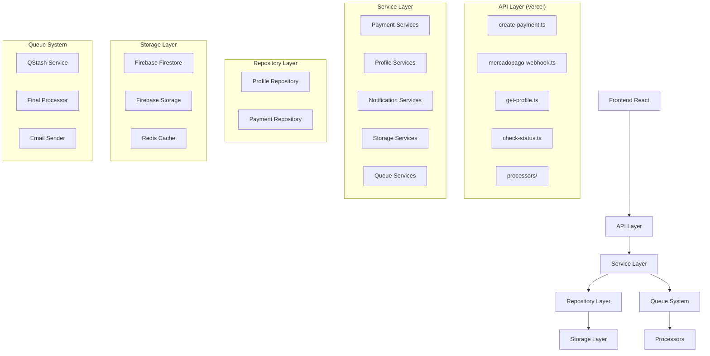
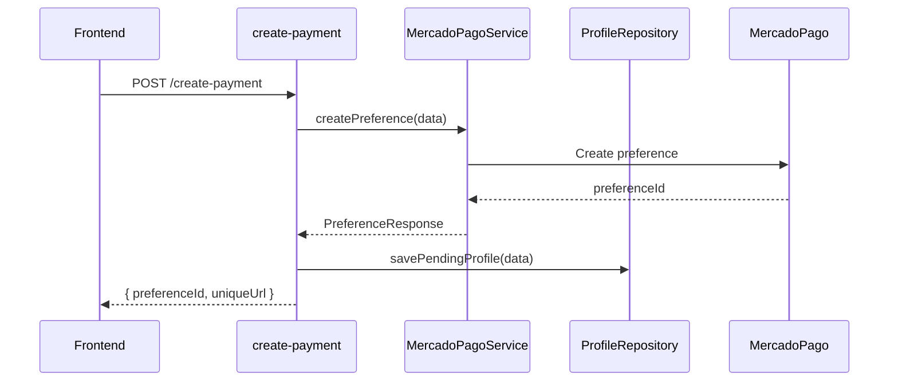
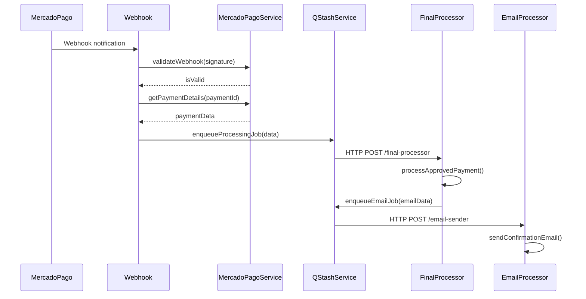
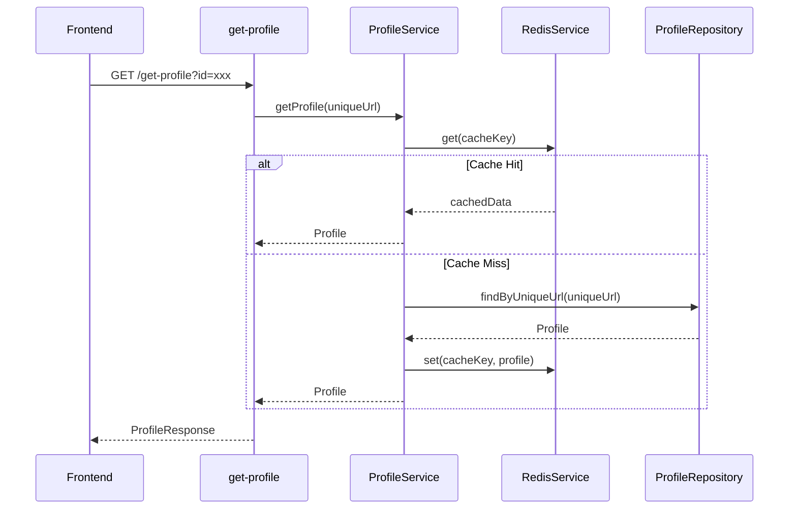

# Refatoração Arquitetural - Sistema SOS Moto

## 1. Visão Geral da Refatoração

Este documento detalha a refatoração completa da arquitetura do sistema SOS Moto, implementando separação de responsabilidades, padrões de design modernos e processamento assíncrono. A refatoração visa resolver os problemas arquiteturais identificados na estrutura atual, criando um sistema mais escalável, manutenível e resiliente.

**Objetivos da Refatoração:**
- Separação clara de responsabilidades por domínio
- Implementação de padrão Repository e Service Layer
- Sistema de filas para processamento assíncrono
- Melhor testabilidade e manutenibilidade
- Arquitetura preparada para crescimento

**Referência para MercadoPago:** Para implementações específicas do MercadoPago, consulte `mercadopago-integration-guide.md`

## 2. Análise da Estrutura Atual

### 2.1 Estrutura Existente (Aproveitada)

```
api/
├── create-payment.ts        # ❌ Múltiplas responsabilidades
├── mercadopago-webhook.ts    # ✅ Mantido com melhorias
├── get-profile.ts           # ✅ Mantido
└── check-status.ts          # ✅ Mantido

lib/
├── services/
│   ├── firebase.ts          # ✅ Reaproveitado
│   └── redis.ts             # ✅ Reaproveitado
├── utils/
│   ├── validation.ts        # ✅ Reaproveitado
│   ├── logger.ts            # ✅ Reaproveitado
│   └── ids.ts              # ✅ Reaproveitado
└── types/
    └── index.ts            # ✅ Expandido
```

### 2.2 Problemas Identificados

1. **create-payment.ts** concentra múltiplas responsabilidades:
   - Validação de dados
   - Criação de preferência MercadoPago
   - Processamento de pagamento aprovado
   - Geração de QR Code
   - Upload para Firebase Storage
   - Envio de email
   - Cache Redis
   - Interação com Firestore

2. **Ausência de separação por domínios**
3. **Falta de sistema de filas para processamento assíncrono**
4. **Acoplamento forte entre componentes**
5. **Dificuldade para testes unitários**

## 3. Nova Arquitetura Proposta

### 3.1 Diagrama da Nova Arquitetura



### 3.2 Estrutura de Diretórios Completa

```
api/
├── create-payment.ts           # ✅ Refatorado - apenas criação de preferência
├── mercadopago-webhook.ts       # ✅ Mantido - enfileira jobs
├── get-profile.ts              # ✅ Mantido - usa novos serviços
├── check-status.ts             # ✅ Mantido - usa novos serviços
└── processors/
    ├── final-processor.ts      # 🆕 Processamento assíncrono completo
    └── email-sender.ts         # 🆕 Envio de emails assíncrono

lib/
├── services/
│   ├── payment/
│   │   ├── mercadopago.service.ts    # 🆕 Lógica específica MercadoPago
│   │   └── payment.processor.ts      # 🆕 Processamento de pagamentos
│   ├── profile/
│   │   ├── profile.service.ts        # 🆕 Lógica de perfis
│   │   └── qrcode.service.ts         # 🆕 Geração de QR Codes
│   ├── notification/
│   │   ├── email.service.ts          # 🆕 Serviço de email
│   │   └── queue.service.ts          # 🆕 Gerenciamento de filas
│   ├── storage/
│   │   ├── firebase.service.ts       # ✅ Refatorado do firebase.ts
│   │   └── redis.service.ts          # ✅ Refatorado do redis.ts
│   └── queue/
│       ├── qstash.service.ts         # 🆕 Cliente QStash
│       └── job.processor.ts          # 🆕 Processador base de jobs
├── repositories/
│   ├── profile.repository.ts         # 🆕 Acesso a dados de perfis
│   └── payment.repository.ts         # 🆕 Acesso a dados de pagamentos
├── domain/
│   ├── profile/
│   │   ├── profile.entity.ts         # 🆕 Entidade de perfil
│   │   ├── profile.types.ts          # 🆕 Tipos específicos
│   │   └── profile.validators.ts     # 🆕 Validações de domínio
│   ├── payment/
│   │   ├── payment.entity.ts         # 🆕 Entidade de pagamento
│   │   ├── payment.types.ts          # 🆕 Tipos específicos
│   │   └── payment.validators.ts     # 🆕 Validações de domínio
│   └── notification/
│       ├── email.entity.ts           # 🆕 Entidade de email
│       └── email.types.ts            # 🆕 Tipos específicos
├── utils/
│   ├── validation.ts                 # ✅ Mantido
│   ├── logger.ts                     # ✅ Mantido
│   ├── ids.ts                        # ✅ Mantido
│   └── errors.ts                     # 🆕 Tratamento de erros
└── types/
    ├── index.ts                      # ✅ Expandido
    ├── api.types.ts                  # 🆕 Tipos de API
    └── queue.types.ts                # 🆕 Tipos de filas
```

## 4. Detalhamento dos Novos Arquivos

### 4.1 Service Layer

#### 4.1.1 Payment Services

**lib/services/payment/mercadopago.service.ts**
```typescript
// Responsabilidades:
// - Criação de preferências MercadoPago
// - Validação de webhooks HMAC
// - Gerenciamento de headers obrigatórios
// - Integração com APIs MercadoPago
// - Device ID e validações de segurança

class MercadoPagoService {
  async createPreference(data: PaymentData): Promise<PreferenceResponse>
  async validateWebhook(signature: string, requestId: string): Promise<boolean>
  async getPaymentDetails(paymentId: string): Promise<PaymentDetails>
  private generateIdempotencyKey(): string
  private validateDeviceId(deviceId: string): boolean
}
```

**lib/services/payment/payment.processor.ts**
```typescript
// Responsabilidades:
// - Orquestração do processamento de pagamentos
// - Coordenação entre serviços
// - Lógica de negócio de pagamentos
// - Tratamento de estados de pagamento

class PaymentProcessor {
  async processApprovedPayment(paymentId: string, paymentData: PaymentData): Promise<void>
  async handlePaymentFailure(paymentId: string, error: Error): Promise<void>
  async retryFailedPayment(paymentId: string): Promise<void>
  private validatePaymentData(data: PaymentData): boolean
}
```

#### 4.1.2 Profile Services

**lib/services/profile/profile.service.ts**
```typescript
// Responsabilidades:
// - Lógica de negócio de perfis
// - Validações de dados médicos
// - Transformação de dados
// - Coordenação com repositórios

class ProfileService {
  async createProfile(data: ProfileData): Promise<Profile>
  async getProfile(uniqueUrl: string): Promise<Profile | null>
  async updateProfile(uniqueUrl: string, data: Partial<ProfileData>): Promise<void>
  async validateMedicalData(data: MedicalData): Promise<ValidationResult>
  private transformToMemorialData(profile: Profile): MemorialData
}
```

**lib/services/profile/qrcode.service.ts**
```typescript
// Responsabilidades:
// - Geração de QR Codes
// - Upload para Firebase Storage
// - Otimização de imagens
// - Gerenciamento de URLs

class QRCodeService {
  async generateQRCode(memorialUrl: string): Promise<QRCodeResult>
  async uploadToStorage(imageBuffer: Buffer, profileId: string): Promise<string>
  async generateDataURL(memorialUrl: string): Promise<string>
  private optimizeImage(buffer: Buffer): Promise<Buffer>
}
```

#### 4.1.3 Notification Services

**lib/services/notification/email.service.ts**
```typescript
// Responsabilidades:
// - Envio de emails via AWS SES
// - Templates de email
// - Retry logic para falhas
// - Logs de envio

class EmailService {
  async sendConfirmationEmail(profile: Profile, qrCodeData: string): Promise<void>
  async sendFailureNotification(email: string, error: string): Promise<void>
  private generateEmailTemplate(type: EmailType, data: any): string
  private retryEmailSend(emailData: EmailData, maxRetries: number): Promise<void>
}
```

**lib/services/notification/queue.service.ts**
```typescript
// Responsabilidades:
// - Gerenciamento de filas de notificação
// - Coordenação com QStash
// - Scheduling de jobs
// - Monitoramento de filas

class QueueService {
  async enqueueEmailJob(emailData: EmailJobData): Promise<void>
  async enqueueProcessingJob(processingData: ProcessingJobData): Promise<void>
  async getQueueStatus(jobId: string): Promise<QueueStatus>
  private scheduleDelayedJob(jobData: JobData, delay: number): Promise<void>
}
```

#### 4.1.4 Storage Services

**lib/services/storage/firebase.service.ts**
```typescript
// Responsabilidades:
// - Abstração do Firebase Firestore
// - Operações CRUD otimizadas
// - Batch operations
// - Error handling específico

class FirebaseService {
  async save<T>(collection: string, id: string, data: T): Promise<void>
  async get<T>(collection: string, id: string): Promise<T | null>
  async update<T>(collection: string, id: string, data: Partial<T>): Promise<void>
  async batchWrite(operations: BatchOperation[]): Promise<void>
  private handleFirebaseError(error: FirebaseError): never
}
```

**lib/services/storage/redis.service.ts**
```typescript
// Responsabilidades:
// - Abstração do Redis/Upstash
// - Cache strategies
// - TTL management
// - Fallback handling

class RedisService {
  async get<T>(key: string): Promise<T | null>
  async set<T>(key: string, value: T, ttl?: number): Promise<void>
  async getOrSet<T>(key: string, factory: () => Promise<T>, ttl?: number): Promise<T>
  async invalidate(pattern: string): Promise<void>
  private handleRedisError(error: RedisError): void
}
```

#### 4.1.5 Queue Services

**lib/services/queue/qstash.service.ts**
```typescript
// Responsabilidades:
// - Cliente QStash
// - Publicação de jobs
// - Configuração de retry policies
// - Monitoramento de jobs

class QStashService {
  async publishJob(url: string, data: any, options?: PublishOptions): Promise<string>
  async scheduleJob(url: string, data: any, delay: number): Promise<string>
  async getJobStatus(jobId: string): Promise<JobStatus>
  async cancelJob(jobId: string): Promise<void>
  private validateSignature(request: Request): boolean
}
```

**lib/services/queue/job.processor.ts**
```typescript
// Responsabilidades:
// - Classe base para processadores
// - Retry logic comum
// - Error handling padrão
// - Logging estruturado

abstract class JobProcessor {
  abstract process(data: any): Promise<void>
  protected async executeWithRetry(fn: () => Promise<void>, maxRetries: number): Promise<void>
  protected logJobStart(jobType: string, data: any): void
  protected logJobComplete(jobType: string, duration: number): void
  protected logJobError(jobType: string, error: Error): void
}
```

### 4.2 Repository Layer

**lib/repositories/profile.repository.ts**
```typescript
// Responsabilidades:
// - Acesso a dados de perfis
// - Queries otimizadas
// - Mapeamento de entidades
// - Cache integration

class ProfileRepository {
  async save(profile: Profile): Promise<void>
  async findByUniqueUrl(uniqueUrl: string): Promise<Profile | null>
  async findPendingProfile(uniqueUrl: string): Promise<PendingProfile | null>
  async updateStatus(uniqueUrl: string, status: ProfileStatus): Promise<void>
  private mapToEntity(data: any): Profile
  private mapFromEntity(profile: Profile): any
}
```

**lib/repositories/payment.repository.ts**
```typescript
// Responsabilidades:
// - Acesso a dados de pagamentos
// - Logs de auditoria
// - Queries de relatórios
// - Histórico de transações

class PaymentRepository {
  async savePaymentLog(paymentLog: PaymentLog): Promise<void>
  async findByPaymentId(paymentId: string): Promise<PaymentLog | null>
  async findByExternalReference(externalRef: string): Promise<PaymentLog[]>
  async getPaymentHistory(filters: PaymentFilters): Promise<PaymentLog[]>
  private mapToPaymentLog(data: any): PaymentLog
}
```

### 4.3 Domain Layer

**lib/domain/profile/profile.entity.ts**
```typescript
// Responsabilidades:
// - Definição da entidade Profile
// - Métodos de domínio
// - Validações de negócio
// - Invariantes de domínio

class Profile {
  constructor(
    public readonly uniqueUrl: string,
    public readonly personalData: PersonalData,
    public readonly medicalData: MedicalData,
    public readonly emergencyContacts: EmergencyContact[],
    public readonly planType: PlanType
  ) {}
  
  isValid(): boolean
  canGenerateQRCode(): boolean
  getMemorialUrl(): string
  addEmergencyContact(contact: EmergencyContact): void
  updateMedicalData(data: Partial<MedicalData>): void
}
```

**lib/domain/payment/payment.entity.ts**
```typescript
// Responsabilidades:
// - Definição da entidade Payment
// - Estados de pagamento
// - Validações de negócio
// - Transformações de dados

class Payment {
  constructor(
    public readonly id: string,
    public readonly externalReference: string,
    public readonly amount: number,
    public readonly status: PaymentStatus,
    public readonly createdAt: Date
  ) {}
  
  isApproved(): boolean
  isPending(): boolean
  isFailed(): boolean
  canBeProcessed(): boolean
  getProcessingData(): ProcessingData
}
```

### 4.4 Processors (QStash Workers)

**api/processors/final-processor.ts**
```typescript
// Responsabilidades:
// - Processamento completo de pagamentos aprovados
// - Orquestração de serviços
// - Geração de QR Code
// - Salvamento de perfil
// - Atualização de cache
// - Enfileiramento de email

export default async function handler(req: VercelRequest, res: VercelResponse) {
  const processor = new FinalProcessor(
    new PaymentProcessor(),
    new ProfileService(),
    new QRCodeService(),
    new RedisService(),
    new QueueService()
  );
  
  await processor.process(req.body);
}

class FinalProcessor extends JobProcessor {
  async process(data: ProcessingJobData): Promise<void> {
    // 1. Validar dados do pagamento
    // 2. Buscar perfil pendente
    // 3. Gerar QR Code
    // 4. Salvar perfil final
    // 5. Atualizar cache
    // 6. Enfileirar job de email
  }
}
```

**api/processors/email-sender.ts**
```typescript
// Responsabilidades:
// - Envio assíncrono de emails
// - Retry automático
// - Templates dinâmicos
// - Logs de entrega

export default async function handler(req: VercelRequest, res: VercelResponse) {
  const processor = new EmailProcessor(
    new EmailService(),
    new ProfileService()
  );
  
  await processor.process(req.body);
}

class EmailProcessor extends JobProcessor {
  async process(data: EmailJobData): Promise<void> {
    // 1. Buscar dados do perfil
    // 2. Gerar template de email
    // 3. Enviar email via SES
    // 4. Log de confirmação
  }
}
```

## 5. Fluxos de Dados Refatorados

### 5.1 Fluxo de Criação de Pagamento (Refatorado)



### 5.2 Fluxo de Processamento de Webhook (Refatorado)



### 5.3 Fluxo de Busca de Perfil (Refatorado)



## 6. Implementação em Fases

### 6.1 Fase 1 - Estrutura Base (Semana 1-2)

**Prioridade Alta:**
1. Criar estrutura de diretórios
2. Implementar domain entities
3. Criar repositories básicos
4. Implementar services fundamentais

**Arquivos a criar:**
- `lib/domain/profile/profile.entity.ts`
- `lib/domain/payment/payment.entity.ts`
- `lib/repositories/profile.repository.ts`
- `lib/repositories/payment.repository.ts`
- `lib/services/storage/firebase.service.ts`
- `lib/services/storage/redis.service.ts`

### 6.2 Fase 2 - Services Layer (Semana 3-4)

**Prioridade Alta:**
1. Implementar MercadoPagoService
2. Criar ProfileService
3. Implementar QRCodeService
4. Criar EmailService

**Arquivos a criar:**
- `lib/services/payment/mercadopago.service.ts`
- `lib/services/profile/profile.service.ts`
- `lib/services/profile/qrcode.service.ts`
- `lib/services/notification/email.service.ts`

### 6.3 Fase 3 - Queue System (Semana 5-6)

**Prioridade Média:**
1. Implementar QStashService
2. Criar processadores base
3. Implementar final-processor
4. Criar email-sender

**Arquivos a criar:**
- `lib/services/queue/qstash.service.ts`
- `lib/services/queue/job.processor.ts`
- `api/processors/final-processor.ts`
- `api/processors/email-sender.ts`

### 6.4 Fase 4 - Refatoração APIs (Semana 7-8)

**Prioridade Alta:**
1. Refatorar create-payment.ts
2. Atualizar mercadopago-webhook.ts
3. Atualizar get-profile.ts
4. Atualizar check-status.ts

### 6.5 Fase 5 - Testes e Otimização (Semana 9-10)

**Prioridade Média:**
1. Implementar testes unitários
2. Testes de integração
3. Monitoramento e logs
4. Otimizações de performance

## 7. Benefícios da Nova Arquitetura

### 7.1 Separação de Responsabilidades
- **Single Responsibility Principle**: Cada classe tem uma responsabilidade específica
- **Domain-Driven Design**: Separação clara por domínios de negócio
- **Layered Architecture**: Camadas bem definidas com dependências claras

### 7.2 Testabilidade
- **Dependency Injection**: Facilita mocking em testes
- **Pure Functions**: Funções sem efeitos colaterais
- **Isolated Components**: Cada componente pode ser testado isoladamente

### 7.3 Escalabilidade
- **Processamento Assíncrono**: Jobs pesados não bloqueiam APIs
- **Queue System**: Gerenciamento automático de carga
- **Cache Strategy**: Redução de carga no banco de dados

### 7.4 Manutenibilidade
- **Clear Interfaces**: Contratos bem definidos entre componentes
- **Error Handling**: Tratamento consistente de erros
- **Logging**: Rastreabilidade completa de operações

### 7.5 Resiliência
- **Retry Logic**: Recuperação automática de falhas
- **Circuit Breaker**: Proteção contra cascata de falhas
- **Graceful Degradation**: Sistema continua funcionando mesmo com falhas parciais

## 8. Considerações de Implementação

### 8.1 Dependency Injection

```typescript
// Exemplo de DI container simples
class Container {
  private services = new Map();
  
  register<T>(token: string, factory: () => T): void {
    this.services.set(token, factory);
  }
  
  resolve<T>(token: string): T {
    const factory = this.services.get(token);
    return factory();
  }
}

// Configuração de serviços
const container = new Container();
container.register('ProfileRepository', () => new ProfileRepository());
container.register('ProfileService', () => new ProfileService(
  container.resolve('ProfileRepository')
));
```

### 8.2 Error Handling

```typescript
// lib/utils/errors.ts
export class DomainError extends Error {
  constructor(message: string, public code: string) {
    super(message);
  }
}

export class ValidationError extends DomainError {
  constructor(field: string, message: string) {
    super(`Validation failed for ${field}: ${message}`, 'VALIDATION_ERROR');
  }
}

export class PaymentError extends DomainError {
  constructor(message: string, public paymentId?: string) {
    super(message, 'PAYMENT_ERROR');
  }
}
```

### 8.3 Configuration Management

```typescript
// lib/config/index.ts
export const config = {
  mercadopago: {
    accessToken: process.env.MERCADOPAGO_ACCESS_TOKEN!,
    publicKey: process.env.VITE_MERCADOPAGO_PUBLIC_KEY!,
    webhookSecret: process.env.MERCADOPAGO_WEBHOOK_SECRET!,
  },
  firebase: {
    projectId: process.env.FIREBASE_PROJECT_ID!,
    clientEmail: process.env.FIREBASE_CLIENT_EMAIL!,
    privateKey: process.env.FIREBASE_PRIVATE_KEY!,
  },
  redis: {
    url: process.env.UPSTASH_REDIS_REST_URL!,
    token: process.env.UPSTASH_REDIS_REST_TOKEN!,
  },
  qstash: {
    token: process.env.QSTASH_TOKEN!,
    signingKey: process.env.QSTASH_SIGNING_KEY!,
  },
  aws: {
    region: process.env.AWS_SES_REGION!,
    accessKeyId: process.env.AWS_SES_ACCESS_KEY_ID!,
    secretAccessKey: process.env.AWS_SES_SECRET_ACCESS_KEY!,
  }
};
```

## 9. Monitoramento e Observabilidade

### 9.1 Structured Logging

```typescript
// lib/utils/logger.ts (expandido)
export class Logger {
  static info(message: string, metadata?: Record<string, any>) {
    console.log(JSON.stringify({
      level: 'info',
      message,
      timestamp: new Date().toISOString(),
      ...metadata
    }));
  }
  
  static error(message: string, error: Error, metadata?: Record<string, any>) {
    console.error(JSON.stringify({
      level: 'error',
      message,
      error: {
        name: error.name,
        message: error.message,
        stack: error.stack
      },
      timestamp: new Date().toISOString(),
      ...metadata
    }));
  }
  
  static performance(operation: string, duration: number, metadata?: Record<string, any>) {
    console.log(JSON.stringify({
      level: 'performance',
      operation,
      duration,
      timestamp: new Date().toISOString(),
      ...metadata
    }));
  }
}
```

### 9.2 Métricas de Negócio

```typescript
// lib/utils/metrics.ts
export class Metrics {
  static async trackPaymentCreated(planType: string, amount: number) {
    Logger.info('Payment created', {
      metric: 'payment.created',
      planType,
      amount
    });
  }
  
  static async trackPaymentApproved(paymentId: string, processingTime: number) {
    Logger.info('Payment approved', {
      metric: 'payment.approved',
      paymentId,
      processingTime
    });
  }
  
  static async trackProfileCreated(uniqueUrl: string, planType: string) {
    Logger.info('Profile created', {
      metric: 'profile.created',
      uniqueUrl,
      planType
    });
  }
  
  static async trackCacheHit(key: string) {
    Logger.info('Cache hit', {
      metric: 'cache.hit',
      key
    });
  }
}
```

## 10. Migração e Compatibilidade

### 10.1 Estratégia de Migração

1. **Implementação Paralela**: Novos serviços coexistem com código atual
2. **Feature Flags**: Controle de qual implementação usar
3. **Gradual Rollout**: Migração progressiva por funcionalidade
4. **Rollback Plan**: Capacidade de reverter mudanças rapidamente

### 10.2 Compatibilidade com APIs Existentes

```typescript
// Wrapper para manter compatibilidade
export async function legacyCreatePayment(req: VercelRequest, res: VercelResponse) {
  const useNewArchitecture = process.env.USE_NEW_ARCHITECTURE === 'true';
  
  if (useNewArchitecture) {
    return newCreatePaymentHandler(req, res);
  } else {
    return originalCreatePaymentHandler(req, res);
  }
}
```

## 11. Conclusão

A refatoração arquitetural proposta transforma o sistema SOS Moto de uma arquitetura monolítica para uma arquitetura modular, escalável e manutenível. A implementação em fases garante uma transição suave, mantendo a funcionalidade existente enquanto introduz melhorias significativas.

**Principais Benefícios:**
- ✅ Separação clara de responsabilidades
- ✅ Melhor testabilidade e manutenibilidade
- ✅ Processamento assíncrono com filas
- ✅ Arquitetura preparada para crescimento
- ✅ Melhor tratamento de erros e resiliência
- ✅ Observabilidade e monitoramento aprimorados

**Próximos Passos:**
1. Revisar e aprovar a arquitetura proposta
2. Iniciar implementação da Fase 1
3. Configurar ambiente de desenvolvimento
4. Implementar testes automatizados
5. Documentar APIs e contratos

**Referência MercadoPago:** Para detalhes específicos sobre implementação do MercadoPago, incluindo `mercadopago.service.ts`, consulte `mercadopago-integration-guide.md`.

Esta refatoração estabelece uma base sólida para o crescimento futuro do sistema SOS Moto, garantindo que possa escalar eficientemente conforme a demanda aumenta.