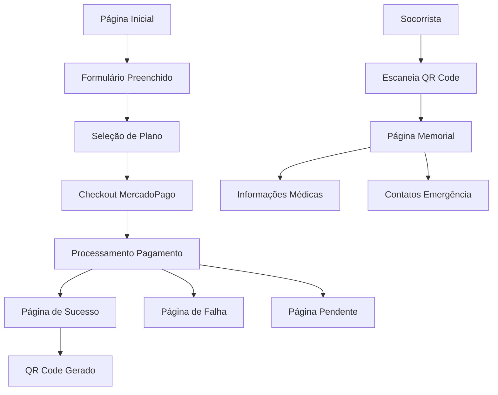

# Documento de Requisitos de Produto - SOS Moto

## 1. Visão Geral do Produto

O SOS Moto é uma plataforma digital que permite aos motociclistas criar perfis médicos de emergência acessíveis via QR Code. Em caso de acidentes, socorristas podem escanear o código para acessar instantaneamente informações médicas críticas, facilitando o atendimento de emergência e potencialmente salvando vidas.

O produto resolve o problema da falta de acesso rápido a informações médicas em emergências, oferecendo uma solução prática e acessível para motociclistas que enfrentam riscos diários no trânsito.

## 2. Funcionalidades Principais

### 2.1 Papéis de Usuário

| Papel | Método de Acesso | Permissões Principais |
|-------|------------------|----------------------|
| Motociclista | Criação de perfil via formulário e pagamento | Criar perfil médico, visualizar QR Code próprio, receber emails de confirmação |
| Socorrista/Médico | Acesso via QR Code escaneado | Visualizar informações médicas de emergência, acessar contatos de emergência |
| Administrador | Acesso direto ao sistema | Monitorar pagamentos, gerenciar perfis, acessar logs do sistema |

### 2.2 Módulos Funcionais

Nosso sistema SOS Moto consiste nas seguintes páginas principais:

1. **Página Inicial**: formulário de criação de perfil, seleção de planos, integração com checkout MercadoPago
2. **Página de Sucesso**: exibição do QR Code gerado, instruções de uso, opções de download
3. **Página Memorial**: visualização de informações médicas via QR Code, dados de emergência, contatos
4. **Páginas de Status**: páginas de falha, pendência e erro no processamento de pagamentos

### 2.3 Detalhes das Páginas

| Nome da Página | Nome do Módulo | Descrição da Funcionalidade |
|----------------|----------------|-----------------------------|
| Página Inicial | Formulário de Perfil | Coletar dados pessoais (nome, email, telefone, idade), informações médicas (tipo sanguíneo, alergias, medicamentos, condições médicas), contatos de emergência |
| Página Inicial | Seleção de Planos | Exibir planos Basic (R$ 55,00) e Premium (R$ 85,00), destacar diferenças entre planos, permitir seleção |
| Página Inicial | Checkout MercadoPago | Integrar SDK React do MercadoPago, processar pagamentos via modal, suportar cartão, PIX, boleto. **Referência:** Consulte `mercadopago-integration-guide.md` para implementação completa |
| Página de Sucesso | Exibição QR Code | Mostrar QR Code gerado, fornecer instruções de uso, permitir download da imagem PNG |
| Página de Sucesso | Confirmação Email | Exibir confirmação de envio de email, instruções para verificar caixa de entrada |
| Página Memorial | Informações Médicas | Exibir dados médicos críticos (tipo sanguíneo, alergias, medicamentos), mostrar condições médicas relevantes |
| Página Memorial | Contatos Emergência | Listar contatos de emergência com telefones, destacar contato principal, permitir ligação direta |
| Página Memorial | Dados Pessoais | Mostrar informações básicas (nome, idade), exibir plano de saúde e hospital preferido |
| Páginas Status | Feedback Pagamento | Informar status do pagamento (pendente, falha), fornecer instruções para próximos passos, permitir nova tentativa |

## 3. Fluxo Principal do Sistema

### Fluxo do Motociclista:
1. Usuário acessa a página inicial
2. Preenche formulário com dados pessoais e médicos
3. Seleciona plano (Basic R$ 55,00 ou Premium R$ 85,00)
4. Realiza pagamento via MercadoPago
5. Recebe confirmação e acessa página de sucesso
6. Visualiza e baixa QR Code gerado
7. Recebe email de confirmação com instruções

### Fluxo do Socorrista:
1. Socorrista encontra motociclista acidentado
2. Localiza QR Code no capacete/moto
3. Escaneia código com smartphone
4. Acessa página memorial com informações médicas
5. Visualiza dados críticos para atendimento
6. Contata emergência ou hospital se necessário

## 4. Design de Interface do Usuário

### 4.1 Estilo de Design

- **Cores Primárias**: 
  - Azul principal: #3B82F6 (confiança e segurança)
  - Verde sucesso: #10B981 (confirmações)
  - Vermelho alerta: #EF4444 (emergências)
  - Cinza neutro: #6B7280 (textos secundários)

- **Estilo de Botões**: Arredondados (border-radius: 8px), com sombras sutis, estados hover bem definidos

- **Tipografia**: 
  - Fonte principal: Inter (legibilidade)
  - Tamanhos: H1 (32px), H2 (24px), Body (16px), Small (14px)
  - Peso: Regular (400) para textos, Semibold (600) para títulos

- **Layout**: Design responsivo mobile-first, cards com bordas arredondadas, espaçamento consistente (múltiplos de 8px)

- **Ícones**: Lucide React (consistência visual), ícones médicos específicos, símbolos de emergência reconhecíveis

### 4.2 Visão Geral do Design das Páginas

| Nome da Página | Nome do Módulo | Elementos de UI |
|----------------|----------------|----------------|
| Página Inicial | Hero Section | Título impactante "Sua Segurança em um QR Code", subtítulo explicativo, imagem de motociclista, cores azul/branco |
| Página Inicial | Formulário | Cards organizados por seções, campos com validação visual, labels flutuantes, ícones contextuais |
| Página Inicial | Seleção Planos | Cards comparativos lado a lado, destaque visual para plano recomendado, lista de benefícios com checkmarks |
| Página Inicial | Checkout | Modal centralizado, integração nativa MercadoPago, loading states, feedback visual |
| Página Sucesso | QR Code Display | QR Code centralizado em card destacado, botão download proeminente, instruções passo-a-passo |
| Página Sucesso | Confirmação | Ícone de sucesso verde, mensagem clara, informações sobre email enviado |
| Página Memorial | Header Emergência | Banner vermelho "INFORMAÇÕES DE EMERGÊNCIA", nome do usuário em destaque, idade visível |
| Página Memorial | Dados Médicos | Cards organizados por categoria, ícones médicos, cores de alerta para alergias, texto grande e legível |
| Página Memorial | Contatos | Lista de contatos com botões de ligação direta, destaque para contato principal, ícones de telefone |
| Páginas Status | Feedback Visual | Ícones de status coloridos, mensagens claras, botões de ação apropriados, links para suporte |

### 4.3 Responsividade

O produto é desenvolvido com abordagem mobile-first, garantindo experiência otimizada em smartphones (principal dispositivo de acesso para socorristas). A interface se adapta progressivamente para tablets e desktops, mantendo usabilidade e legibilidade em todas as telas.

**Breakpoints:**
- Mobile: 320px - 768px (foco principal)
- Tablet: 768px - 1024px
- Desktop: 1024px+

**Otimizações Mobile:**
- Botões com área de toque mínima de 44px
- Formulários com teclados contextuais
- Navegação simplificada
- Carregamento otimizado para conexões móveis
- QR Code escaneável diretamente da tela

## 5. Especificações Técnicas de Interface

### 5.1 Componentes Principais

**Formulário de Perfil:**
- Validação em tempo real com Zod
- Estados de erro visuais claros
- Campos condicionais baseados no plano
- Auto-save local para prevenir perda de dados

**Checkout MercadoPago:**
- SDK React integrado
- Suporte a múltiplos métodos de pagamento
- Loading states durante processamento
- Tratamento de erros com retry automático

**QR Code Generator:**
- Geração via biblioteca qrcode
- Formato PNG de alta qualidade
- URL otimizada para mobile
- Backup em Firebase Storage

**Página Memorial:**
- Carregamento otimizado (cache Redis)
- Layout otimizado para leitura rápida
- Botões de ação diretos (ligar, emergência)
- Informações hierarquizadas por criticidade

### 5.2 Estados da Interface

**Estados de Carregamento:**
- Skeleton loading para formulários
- Spinners para ações de pagamento
- Progress bars para upload de dados

**Estados de Erro:**
- Mensagens contextuais específicas
- Sugestões de correção
- Botões de retry quando aplicável
- Links para suporte técnico

**Estados de Sucesso:**
- Confirmações visuais claras
- Próximos passos destacados
- Opções de compartilhamento

### 5.3 Acessibilidade

- Contraste mínimo WCAG AA (4.5:1)
- Navegação por teclado completa
- Labels descritivos para screen readers
- Textos alternativos para imagens
- Foco visual bem definido
- Tamanhos de fonte escaláveis

### 5.4 Performance

- Lazy loading para componentes não críticos
- Otimização de imagens (WebP com fallback)
- Cache estratégico para dados médicos
- Minificação de assets
- CDN para recursos estáticos
- Tempo de carregamento < 3 segundos

## 6. Critérios de Aceitação

### 6.1 Funcionalidades Críticas

**Criação de Perfil:**
- ✅ Formulário deve validar todos os campos obrigatórios
- ✅ Checkout deve processar pagamentos em < 30 segundos
- ✅ QR Code deve ser gerado automaticamente após pagamento aprovado
- ✅ Email de confirmação deve ser enviado em < 2 minutos

**Acesso via QR Code:**
- ✅ Página memorial deve carregar em < 2 segundos
- ✅ Informações devem ser legíveis em telas de 4 polegadas
- ✅ Contatos de emergência devem permitir ligação direta
- ✅ Dados devem estar disponíveis mesmo com conexão lenta

**Segurança e Privacidade:**
- ✅ Dados médicos acessíveis apenas via QR Code único
- ✅ Nenhuma informação pessoal em URLs ou logs públicos
- ✅ Validação HMAC para webhooks de pagamento
- ✅ Cache com TTL apropriado (24 horas)

### 6.2 Métricas de Sucesso

- **Taxa de Conversão**: > 15% (formulário → pagamento aprovado)
- **Tempo de Carregamento**: < 3 segundos (página memorial)
- **Taxa de Erro**: < 2% (falhas no processamento)
- **Disponibilidade**: > 99.5% (uptime do sistema)
- **Satisfação**: > 4.5/5 (feedback dos usuários)

## 7. Roadmap de Funcionalidades

### 7.1 Versão Atual (MVP)
- ✅ Criação de perfis médicos
- ✅ Checkout MercadoPago
- ✅ Geração de QR Codes
- ✅ Página memorial responsiva
- ✅ Sistema de cache Redis

### 7.2 Próximas Versões

**V2.0 - Melhorias de UX:**
- Dashboard do usuário
- Edição de perfis existentes
- Múltiplos QR Codes por usuário
- Notificações push

**V3.0 - Funcionalidades Avançadas:**
- Integração com hospitais
- Histórico médico detalhado
- Geolocalização de emergência
- API para aplicativos de emergência

**V4.0 - Expansão:**
- Suporte a outros veículos
- Integração com seguradoras
- Programa de parceiros
- Versão internacional

**Refatoração Arquitetural:**
- Implementação de nova arquitetura modular
- Sistema de filas para processamento assíncrono
- Separação de responsabilidades por domínio
- **Referência:** Consulte `refatoracao-arquitetural-sos-moto.md` para detalhes completos

## 8. Considerações de Negócio

### 8.1 Modelo de Receita
- **Plano Basic**: R$ 55,00 (funcionalidades essenciais)
- **Plano Premium**: R$ 85,00 (recursos avançados)
- **Renovação Anual**: Desconto de 20%
- **Parcerias**: Comissões com seguradoras e concessionárias

### 8.2 Público-Alvo
- **Primário**: Motociclistas urbanos (25-45 anos)
- **Secundário**: Entregadores e motoboys
- **Terciário**: Motociclistas de longa distância

### 8.3 Diferenciais Competitivos
- Foco específico em motociclistas
- Acesso instantâneo via QR Code
- Interface otimizada para emergências
- Preço acessível
- Integração com sistema de saúde brasileiro

Este documento de requisitos serve como guia completo para o desenvolvimento, design e evolução do produto SOS Moto, garantindo que todas as funcionalidades atendam às necessidades dos usuários e objetivos de negócio.