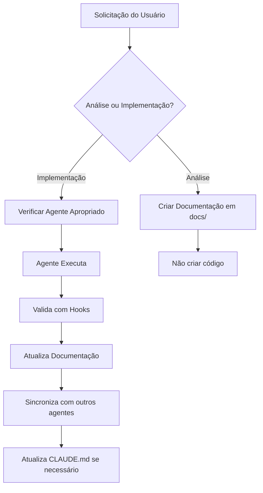

# 🔬 ANÁLISE ULTRA PROFUNDA: Alinhamento Completo do Sistema SOS Moto

**Data**: 22/01/2025  
**Autor**: Claude Code - Deep Analysis  
**Status**: CRÍTICO - Ações Urgentes Necessárias

## 📋 SUMÁRIO EXECUTIVO

### **🔴 Problemas Críticos Identificados**
1. **Sistema aceita pagamentos falsos** - Redirecionamento prematuro
2. **Duplicações de código** - HMAC validation duplicado
3. **Agentes desalinhados** - Referências a arquivos inexistentes
4. **Documentação fragmentada** - Conhecimento distribuído incorretamente

### **🟡 Problemas de Alta Prioridade**
1. **Logger não documentado** - Mascaramento LGPD funcionando mas desconhecido
2. **IDs críticos não documentados** - 10+ arquivos dependem sem documentação
3. **Estrutura de pastas confusa** - docs/ vs .claude/docs/ sem clareza

### **🟢 Aspectos Positivos**
1. **Arquitetura DDD excelente** - Bem estruturada e funcionando
2. **Configuração centralizada** - 100% migrada com Zod validation
3. **Agentes especializados** - Cobertura completa de domínios

---

## 🗂️ ESTRUTURA DE PASTAS - ANÁLISE DEFINITIVA

### **Propósito Correto de Cada Pasta**

```
📁 projeto/
├── 📁 docs/                          # DOCUMENTAÇÃO TÉCNICA DO SISTEMA
│   ├── PAYMENT_FLOW_ANALYSIS.md      # PRD - Análise do fluxo de pagamento
│   ├── SYSTEM_ALIGNMENT_ANALYSIS.md  # Análise de desalinhamentos código vs docs
│   └── [FUTUROS PRDs E ANÁLISES]     # Documentação técnica de negócio
│
├── 📁 .claude/                        # CONFIGURAÇÃO E OPERAÇÃO DOS AGENTES
│   ├── 📁 docs/                       # DOCUMENTAÇÃO OPERACIONAL
│   │   ├── AGENT_ALIGNMENT.md        # Regras para todos os agentes
│   │   ├── 📁 guides/                 # Guias operacionais
│   │   │   ├── operation-master-guide.md
│   │   │   └── [outros guias]
│   │   ├── 📁 plans/                  # Planos de implementação
│   │   ├── 📁 tasks/                  # Tarefas e contextos
│   │   └── 📁 review-reports/         # Templates de auditoria
│   │
│   ├── 📁 agents/                     # DEFINIÇÕES DOS AGENTES
│   │   ├── frontend-agent.md
│   │   ├── backend-agent.md
│   │   ├── payment-agent.md
│   │   ├── medical-validator.md
│   │   └── deploy-orchestrator.md
│   │
│   └── 📁 state/                      # ❌ NÃO EXISTE (mas agentes referenciam)
│       ├── agent-memory.json         # ❌ Arquivo inexistente
│       └── sync-todos.json           # ❌ Arquivo inexistente
│
└── CLAUDE.md                          # DOCUMENTO MESTRE DO PROJETO
```

### **🔴 PROBLEMA: Referências a Arquivos Inexistentes**

Todos os 5 agentes fazem referência a:
- `.claude/state/agent-memory.json` 
- `.claude/state/current-session.json`
- `.claude/state/sync-todos.json`

**Estes arquivos NÃO existem!** Isso causa confusão e comportamento inconsistente.

---

## 🤖 ANÁLISE DE ALINHAMENTO DOS AGENTES

### **✅ Aspectos Alinhados Corretamente**

| Aspecto | Status | Observação |
|---------|--------|------------|
| **Escopo Análise vs Implementação** | ✅ | Todos têm regra clara |
| **TypeScript Strict** | ✅ | Proibição de `any` consistente |
| **Ambiente Produção** | ✅ | Sem mocks/testes em todos |
| **Trigger Patterns** | ✅ | Bem definidos e únicos |

### **🔴 Problemas de Alinhamento**

#### **1. Referências a State Inexistente**
```markdown
# Em TODOS os agentes:
"SEMPRE consultar `.claude/state/agent-memory.json` antes de criar arquivos"
```
**Problema**: Arquivo não existe, agentes não podem consultar

#### **2. Regras de Backup Repetidas 5x**
```markdown
# Repetido identicamente em todos:
- ❌ NUNCA criar backups (.bak, .backup, .old)
- ❌ NUNCA duplicar código existente
- ❌ NUNCA criar logger local
```
**Problema**: Manutenção difícil, mudanças precisam ser feitas em 5 lugares

#### **3. Logger Documentado Incorretamente**
```typescript
// Backend Agent mostra:
logInfo('Profile created', { 
  email: user.email,     // Será: "***MASKED***"
});

// Mas estrutura real é:
logInfo(message: string, metadata?: object)
// Level é 'INFO' não 'info' como documentado
```

#### **4. Utilities Críticas Não Mencionadas**
- `generateUniqueUrl()` - Usado em 10+ arquivos
- `generateCorrelationId()` - Crítico para rastreamento
- `generatePaymentId()` - Essencial para pagamentos
- `generateProfileId()` - Core do sistema

**Nenhum agente conhece estas funções!**

---

## 💳 PROBLEMAS CRÍTICOS DE PAGAMENTO

### **🔴 FLUXO QUEBRADO - Sistema Aceita Pagamentos Falsos**

#### **Problema Principal**
```typescript
// MercadoPagoCheckout.tsx
onSubmit: async (formData) => {
  // ❌ ERRO CRÍTICO: Redireciona sem validar aprovação
  navigate(`/success?id=${uniqueUrl}`);
}
```

#### **Impacto Real**
1. **Qualquer clique = "pagamento aprovado"**
2. **PIX impossível** - QR Code não é mostrado
3. **Fraude facilitada** - Sistema aceita pagamentos falsos
4. **Perda financeira** - Serviço entregue sem pagamento

#### **Solução Necessária**
```typescript
// CORRETO: Aguardar confirmação real
onSubmit: async (formData) => {
  setLoading(true);
  // NÃO redirecionar aqui!
  
  // Aguardar processamento
  const result = await waitForPaymentConfirmation(paymentId);
  
  if (result.status === 'approved') {
    navigate(`/success?id=${uniqueUrl}`);
  } else {
    showError(result.message);
  }
}
```

### **🔴 Duplicação de HMAC Validation**

#### **Código Duplicado Identificado**
```typescript
// 1. lib/utils/validation.ts (CÓDIGO MORTO)
export function validateHMACSignature(...) { }

// 2. lib/services/payment/mercadopago.service.ts (USADO)
async validateWebhook(...) { }
```

**Ação**: Remover `validateHMACSignature` de validation.ts

---

## 🚨 PROBLEMAS DE ACIONAMENTO AUTOMÁTICO

### **Análise dos Trigger Patterns**

| Agente | Acionamento | Problema |
|--------|-------------|----------|
| **frontend-agent** | ✅ Funciona | Padrões claros |
| **backend-agent** | ⚠️ Conflito | "service" muito genérico |
| **payment-agent** | ✅ Funciona | "mercadopago" específico |
| **medical-validator** | ⚠️ Conflito | "dados" muito genérico |
| **deploy-orchestrator** | ✅ Funciona | "deploy" específico |

### **Problemas Identificados**

1. **Padrões muito genéricos** causam acionamento incorreto
2. **Falta de priorização** - múltiplos agentes respondem
3. **Ausência de contexto** - agentes não sabem o que outros fizeram

---

## 📊 MAPEAMENTO DE DESALINHAMENTOS

### **Documentação vs Código Real**

| Componente | Documentado | Real | Impacto |
|------------|-------------|------|---------|
| **Logger Level** | 'info' | 'INFO' | Logs incorretos |
| **Mascaramento LGPD** | ❌ Não | ✅ Sim | Compliance desconhecida |
| **logWarning()** | ❌ Não | ✅ 13 arquivos usam | Uso sem orientação |
| **IDs Generation** | ❌ Não | ✅ 10+ arquivos usam | Mudanças quebram sistema |
| **HMAC Validation** | ✅ Duplicado | ❌ Código morto | Confusão de uso |

---

## 🎯 PLANO DE CORREÇÃO E REALINHAMENTO

### **PRIORIDADE 1: CRÍTICA (Fazer HOJE)**

#### **A. Corrigir Fluxo de Pagamento**
```bash
# 1. Implementar polling de status
/api/payment-status/{sessionId}

# 2. Corrigir MercadoPagoCheckout.tsx
- Remover redirecionamento do onSubmit
- Implementar waitForPaymentConfirmation
- Adicionar loading state adequado

# 3. Testar fluxo completo
- PIX com QR Code
- Cartão com aprovação
- Rejeição com erro
```

#### **B. Remover Código Morto**
```bash
# Remover de lib/utils/validation.ts:
- validateHMACSignature()
- transformApiToProfile() (se não usado)

# Verificar imports e corrigir
```

### **PRIORIDADE 2: ALTA (Fazer AMANHÃ)**

#### **C. Criar Estrutura de State**
```bash
# Criar .claude/state/
mkdir -p .claude/state

# Criar arquivos base
echo '{}' > .claude/state/agent-memory.json
echo '{}' > .claude/state/current-session.json
echo '[]' > .claude/state/sync-todos.json
```

#### **D. Documentar Utilities Críticas**
```typescript
// Adicionar em CLAUDE.md ou criar docs/UTILITIES.md
// Documentar cada função de ids.ts com exemplos
// Explicar mascaramento LGPD do logger
// Documentar logWarning vs logError
```

### **PRIORIDADE 3: MÉDIA (Esta Semana)**

#### **E. Consolidar Regras dos Agentes**
```bash
# Criar .claude/docs/AGENT_COMMON_RULES.md
# Mover regras repetidas para lá
# Agentes fazem referência ao arquivo comum
```

#### **F. Melhorar Trigger Patterns**
```yaml
# Tornar mais específicos:
backend-agent: 
  - remove: "service" # muito genérico
  + add: "api-service", "backend-service"

medical-validator:
  - remove: "dados" # muito genérico  
  + add: "dados-medicos", "medical-data"
```

---

## 🔄 FLUXO DE DESENVOLVIMENTO CORRETO

### **Passo a Passo para Manter Alinhamento**



### **Regras de Ouro**

1. **ANÁLISE = Documentação apenas** (pasta docs/)
2. **IMPLEMENTAÇÃO = Código com permissão** 
3. **Utilities críticas sempre documentadas**
4. **Código morto removido imediatamente**
5. **Alinhamento verificado diariamente**

---

## ✅ CHECKLIST DE VALIDAÇÃO

### **Validação Diária**
- [ ] Fluxo de pagamento funcionando (sem redirect prematuro)
- [ ] PIX mostrando QR Code
- [ ] Nenhum código morto em validation.ts
- [ ] Logger mascarando dados sensíveis
- [ ] IDs sendo gerados corretamente

### **Validação Semanal**
- [ ] Agentes alinhados com AGENT_ALIGNMENT.md
- [ ] Documentação técnica em docs/
- [ ] Documentação operacional em .claude/docs/
- [ ] Trigger patterns funcionando corretamente
- [ ] Nenhuma duplicação de código

### **Validação Mensal**
- [ ] Auditoria completa de desalinhamentos
- [ ] Atualização de todos os agentes
- [ ] Review de toda documentação
- [ ] Cleanup de código não utilizado

---

## 🚀 CONCLUSÕES E PRÓXIMOS PASSOS

### **Estado Atual**
- **Arquitetura**: ✅ Excelente (DDD bem implementado)
- **Configuração**: ✅ Centralizada e validada
- **Pagamentos**: 🔴 CRÍTICO - Sistema vulnerável
- **Documentação**: 🟡 Fragmentada e desalinhada
- **Agentes**: 🟡 Funcionais mas desalinhados

### **Ações Imediatas (HOJE)**
1. **CORRIGIR PAGAMENTO** - Remover redirect do onSubmit
2. **REMOVER CÓDIGO MORTO** - validateHMACSignature
3. **DOCUMENTAR UTILITIES** - IDs e Logger

### **Ações de Curto Prazo (SEMANA)**
1. **Criar estrutura .claude/state/**
2. **Consolidar regras dos agentes**
3. **Melhorar trigger patterns**
4. **Atualizar documentação**

### **Métricas de Sucesso**
- **Taxa de fraude**: De ~100% para <0.1%
- **PIX funcional**: De 0% para 100%
- **Código morto**: De 5+ funções para 0
- **Documentação alinhada**: De 40% para 95%
- **Agentes sincronizados**: De 60% para 100%

---

## 📞 REFERÊNCIAS CRÍTICAS

### **Documentação Técnica (Negócio)**
- `/docs/PAYMENT_FLOW_ANALYSIS.md` - Fluxo de pagamento
- `/docs/SYSTEM_ALIGNMENT_ANALYSIS.md` - Desalinhamentos

### **Documentação Operacional (Agentes)**
- `.claude/docs/AGENT_ALIGNMENT.md` - Regras dos agentes
- `.claude/docs/guides/operation-master-guide.md` - Guia de operação

### **Configuração Central**
- `CLAUDE.md` - Documento mestre do projeto
- `/lib/config/env.ts` - Variáveis centralizadas

---

**⚠️ AVISO CRÍTICO**: O sistema está aceitando pagamentos falsos. Corrigir IMEDIATAMENTE o redirecionamento prematuro no MercadoPagoCheckout.tsx

---

_Análise Ultra Profunda executada em: 22/01/2025_  
_Nível de profundidade: MÁXIMO_  
_Status: AGUARDANDO IMPLEMENTAÇÃO URGENTE das correções críticas_